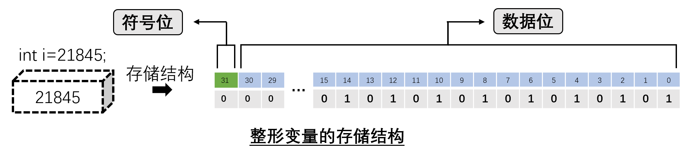

3.C语言基本概念
===========================================================

本章节将介绍C语言的基本概念,包括变量、数据类型、数据运算等,通过本章节将对C语言有个初步的了解,为后面学习打下基础.

3.1.存放数值和字符的盒子-变量
-----------------------------------------------------------

最初接触变量概念来自数学,数学中变量也叫变数,是指没有固定的值,可以改变的数.一般用英文字母或者拉丁字母表示.

-----------------------------------------------------------

如用x、y分别表示鸡和兔子的数量,此时x和y就是存放鸡和兔子数量的 ``盒子`` .

可以得到: 

.. code-block:: text

   x+y=35
   2x+4y=94

使用乘除消元法解得,x=23,y=12,即笼子中有鸡23只,兔子12只.

对于鸡兔同笼的问题,设动物和爪子的数量分别为m和n,可以提取出一般的计算方法:

.. code-block:: text

   y=n/2-m
   x=m-y

只需要替换m和n的具体数值就可以解决所有的鸡兔同笼问题.

3.1.1.变量的概念
~~~~~~~~~~~~~~~~~~~~~~~~~~~~~~~~~~~~~~~~~~~~~~~~~~~~~~~~~~~

c语言中, :guilabel:`变量代表一个有名字的、具有特定属性的一个存储单元` .

与数学中变量的概念相同的是都用来存放可能随时变化数据的 ``盒子``,不同的是C语言中变量是 ``存储单元`` ,在计算机物理内存一定的情况下不能够无限的定义变量,而数学中变量可以任意的设变量.

.. figure:: ./../media/变量概念示意图.png
   :width: 40%
   :alt: 变量概念示意图
   :align: center

-----------------------------------------------------------

示例📑:用C语言定义鸡兔同笼问题相关变量:

.. code-block:: c
   :caption: 鸡兔同笼问题
   :linenos:

   int chicken;          //定义int型变量chicken,表示笼子中的鸡数量
   int rabbit;           //定义int型变量rabbit,表示笼子中的兔子数量
   int animal;           //定义int型变量animal,表示鸡和兔子的数量
   int clows;            //定义int型变量clows,表示鸡和兔子爪子的数量

上面程序每个变量前有一个int来修饰,每个int型变量占用4个字节的内存.由于变量的本质是存储单元,在使用的时候要 ``量体裁衣`` ,根据待存放数据的取值范围选择合适的数据类型来修饰这个变量,避免内存空间浪费,动物的数量是整数且int所能表示的数据取值范围(-32768到32768)也可以满足鸡兔同笼的问题要求.

-----------------------------------------------------------

变量用来存放数据,也就是存放变量的值,在程序运行期间,变量的值是可以改变的.通过变量概念的定义可以知道, ``变量的本质是存储单元``,程序在编译的时候编译系统为每个变量分配一个内存地址,通过变量名的方式读取或者写入数据.学习变量需要从以下几点切入: ``变量名、变量值、变量的数据类型``. 

示例📑:用C语言的方法解决鸡兔同笼问题:

.. code-block:: c
   :caption: 变量的概念
   :linenos:

   #include <stdio.h>    //预编译指令,引入标准输入输出函数库

   int chicken;          //定义int型变量chicken表示笼子中的鸡数量
   int rabbit;           //定义int型变量rabbit表示笼子中的兔子数量
   int animal;           //定义int型变量animal表示鸡和兔子的数量
   int clows;            //定义int型变量clows表示鸡和兔子爪子的数量

   int main(void)
   {
      printf("请输入鸡和兔子的总数\n");
      scanf("%d",&animal);
      printf("请输入鸡和兔子爪子总数\n");
      scanf("%d",&clows);

      rabbit=clows/2-animal;
      chicken=rabbit-rabbit;

      printf("鸡的数量为:%d,兔子的数量为:%d\n",chicken,rabbit);

      return 0;
   }

.. csv-table:: 数学中变量与C语言变量的区别
  :align: center
  :header: 区别, C语言变量, 数学变量
  :widths: 15, 40, 30

  变量命名方式,        标识符命名规则,      英文字母或拉丁字母
  变量数据类型,        指定数据类型,        不需指定数据类型
  读写方式,            按照变量名读写,      按照变量名读写
  变量值取值范围,      有取值范围限制,      没有取值范围限制

3.1.2.C语言标识符命名规则
~~~~~~~~~~~~~~~~~~~~~~~~~~~~~~~~~~~~~~~~~~~~~~~~~~~~~~~~~~~

计算机高级语言中,将变量、符号常量名、函数、数组、类型等命名的有效字符统称为 ``标识符`` .前面说过在数学中通常使用x、y来表示变量,C语言中对变量的命名做了进一步的规范加了一些限制条件.起到 ``见名知意`` 的目的,方便理解程序.

.. note::

  - 标识符只能是由英文字母(A~Z,a~z)和数字(0~9)或者下划线(_)组成.
  - 只能以英文字母或者下划线开头,不能以数字开头.
  - 标识符是区分大小写.
  - 不能使用关键字命名.

通过上面标识符的命名规则可以知道,标识符中不能出现中文字符或者其他特殊字符,标识符不能以数字开头,如"1234hello"显然是不对的,"hello1234"或者"hello_1234"是正确的标识符,标识符也是区分大小写的,如"hello"和"Hello"是两个不同的标识符,也不能以C语言关键字来命名标识符,如"int"、"if"等C语言关键字也不能作为标识符.

上面说到"hello1234"这样的标识符,虽然满足标识符的命名规则,程序编译也不会报错,但是不满足 ``见名知意`` 的目的,程序应该是简洁的、易读的,程序首先是给人看的,其次才是给计算机执行的.由此产生很多标识符的命名法,下面一一介绍说:

.. note::

  - ``下划线命名法`` 例如people_number,current_time,就是使用下划线来分割两个或者两个以上单词.
  - ``驼峰命名法`` 例如serialNumber,第一个单词小写,后面单词首字母大写.

不建议使用a、b这类看不出含义的变量,同时也不建议使用汉语拼音代替单词,具体使用哪一种命名法则,需要根据已有程序使用的命名法则灵活使用,不用拘泥于一种命名法则.

练习📝:判断如下变量的命名是否正确

.. code-block:: text

   HELLO、Hello、hello、int、if、do、#passwd、root@ip、user admin、xiao-ming、xiao_ming、91vip、vip91、_user_admin、_、i.

3.1.3.C语言关键字
~~~~~~~~~~~~~~~~~~~~~~~~~~~~~~~~~~~~~~~~~~~~~~~~~~~~~~~~~~~

C语言关键字是具有特定含义的字符,例如int关键字可以用来定义一个整型的变量,if关键字可以进行条件判断.这些关键字不能用作标识符,关键字将会伴随着学习C语言的全部过程,关键字的含义和用法将在后续的学习中逐渐深入.

随着C语言的发展,C语言关键字的数量也在发生变化,一般使用ANSI C定义的32个关键字.常用的关键字也就这些,其他的关键字会在Linux源码中见到,看到再查就可以,只要掌握如下32个关键字已经够用.

.. csv-table:: C语言关键字
  :align: center
  :widths: 15,15,15,15,15,15,15,15

  auto,   break,  case,     char,   const,    continue, default,  do
  double, else,   enum,     extern, float,    for,      goto,     if
  int,    long,   register, return, short,    signed,   sizeof,   static
  struct, switch, typedef , union,  unsigned, void,     volatile, while

3.2.常量有哪些
-----------------------------------------------------------

常量是指值不变的量.常量是相对于变量而言,变量是存放数据的 ``盒子``,而常量就是放在里面的数据.

3.2.1.常量分类
~~~~~~~~~~~~~~~~~~~~~~~~~~~~~~~~~~~~~~~~~~~~~~~~~~~~~~~~~~~

1. ``数值常量``   由十进制的阿拉伯数字构成的常量,有两类数值常量:一类是由整数构成的 ``整型常量``,如128、256、-99.另一类是有小数点的数构成的 ``实型常量也叫为浮点数``,如1.22、3.14、-22.
2. ``字符常量``   由单个字符构成的常量,将字符用 ``单引号''括起来``,有两类字符常量:一类是 ``普通字符`` ,如'a'、'Z'、'3'、'?'、'#'、','.另一类是 ``转义字符`` ,如常用的'\\r'表示回车,'\\n'表示换行,转义字符即为具有特殊功能的字符.
3. ``字符串常量`` 由多个字符构成的常量,将多个字符用 ``双引号""括起来``,如"Hello,world!"、"123".
4. ``符号常量``   用符号代替数值字符或字符串,也叫 ``宏定义``.符号常量一般使用 ``大写字母`` 表示,如#define PI 3.1415.PI就是符号常量,PI就代表3.1415. 

U表示该常数用无符号整型方式存储,相当于 unsigned int
L表示该常数用长整型方式存储,相当于 long
F表示该常数用浮点型方式存储,相当于 float

.. csv-table:: 转义字符
  :align: center
  :header: 转义字符, 字符值, 输出结果
  :widths: 15, 15, 30

  \\a,              警告(alert),                 产生声音或视觉信号
  \\b,              退格(backspace),             将当前位置后退一个字符
  \\f,              换页(form feed),             将当前位置移到下一页的开头
  \\n,              换行,                        将当前位置移到下一行的开头
  \\r,              回车(carriage return),       将当前位置移到本行的开头
  \\t,              水平制表,                     将当前位置移到下一个tab位置 
  \\v,              垂直制表,                     将当前位置移到下一个垂直制表对齐点
  \'\',             单引号(''),                   具有此八进制的字符
  \"\",             双引号(""),                   输出此字符
  \?,               问号(?),                      输出此字符
  \\\,              反斜杠,                       输出此字符

示例📑:

.. code-block:: c
   :caption: 常量分类
   :linenos:

   #include <stdio.h>   //预编译指令,引入标准输入输出函数库

   #define PI 3.14
   float a=12.34e3;
   char language = 'c';
   char str[30]="Hello,world!"

   int main(void)
   {
       printf("%f",a);
       printf("%c",language);
       printf("%s",str);
       printf("%f",3.14);
       return 0;
   }

.. important::
   
   两个常用的转义字符:

   ``\n``:换行符,在使用printf函数打印数据的时候,\\n起到另起一行的作用.

   ``\r``:回车符,如同使用word制作文档时候按下 ``回车按键``,在一些数据通信领域回车符通常作为一行结束的标志.

使用符号常量的优点,首先有 ``见名知意``,在程序规范中尽可能减少常数的使用,尽可能使用“见名知意”的变量名或者符号常量.还有 ``一改全改`` 的作用,例如修改圆周率的精度为3.141596,需要将所有用到圆周率的地方全部修改,而使用符号常量只需要一次修改即可.

示例📑:

.. code-block:: c
   :caption: Hello,world !打印
   :linenos:

   #include <stdio.h>  //预编译指令,引入标准输入输出函数库

   int main(void)
   {
      //  http://www.network-science.de/ascii/,使用字体o8
      printf("                                                                                                       \n\
      ooooo ooooo            o888  o888                                                  o888        oooo   oo       \n\
      888   888  ooooooooo8  888   888   ooooooo     oooo  o  oooo  ooooooo  oo oooooo   888   ooooo888   8888       \n\
      888ooo888 888oooooo8   888   888 888     888    888 888 888 888     888 888    888 888 888    888   8888       \n\
      888   888 888          888   888 888     888 ooo 888888888  888     888 888        888 888    888    88        \n\
      o888o o888o  88oooo888 o888o o888o  88ooo88   888  88   88     88ooo88  o888o      o888o  88ooo888o   oo       \n\
                                                   o88                                                               \n\
      ");               
      return 0;
   }

3.2.2.常变量
~~~~~~~~~~~~~~~~~~~~~~~~~~~~~~~~~~~~~~~~~~~~~~~~~~~~~~~~~~~
           
在C语言中有一种特殊的变量,就是常变量.常变量的使用为const int n=1024;;与上面int chicken;类似只是在int前面加了const修饰限定,表明这个变量只能在定义的时候初始化为3,后面禁止修改.上面圆周率使用符号常量定义,也可以使用常变量定义为const float pi = 3.1416; ``常变量通过const这个关键字来赋予变量只读的属性``.

-----------------------------------------------------------

.. important::

  符号常量与常变量的区别？

  符号常量发生在编译前,不会分配储存单元,#define是预编译指令,将所有使用的符号常量全部替换.而常变量是发生在编译后,分配储存单元的,只不过变量的值不能改变而已.

3.3.数据类型
-----------------------------------------------------------

``数据类型界定了变量的数据取值范围``,比如unsigned char people;定义了一个"unsigned char"类型的变量people,"unsigned char"的取值范围是0到255,如果people存放的是一所大学的学生人数,显然是不合理的,一般情况一所大学的学生人数是超过255人的.

``数据类型决定了变量的存储结构``,我们知道计算机中只能够存储二进制数据,如定义数据类型为整型int number;和浮点型float number;的变量存储方式是不同的.

示例📑:编写一个求圆的面积的示例.

.. code-block:: c
   :caption: 数据类型的引例
   :linenos:

    #include <stdio.h>   //预编译指令,引入标准输入输出函数库

    #define PI (3.14)

    int r,area;

    int main(void)
    {
        r = 3;
        area = r*r*PI;

        printf("半径为%d的圆面积为%d\r\n",r,area);
        return 0;
    }

计算圆的面积是28.26,而实际程序输出的结果是28,也就是小数点后面的部分被舍弃了,因为int型变量只能够处理整形数据.

练习📝:思考如下程序输出的结果:

.. code-block:: c
   :caption: 数据类型的引例
   :linenos:

    #include <stdio.h>    //预编译指令,引入标准输入输出函数库

    int r,area;
    int pi = 3.14;

    int main(void)
    {
        r = 3;
        area = r*r*PI;

        printf("半径为%d的圆面积为%d\r\n",r,area);
        return 0;
    }

3.3.1.数据类型分类
~~~~~~~~~~~~~~~~~~~~~~~~~~~~~~~~~~~~~~~~~~~~~~~~~~~~~~~~~~~

已经知道int chicken;由3部分组成."int"是C语言关键字,表示chicken这个变量是整形,是对变量的数据类型的修饰."chicken"即为变量,需要遵从C语言变量命名规则.";"分号表示一句话的结束,也就是C语言语句的结束标志.这就是C语言语法规则,按照这个规则就能定义一个变量.

.. figure:: ./../media/数据类型.png
   :width: 80%
   :alt: ASCII码表
   :align: center

-----------------------------------------------------------

3.3.2.基本数据类型取值范围
~~~~~~~~~~~~~~~~~~~~~~~~~~~~~~~~~~~~~~~~~~~~~~~~~~~~~~~~~~~

.. csv-table:: 整形存储空间和取值范围
  :align: center
  :header: 类型(整形), 存储空间大小, 最小值, 最大值
  :widths: 30, 15, 30 ,30

  char(signed char),             1个字节,         -128,                 127
  unsigned char,                 1个字节,         0,                    255
  short,                         2个字节,         -32768,               32767
  unsigned short,                2个字节,         0,                    65535
  int,                           4个字节,         -2147483648,          2147483647
  unsigned int,                  4个字节,         0,                    4294967295
  long,                          4个字节,         -2147483648,          2147483647
  unsigned long,                 4个字节,         0,                    4294967295
  long long(C99),                8个字节,         -9223372036,          9223372036
  unsigned longlong (C99),       8个字节,         0,                    18446744073

.. csv-table:: 浮点型存储空间
  :align: center
  :header: 类型(浮点型), 存储空间大小, 取值范围
  :widths: 30, 15,30

  float,        4个字节,      0以及1.2*10^-38~3.4*10^38
  double,       8个字节,      0以及2.3*10^-308~1.7*10^308
  long,         8个字节,      0以及2.3*10^-308~1.7*10^308

3.3.3.如何定义一个变量
~~~~~~~~~~~~~~~~~~~~~~~~~~~~~~~~~~~~~~~~~~~~~~~~~~~~~~~~~~~

所以的变量必须遵循先定义在使用的原则,变量的定义有如下三种写法:

1. 在关键字后定义一个变量,如unsigned char count;使用这种方法单个unsigned char型(无符号字符型)变量count,占用一行空间,方便添加注释和修改程序.
2. 在关键字后定义多个变量,如int m,n,i;同时定义多个int型(整形)变量m,n,i,适用于需要同时定义多个数据类型相同的变量.
3. 在关键字后定义一个变量并对变量值初始化,如float pi=3.14;定义float型(浮点型)变量pi,并设置初始值为3.14.

.. code-block:: c
   :caption: 变量的概念
   :linenos:

   #include <stdio.h>   //预编译指令,引入标准输入输出函数库

   #define PI (3.14)

   int main(void)
   {
      int r = 3;
      float area = r*r*PI;
      printf("半径为%d的圆面积为%f\r\n",r,area);
      return 0;
   }

.. note::
   
   变量在定义的时候如果没有初始化,则默认的初始值为0,初始化的表达式必须为常量表达式.

3.3.4.进制转换
~~~~~~~~~~~~~~~~~~~~~~~~~~~~~~~~~~~~~~~~~~~~~~~~~~~~~~~~~~~

3.3.5.整形变量的值是如何用二进制表示
~~~~~~~~~~~~~~~~~~~~~~~~~~~~~~~~~~~~~~~~~~~~~~~~~~~~~~~~~~~

C语言中编写程序使用十进制的阿拉伯数字表示数字,也把这样的数字叫做数值常量.

定义一个变量int n=21845;,这里21845就是我们生活中常用的十进制数,c语言中也可以写作21845l或21845L,即在数字后面加一个小写字母l或者大写字母L来强制表示这是一个整数.而计算机只能够识别二进制,那么只需要15个二进制数(01010101 01010101)就能表示十进制数21845,由于int型变量占用4字节(32 bit)存储单元,也就写作00000000 00000000 01010101 01010101.

思考🤔:int n=-21845;又该如何用二进制表示呢？

c语言中,存储单元整数的二进制表示被称为 ``补码`` ,由于 ``int等价于signed int;`` 只不过signed往往被省略,即为有符号的整形变量n,把32 bit位存储单元的左边第一位作为符号位,0则表示为正,如果为1则表示为负.规定正数的补码是其二进制形式.负数补码先将此数的绝对值写出二进制形式,然后对所有位置的二进制形式取反,最后再加1即为此负数的补码.

-----------------------------------------------------------

示例📑:计算负数的补码.

.. code-block:: text

   假设定义一个int型变量n,初始值为6,+6的补码也就是其二进制形式表示00000000 00000000 00000000 00000110.

   求值为-6的int型变量补码过程:

   1.求出-6绝对值的二进制表示     00000000 00000000 00000000 00000110.
   2.按位取反                    11111111 11111111 11111111 11111001.
   3.取反后的结果+1即为-6的补码   11111111 11111111 11111111 11111010.

   最左面第一位表示符号,为0则表示为正,如果为1则表示为负.

.. note::

   - 整数以其补码方式存放在存储单元.
   - 正整数的补码为其二进制形式.
   - 负整数的补码为其绝对值的二进制形式按位取反后的值再加1.
   - 整数补码中左边第一位表示符号,为0则表示为正,如果为1则表示为负.

练习📝:计算值为-12345的int型变量补码?

.. code-block:: text

   1.求出-12345绝对值的二进制表示为00000000 00000000 00110000 00111001
   2.按位取反                     11111111 11111111 11001111 11000110
   3.按位取反结果+1               11111111 11111111 11001111 11000111

练习📝:解释int型变量和unsigned int形变量的取值范围

.. code-block:: text
   
   int修饰的变量为有符号整形,有31位数据位和1位符号位,则能够表示的最小负数为-2e31,能够表示的最大正数为2e31-1,一共2e32个数.
   unsigned int修饰的变量为无符号整形(正整数),32位全部为数据位,则能够表示的最小数为0,能够表示的最大正数为2e32-1,一共2e32个数.

思考🤔:学习整数的存储结构的意义？

1.位操作
2.数据乘2或者除2
3.数据溢出
4.从翻译的角度看存储结构

3.3.6.字符型变量的存储结构
~~~~~~~~~~~~~~~~~~~~~~~~~~~~~~~~~~~~~~~~~~~~~~~~~~~~~~~~~~~

C语言中,字符可以通过单引号''来表示.如'a','A','1'等.知道了整形是通过补码的方式存放在存储单元,那么字符是如何存放在存储单元的呢？大多数系统都是使用ASCII码表来存储字符,例如大写字母'A'在ASCLL码表中的十进制为65,即通过65的二进制表示01000001来表示'A'.在ASCII码中包含了33个控制字符(具有某些特殊功能但是无法显示的字符)和95个可显示字符;
字符'a'或者字符'!'是我们能够识别的,而计算机只能够识别二进制,所以ASCII码表就是起到 ``翻译`` 的功能.

.. figure:: ./../media/ASCLL.png
   :width: 80%
   :alt: ASCII码表
   :align: center

-----------------------------------------------------------

1. 通过ASCLL码表可以看出,大写字母'A'的ASCII码十进制为65,小写字母'a'的ASCII码十进制为97,可以用大小写字母切换.
2. 数字字符不等于数字,字符'1'的ASCII代码是十进制数49,数字1的ASCII码就是1.
3. 空格字符' '的ASCII代码是十进制数32,并不是没有ASCII码

-----------------------------------------------------------

练习📝:如何知道存储单元是字符还是整数?

在定义一个字符变量的时候,可以定义char n=‘a’;或者char n=97;两者的ASCII码均是01100001,如何知道存储单元是字符还是整数？

.. code-block:: text

   打印出这个字符变量的数值:
   printf(“%d”,n);
   打印出这个字符变量的字符:
   printf(“%c”,n);
   关键是在用途,也就是被翻译成什么.

3.3.7.浮点型变量的存储结构
~~~~~~~~~~~~~~~~~~~~~~~~~~~~~~~~~~~~~~~~~~~~~~~~~~~~~~~~~~~

实数型常量又可以用两种形式表现,一种就是我们经常用的十进制小数形式,如123.456、23.56等,但是由于计算机的内存限制和计算规则以及工程科学中对于数值计算的要求,经常会用科学计数法来表示实数,另外一种就是指数形式,如12.34e3(代表12.34乘以10的3次方),在C语言中规定用e/E来代表以10为底的指数,在e的前面必须有数字,e的后面必须为整数.

浮点数也就是实数,例如12.34可以直接写作12.34或者12.34f,通过加字母f或者F强制表示这个是浮点型数据,也可以写作指数形式1.234e1(1.234乘以10的1次方),C语言中浮点数在以其指数方式表示时候.由于小数点可以向前或者向后移动,只要同时改变指数的值,就可以保证浮点数的值不变,因此被称为浮点数.

.. code-block:: c
   :caption: 定义一个浮点型变量
   :linenos:

   float pi = 3.14;                     //定义一个单精度浮点型变量pi
   float pencil_price = 1.5f;           //定义一个单精度浮点型变量pencil_price
   float student_number = 2.14e5;       //定义一个单精度浮点型变量student_number

前面说过数字按照其补码的二进制在存储单元存放,字符按照ASCII码的二进制形式存放在存储单元,C语言中浮点数以指数方式存放,具体是如何存放的呢？根据国际标准IEEE754,任意二进制浮点数的表示方式:

.. note::

  浮点数V表示为(-1)^S*M*2^E形式,(-1)^S表示符号位,当S=0时,V为正数;当S=1时,V为负数.M表示有效数字,且1<=M<2,2^E表示指数位

例如圆周率pi=3.14,写成二进制为11.1110,相当于1.1111*2^1,则有S=0,M=1.1111,E=1,-3.14可以表示为-1.1111*2^1,则有S=1,M=1.1111,E=1,存储单元中也就存放和S、M和E相关的值来表示浮点数.浮点数的存储结构相对复杂,不用花太多时间,后面在共用体时候将介绍如何巧用浮点数存储结构将浮点数转换为16进制,这在传输浮点数数据非常有意义.

.. code-block:: c
   :caption: 定义一个浮点型变量
   :linenos:

    #include <stdio.h>                    //预编译指令,引入标准输入输出函数库
    #include <stdlib.h>

    union data 
    {
        int integer;
        float float_point;
    };

    char *float_to_bin(float value)
    {
        int flag=1;
        union data temp;
        temp.float_point = value;
        char* result=(char*)malloc(sizeof(char)*33);

        for(int i=31;i>=0;i--)
        {
            if(temp.integer & flag)
            {
                result[i]='1';
            }
            else
            {
                result[i]='0';
            }
            flag<<=1;
        }
        result[32]='\0';
        return result;
    }

    int main() 
    {
        char *s =float_to_bin(3.14f);
        for(int i=0;i<32;i++)
        {
            printf("%c",s[i]);
        }
        return 0;
    }

3.4.运算符
-----------------------------------------------------------

同数学中运算符类似,像 ``+ 、-、*、/、%等`` 可以进行数据计算的符号称为 ``运算符`` ,作为计算对象的变量或者常量被称为 ``操作数`` ,定义变量的最终目的是计算,如下学习C语言的数据运算

3.4.1.算术运算符
~~~~~~~~~~~~~~~~~~~~~~~~~~~~~~~~~~~~~~~~~~~~~~~~~~~~~~~~~~~

.. list-table:: 算数运算符
    :widths: 15 10 30
    :header-rows: 1
    :align: center

    * - 运算符
      - 含义
      - 举例
    * - \+
      - 正号运算符
      - +a
    * - \-
      - 减号运算符
      - -a
    * - \*
      - 乘法运算符
      - a*b
    * - \/
      - 除法运算符
      - a/b
    * - \%
      - 求余运算符
      - a%b
    * - \+
      - 加法运算符
      - a+b
    * - \-
      - 减法运算符
      - a-b

-----------------------------------------------------------
    
如上图,m和n称为操作数,+称为运算符,运算符的左边称为左操作数,运算符的右边称为右操作数

.. note::

   - ``m + n`` m和n的和
   - ``m - n`` m减n的值
   - ``m * n`` m称n的值
   - ``m / n`` m除以n的商,m和n均为整数时,结果为整数.m和n其中一个为浮点数时结果为浮点数.
   - ``m % n`` m除以n的余数,m和n都必须为整数,如2.5%2这样是非法的.

示例📑:

.. code-block:: c
   :caption: 算术运算符
   :linenos:
    
    #include <stdio.h>       //预编译指令,引入标准输入输出函数库

    int main(void)
    {
      int m,n;
      printf("请输入两个整数\n");

      printf("整数m:");
      scanf("%d",&m);
      printf("整数n:");
      scanf("%d",&n);

      printf("m + n = %d\n", m+n);
      printf("m - n = %d\n", m-n);
      printf("m * n = %d\n", m*n);
      printf("m / n = %d\n", m/n);
      printf("m %% n = %d\n",m%n);    //%有转换说明的功能,当只是想输出%的时候需要写为%%
    }

示例📑:

.. code-block:: c
   :caption: 算数运算符的应用举例
   :linenos:
    
    if((year%4==0&&year%100!=0)||year%400==0)
    {
      printf("%d is a leap year\n",year);
    }
    else 
    {
      printf("%d is not a leap year\n",year);
    }

3.4.2.算术运算符优先级
~~~~~~~~~~~~~~~~~~~~~~~~~~~~~~~~~~~~~~~~~~~~~~~~~~~~~~~~~~~

双目运算符+和-具有相同的优先级,它们的优先级比运算符\*、/和%的优先级低,而运算符\*、/和％的优先级又比单目运算符+(正号)和-(负号)的优先级低.

示例📑:

3.4.3.自增、自减
~~~~~~~~~~~~~~~~~~~~~~~~~~~~~~~~~~~~~~~~~~~~~~~~~~~~~~~~~~~

自增、自减运算符也叫单目运算符,只有一个操作数.
自增1运算符记为“++”,其功能是使变量的值自增1;自减1运算符记为“--”,其功能是使变量值自减1.

自增1,自减1运算符均为单目运算,都具有右结合性.可有以下几种形式:

.. note::

  - ++i:i自增1后再参与其它运算.
  - --i:i自减1后再参与其它运算.
  - i++:i参与运算后,i的值再自增1.
  - i--:i参与运算后,i的值再自减1.

.. code-block:: c
   :caption: Hello, world!程序
   :linenos:

   #include <stdio.h> //预编译指令,引入标准输入输出函数库

   int i = 3;
   int j = 3;

   int main() 
   {
      printf("%d\r\n",i++);
      printf("%d\r\n",++i);
      printf("%d\r\n",j--);
      printf("%d\r\n",++j);
      return 0; 
   }

3.4.4.赋值运算符
~~~~~~~~~~~~~~~~~~~~~~~~~~~~~~~~~~~~~~~~~~~~~~~~~~~~~~~~~~~

前面已经知道可以通过变量名的方式读取或者写入变量的值,使用赋值运算符 ``=`` 可以将一个数值或者变量的值赋值给另一个变量.

.. code-block:: c
   :caption: Hello, world!程序
   :linenos:

   #include <stdio.h> //预编译指令,引入标准输入输出函数库

   char lowercase = 'a';
   char uppercase;

   int main() 
   {
      uppercase = lowercase -32;
      printf("%c\n",uppercase);
      return 0; 
   }

思考:输入任何一个英文字母写出其对于的大写或者小写形式？

3.5.强制类型转换
-----------------------------------------------------------

.. figure:: ./../media/数据类型转换.png
   :width: 80%
   :alt: 数据类型转换
   :align: center

-----------------------------------------------------------

-----------------------------------------------------------

3.6.标准输入输出-与计算机交互
-----------------------------------------------------------

简单来说数据输入和输出就是使用C语言通过键盘获取输入数据并向屏幕输出打印信息.也就是使用C语言提供的 ``标准输入输出函数``.
常用的有printf格式化输出函数和scanf格式化输入函数 ,除此之外还包括putchar(输出字符)、getchar(输入字符)、puts(输出字符串)、gets(输入字符串)等函数.

-----------------------------------------------------------

学习标准输入输出函数之前先学习 ``预处理命令`` ,前面的程序已经使用到预处理命令,如 :guilabel:`#include <stdio.h>`,其中 ``#include`` 就是预处理命令,stdio.h这样是.h结尾的文件被称为 ``头文件`` .

预处理命令就是告诉编译器 ``后面我会用到printf()和scanf()这里标准输入输出函数,虽然我自己没有定义这些函数,但是在stdio.h文件中可以找到,你可别把我这当错误程序处理`` .在stdio.h文件中包含很多函数,这是C语言为我们设计好的,我们只需要知道如何使用即可,下面开始学习如何使用这些函数.

.. note::

   引用头文件的两种方式:

   1. 尖括号 ``<>``,如#include <stdio.h>,引用标准库头文件写法,编译系统从存放编译系统的子目录下寻找需要包含的头文件.
   
   2. 双引号 ``""``,如#include "myCode.h",引用自定义头文件写法,编译系统先在用户当前目录下(存放源码目录)寻找包含的头文件,如果找不到编译系统则从存放编译系统的子目录下寻找.

3.6.1.格式化输出函数printf
~~~~~~~~~~~~~~~~~~~~~~~~~~~~~~~~~~~~~~~~~~~~~~~~~~~~~~~~~~~

一般形式:printf("格式控制",输出列表); 

- d格式符,用来输出有符号的十进制整数,printf("%d",10);
- ld格式符,用来输出有符号的十进制长整数,printf("%d",50000);
- c格式符,用来输出一个字符,printf("%c",'A');
- s格式符,用来输出一个字符串,printf("%s","Hello,world!");
- f格式符,用来输出实数,printf("%f",3.14);
- x格式符,用来输出整数的16进制形式,printf("%x",10);
- p格式符,用来输出变量的16进地址式,printf("%x",&n);

下面通过printf格式化输出,打印一个人的描述信息.

.. code-block:: c
   :caption: printf函数使用举例
   :linenos:

   #include <stdio.h>                        //预编译指令,引入标准输入输出函数库

   #define NAME "zhangsan"                   //符号常量或者称为“宏定义”定义人名“zhangsan”

   int age = 20;                             //定义整形变量age,初始值为20,描述人的年龄
   float height = 1.75;                      //定义浮点型变量height,初始值为1.75,描述人的身高
   char blood_type = 'A';                    //定义字符变量blood_type,初始值为'A',描述人的血型

   int main() 
   {
      printf("我的名字叫%s\n",NAME);         //使用printf函数,向屏幕输出字符串
      printf("我今年%d\n",age);              //使用printf函数,向屏幕输出整形数据
      printf("我的身高是%f\n米",height);     //使用printf函数,向屏幕输出浮点型数据
      printf("我的血型是%c\n型",blood_type); //使用printf函数,向屏幕输出字符
      return 0; 
   }

使用printf函数打印字符串时候以'\0'作为结束标志,'\0'前面的数据原样输出即可,但是整形要考虑数据左对齐还是右对齐,数据前位数不足是否要补0等,浮点数也要考虑数据的精度问题.所以将printf函数叫格式化输出函数.

-----------------------------------------------------------

👉 **0标志** 设置0标志后,数值的前面如果有空位,则用0补齐位数,如果省略则用空白占位.
👉 **最小字段宽度** 至少要显示出来的字符位数
👉 **精度** 指定显示的最小位数,如果不指定,则整数默认为1,浮点数默认为6.
👉 **转换说明符** d表示显示十进制的int型整数,f表示显示十进制的double型浮点数.

使用%f做格式化输出浮点型数据时,整数部分全部输出,小数部分最多输出6位.此外还可以通过%m.nf方式输出m位整数,n位小数,小数最后一位四舍五入处理,如果n=0,只会输出整数部分,小数点都不会输出.

.. code-block:: c
   :caption: f符号的使用
   :linenos:

   #include <stdio.h>                        //预编译指令,引入标准输入输出函数库

   int main(void)
   {
      printf("%d\n",                   123);
      printf("%.4d\n",                 123);
      printf("%4d\n",                  123);
      printf("%04d\n",                 123);
      printf("%-4d\n",                 123);

      printf("%d\n",                   12345);
      printf("%.3d\n",                 12345);
      printf("%3d\n",                  12345);
      printf("%03d\n",                 12345);
      printf("%-3d\n",                 12345);

      printf("%f\n",                   123.13);
      printf("%.1f\n",                 123.13);
      printf("%6.1f\n",                123.13);

      printf("%f\n",                   123.13);
      printf("%.1f\n",                 123.13);
      printf("%4.1f\n",                123.13);
   }

练习📝:体重指数(BMI)是国际通用的计算人体肥胖程度的一个公式,体重指数=体重(千克)/身高(米)的平方.BMI小于18.5属于消瘦,BMI在18.5~23.9之间属于正常,24~27.9属于体重超重,28以上属于肥胖,BMI在30以上属于高度肥胖.

编写程序实现BMI的计算,实现效果如图.

.. code-block:: c
   :caption: printf函数使用举例
   :linenos:

   请输入你的体重(千克):65
   请输入你的身高(米):1.78
   你的BMI为XX,属于正常体重

**putchar函数**

一般形式:putchar('c');

输出字符变量c的值,显示一个字符.

.. code-block:: c
   :caption: f符号的使用
   :linenos:
   
   char a = 'a';

   putchar('H');   
   putchar(96); 
   putchar(a); 

**puts函数**

一般形式:puts(s);

输出字符串,并换行.

.. code-block:: c
   :caption: f符号的使用
   :linenos:
   
   puts("Hello world");   

3.6.2.scanf函数
~~~~~~~~~~~~~~~~~~~~~~~~~~~~~~~~~~~~~~~~~~~~~~~~~~~~~~~~~~~

**scanf函数**

一般形式:scanf("格式控制",地址列表);

- d格式符,用来输入有符号的十进制整数,scanf("&d",a);
- c格式符,用来输入一个字符,scanf("&c",b);
- s格式符,用来输入一个字符串,scanf("&s",c);
- f格式符,用来输入实数,scanf("&f",d);
- x格式符,用来输入整数的16进制形式,scanf("&x",e);

.. code-block:: c
   :caption: scanf函数用法
   :linenos:

   #include <stdio.h>                           //预编译指令,引入标准输入输出函数库

   int age;                                     //定义整形变量age,初始值为20,描述人的年龄
   float height;                                //定义浮点型变量height,初始值为1.75,描述人的身高
   char blood_type;                             //定义字符变量blood_type,初始值为'A',描述人的血型
   char name[20];

   int main() 
   {
      printf("输入你的名字\n");                 //使用printf函数,向屏幕输出字符串
      scanf("%s",name);                        //获取键盘输入的值
      printf("输入你的年龄\n");                 //使用printf函数,向屏幕输出字符串
      scanf("%d",age);                         //获取键盘输入的值
      printf("输入你的身高\n");                 //使用printf函数,向屏幕输出字符串
      scanf("%f",height);                      //获取键盘输入的值
      printf("输入你的血型\n");                 //使用printf函数,向屏幕输出字符串
      scanf("%c",blood_type);                  //获取键盘输入的值

      printf("我的名字叫%s\n",&name);           //使用printf函数,向屏幕输出字符串
      printf("我今年%d\n",age);                 //使用printf函数,向屏幕输出整形数据
      printf("我的身高是%f\n米",height);        //使用printf函数,向屏幕输出浮点型数据
      printf("我的血型是%c\n型",blood_type);    //使用printf函数,向屏幕输出字符
      return 0; 
   }

**getchar函数**

一般形式:getchar(c);

获取输入字符,存放在变量c.

.. code-block:: c
   :caption: scanf函数用法
   :linenos:

   char a;
   getchar(a);

**gets函数**

gets从标准输入设备读字符串函数,其可以无限读取,不会判断上限,以回车结束读取

示例📑:

.. code-block:: c
   :caption: scanf函数用法
   :linenos:

   char a[100];
   gets(a);
   
练习📝:设计一个建议的计算器实现100以内的加减乘除,可以实现对小数的计算,精确到小数点后两位.

