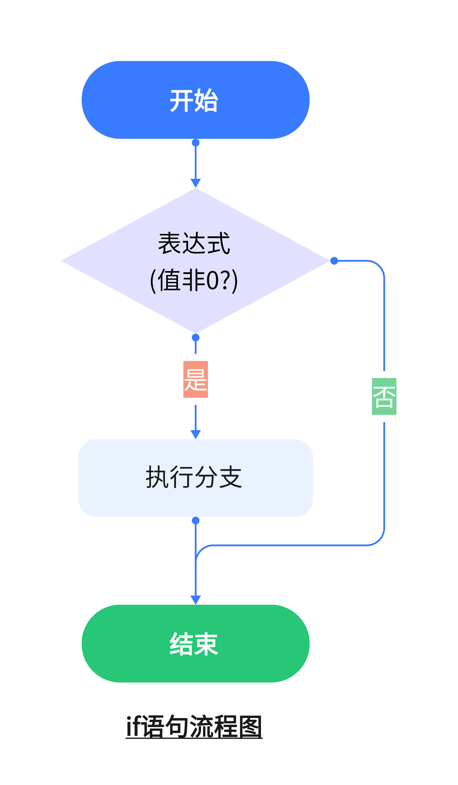
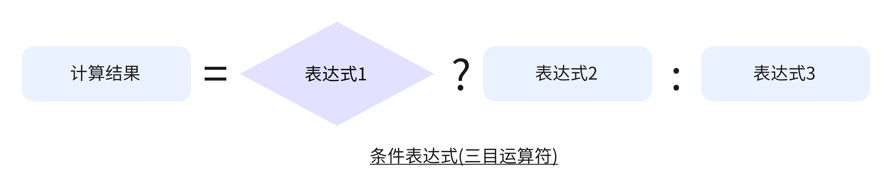
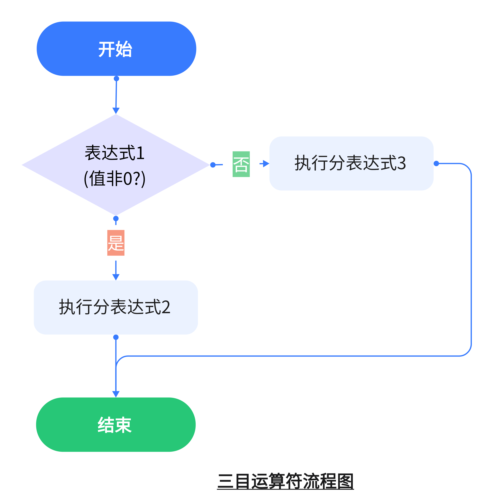

4.分支选择结构
===========================================================

编写程序的目的是让计算机按照我们的想法完成指定的动作,但是有的时候程序的执行结果往往是多样的,这是因为程序中会根据输入判断选择执行不同的部分.比如编写程序计算一元二次方程的时候,需要判断b²-4ac>=0,方程ax²+bx+c=0才有实根,否则不会执行计算方程的程序,而是直接提示方程没有实数根.

C语言中使用两种选择语句, ``一是if语句来实现两个分支的选择结构,二是switch语句来实现多分支的选择结构``.

4.1.if语句
-----------------------------------------------------------

4.1.1.if语句的两种形式
~~~~~~~~~~~~~~~~~~~~~~~~~~~~~~~~~~~~~~~~~~~~~~~~~~~~~~~~~~~

示例📑:if语句的两种形式

.. tabs::

   .. tab:: if语句

      .. code:: c

            if(表达式)
            {
                //if语句的分支,条件满足时执行的程序
            }

   .. tab:: if/else语句

      .. code:: c

            if(表达式)
            {
                //if语句的分支1,条件满足时执行的程序
            }
            else
            {
                //if语句的分支2,条件不满足时执行的程序
            }

.. note::

    **{}** 的含义是 ``程序块``,将多个语句划分为程序块.{}内的语句 ``捆绑`` 在一块,同时被执行.
    
    这样写法的有点:
    - 方便程序拓展,没有{}组成程序块的情况下,if条件满足时只会执行离if语句最近的一条语句,而使用程序块if条件满足时可以执行多行语句.
    - 哪些是if语句的处理分支,哪些是if语句外的程序一目了然.

-----------------------------------------------------------

if语句表达式的值是逻辑值,当表达式的值为非0的时候条件满足,执行分支内的语句,当表达式的值为0的时候条件不满足,不执行分支内的语句

-----------------------------------------------------------

if/else语句表达式的值是逻辑值,当表达式的值为非0的时候条件满足,执行分支内1的语句,当表达式的值为0的时候条件不满足,执行分支内2的语句

4.1.2.关系表达式
~~~~~~~~~~~~~~~~~~~~~~~~~~~~~~~~~~~~~~~~~~~~~~~~~~~~~~~~~~~

比较两个操作数大小关系的运算符称为关系运算符.

.. csv-table:: 关系运算符
  :align: center
  :header: 关系运算符, 含义, 数学中的表示
  :widths: 15, 30, 15
  
  <,            小于,         <
  <=,           小于或等于,   ≤
  >,            大于,         >
  >=,           大于或等于,   ≥
  ==,           等于,         =
  !=,           不等于,       ≠

关系运算符的运算优先级:

关系运算符都是双目运算符,其结合性均为左结合.关系运算符的优先级低于算术运算符,高于赋值运算符.在六个关系运算符中,<、<=、>、>=的优先级相同,高于==和!=,==和!=的优先级相同.

由关系运算符构成的表达式被称为关系表达式,当关系表达式成立时,表达式的值为1,否则表达式的值为0。 

.. note::

逻辑值即布尔值分别是 ``true`` 和 ``false`` ,C语言没有逻辑型变量和逻辑型常量,也没有专门的逻辑值,故以 ``非0`` 代表 ``真``,以 ``0`` 代表 ``假``。

4.1.3.逻辑表达式
~~~~~~~~~~~~~~~~~~~~~~~~~~~~~~~~~~~~~~~~~~~~~~~~~~~~~~~~~~~

连接两个及以上表达式进行逻辑运算的运算符称为逻辑运算符,C语言中有三种逻辑运算符,分别是与(&&)、或(||)、非(!).

.. csv-table:: 逻辑运算符
  :align: center
  :header: 运算符, 说明, 结合性, 举例
  :widths: 15, 40, 30,40

  &&,        与运算 双目 对应数学中的“且”,      左结合,     1&&0、(9>3)&&(b>a)
  ||,        或运算 双目 对应数学中的“或”,      左结合,     1||0、(9>3)||(b>a)
  !,         非运算 单目 对应数学中的“非”,      右结合,     !a、!(2<5)

由逻辑运算符构成的表达式称为逻辑表达式,逻辑表达式的值是一个逻辑值,即 ``true`` 或 ``false`` 。故以“非0”代表“真”,以“0”代表“假”。在关系表达式求解时,以“1”代表“真”,以“0”代表假。
C语言编译系统在给出逻辑运算结果时,以数字1表示“真”,以数字0表示“假”,但在判断一个量是否为“真”时,以0表示“假”,以非0表示“真”。

.. note::

    短路问题
    ||  左边成立情况下编译器不计算右边
    &&  左边不成立情况下编译器不计算右边

示例📑:if语句的第一种形式举例

.. code-block:: c
   :caption: if语句的第一种形式举例1
   :linenos:

    /***************************************************************
    * @file       area_circle.c
    * @brief      判断一个整数是不是奇数
    * @author     单片机设计电子网
    **************************************************************/
    #include <stdio.h>                                      //预编译指令,引入标准输入输出函数库
    
    int number;

    int main(void)
    {
        printf("请输入一个整数\n");                          //打印提醒信息
        scanf("%d", &number);                               //获取键盘输入

        //if语句,number为奇数时number % 2的结果为1,否则为0
        if(number % 2)
            printf("输入的数%d是奇数",number);         

        return 0;
    }

如果输入的数是奇数则执行printf函数打印信息,如果输入的数不是奇数则不打印任何提示信息.

.. code-block:: c
   :caption: if语句的第一种形式举例2
   :linenos:

    /***************************************************************
    * @file       area_circle.c
    * @brief      判断一个数是不是正数
    * @author     单片机设计电子网
    **************************************************************/
    #include <stdio.h>                                      //预编译指令,引入标准输入输出函数库
    #include <math.h>                                      //预编译指令,引入标准输入输出函数库

    float number;

    int main(void)
    {
        printf("请输入一个数\n");                      //打印提醒信息
        scanf("%f", &number);                           //获取键盘输入

        if(number < 0)
            number = abs(number);
        printf("输入的数绝对值为%f\n",number);

        return 0;
    }

如果输入的数是正数则跳过执行绝对值函数,直接打印输出,否则使用abs函数计算负数的绝对值,再打印结果.

.. code-block:: c
   :caption: if语句的第一种形式举例3
   :linenos:

    /***************************************************************
    * @file       area_circle.c
    * @brief      判断一个年份是闰年
    * @author     单片机设计电子网
    **************************************************************/
    #include <stdio.h>                                      //预编译指令,引入标准输入输出函数库
    
    int year;

    int main(void)
    {
        printf("请输入一个年份\n");                      //打印提醒信息
        scanf("%d", &year);                           //获取键盘输入

    if((year%4==0&&year%100!=0)||year%400==0)
        printf("输入的年份%d是闰年\n",year);
        printf("************************");
        return 0;
    }

如果输入的年份是闰年则打印是闰年的提示信息,同上个例子一样这点毋庸置疑,下面的一行*号是在什么情况下才会打印呢?输入一个闰年和一个平年发现都会打印一行*号,由此发现if语句条件满足的时候只会执行离if语句最近的一行.

示例📑:if语句使用程序块的第一种形式举例

.. code-block:: c
   :caption: if语句使用程序块的第一种形式举例1
   :linenos:

    /***************************************************************
    * @file       area_circle.c
    * @brief      比较两个实数大小,并按照由大到小输出,精确到小数点后一位
    * @author     单片机设计电子网
    **************************************************************/
    #include <stdio.h>                                      //预编译指令,引入标准输入输出函数库
    
    float max,min;                                          //存放待计较的两个数的变量
    float temp;                                             //临时周转的变量      

    int main(void)
    {
        printf("请输入两个实数\n");                          //打印提醒信息
        scanf("%f, %f", &max, &min);                        //获取键盘输入

        if(min > max)
        {
            temp = min;                                     //将大值放在temp
            min = max;                                      //小值放在min
            max =temp;                                      //大值放在max
        }
        //如果max大于min不需要交换
        printf("%.1f %.1f\n", max, min);                    //打印结果

        return 0;
    }

通过键盘输入两个实数,分别放在max和min这两个变量中,如果min的值大于max则将两个变量的值交换,否则直接输出结果.

4.1.3.if语句的第二种形式
~~~~~~~~~~~~~~~~~~~~~~~~~~~~~~~~~~~~~~~~~~~~~~~~~~~~~~~~~~~

示例📑:if语句的第二种形式

.. tabs::

   .. tab:: if/else语句

      .. code:: c

        if(表达式)
            //if语句的分支1,条件满足时执行的程序
        else
            //if语句的分支2,条件不满足时执行的程序

   .. tab:: if/else语句程序块

      .. code:: c

        if(表达式)
        {
            //if语句的分支1,条件满足时执行的程序或程序块
        }
        else
        {
            //if语句的分支2,条件不满足时执行的程序或程序块
        }

这种形式增加了对不满足条件判断的情况处理,对于满足与否都会有相应的处理代码,else语句执行的是除了if语句满足的条件外的其他所有情况.

示例📑:if语句的第二种形式举例

.. code-block:: c
   :caption: if语句的第二种形式举例1
   :linenos:

    /***************************************************************
    * @file       area_circle.c
    * @brief      判断一个整数是不是奇数
    * @author     单片机设计电子网
    **************************************************************/
    #include <stdio.h>                                      //预编译指令,引入标准输入输出函数库
    
    int number;

    int main(void)
    {
        printf("请输入一个整数\n");                          //打印提醒信息
        scanf("%d", &number);                               //获取键盘输入

        //if语句,number为奇数时number % 2的结果为1,否则为0
        if(number % 2)
            printf("输入的数%d是奇数",number); 
        else
            printf("输入的数%d是偶数",number); 

        return 0;
    }

.. code-block:: c
   :caption: if语句的第二种形式举例2
   :linenos:

    #include <stdio.h>

    int year;

    int main(void)
    {
        printf("请输入一个年份\n");     //打印提醒信息
        scanf("%d",&year);           //获取键盘输入

        if((year%4==0&&year%100!=0)||year%400==0)
            printf("输入的年份%d是闰年\n",year);
        else 
            printf("输入的年份%d是平年\n",year);

        return 0;
    }

示例📑:if语句使用程序块的第二种形式举例

.. code-block:: c
   :caption: if语句使用程序块的第二种形式举例1
   :linenos:

    /***************************************************************
    * @file       area_circle.c
    * @brief      比较两个实数大小,并按照由大到小输出,精确到小数点后一位
    * @author     单片机设计电子网
    **************************************************************/
    #include <stdio.h>                                      //预编译指令,引入标准输入输出函数库
    
    float max,min;                                          //存放待计较的两个数的变量

    int main(void)
    {
        printf("请输入两个实数\n");                          //打印提醒信息
        scanf("%f, %f", &max, &min);                        //获取键盘输入

        if(min > max)
        {
            printf("%.1f %.1f\n", max, min);                    //打印结果
        }
        else
        {
            printf("%.1f %.1f\n", min, max);                    //打印结果
        }

        return 0;
    }

4.1.4.条件表达式(三目运算符)
~~~~~~~~~~~~~~~~~~~~~~~~~~~~~~~~~~~~~~~~~~~~~~~~~~~~~~~~~~~

示例📑:条件表达式的一般形式

-----------------------------------------------------------

-----------------------------------------------------------

条件运算符的执行顺序是,先求解表达式1,若为真则求解表达式2,此时表达式2的值作为整个条件表达式的值。若表达式1的值为假,则求解表达式3,表达式3的值为整个条件表达式的值。

4.1.1.if分支嵌套
~~~~~~~~~~~~~~~~~~~~~~~~~~~~~~~~~~~~~~~~~~~~~~~~~~~~~~~~~~~

如果一个if语句中包含另外一个if语句,就称为if语句的嵌套,也称为分支结构的嵌套.

.. code-block:: c
   :caption: if分支嵌套使用举例
   :linenos:

    #include <stdio.h>

    int main()
    {
        int year,leap;
        printf("enter year:");
        scanf(" %d",&year);
        
        if (year%4==0)
        {
            if( year%100==0)
            {
                if(year%400= =0)
                {
                    leap=13;
                }
                else
                {
                    leap=0;
                }
            }
            else
            {
                leap=1;
            }
        else
        {
            leap=0;
        }
        if(leap)
        {
            printf("%d is" ,year);
        }
        else
        {
            printf("%d is not",year);
        }            
        printf("a leap year.\n") ;

        return 0;
    }

.. code-block:: c
   :caption: if分支嵌套一般形式
   :linenos:

   if(表达式)
   {
       if(表达式)
       {
           语句或者代码块
       }
       else
       {
           语句或者代码块
       }
   }
   else
   {
       if(表达式)
       {
           语句或者代码块
       }
       else
       {
           语句或者代码块
       }
   }

4.2.switch语句
-----------------------------------------------------------

4.1.2.switch语句的一般形式
~~~~~~~~~~~~~~~~~~~~~~~~~~~~~~~~~~~~~~~~~~~~~~~~~~~~~~~~~~~

switch语句是C语言中的另一个分支选择结构,相比于if语句而言,switch语句可以实现多分支选择,当然也可以通过if语句嵌套实现多分支选择,但是switc语句实现多分支选择写法更加简洁,程序也更加直观.

示例📑:switch语句一般形式

.. code-block:: c
   :caption: switch语句一般形式
   :linenos:

   switch(表达式)
   {
       case 常量1:语句1
       case 常量2:语句2
       ...
       case 常量n:语句n
       default:语句n+1
   }

.. note::

   - switch后面括号内的 ``表达式``,其值应该为整形(包括字符型).
   - 如果没有与switch表达式相匹配的case常量,流程转到default后面的语句.
   - 可以没有default语句,此时如果没有与switch表达式相匹配的case常量,流程直接跳出switch语句.
   - case常量出现的次序不影响执行的结果,且每个case常量必须互不相等.
   - switch表达式找到相匹配的case常量后不在进行case常量判断,执行其后case的所有语句,直到遇到break语句跳出或者switch语句执行结束.

4.1.3.switch语句使用
~~~~~~~~~~~~~~~~~~~~~~~~~~~~~~~~~~~~~~~~~~~~~~~~~~~~~~~~~~~

示例:编写程序实现输入1到7的数字,输出星期一到星期日.

.. code-block:: c
   :caption: switch语句使用举例
   :linenos:

    /***************************************************************
    * @brief      输入数字,返回星期几
    * @author     奈斯编程
    **************************************************************/

    #include <stdio.h>

    int main(void)
    {
        int day;
        printf("请输入一个数字\n");
        scanf("%d", &day);
        switch (day)
        {
            case 1:printf("星期一\r\n");break;    
            case 2:printf("星期二\r\n");break;
            case 3:printf("星期三\r\n");break;
            case 4:printf("星期四\r\n");break;
            case 5:printf("星期五\r\n");break;
            case 6:printf("星期六\r\n");break;
            case 7:printf("星期日\r\n");break;
            default:printf("输入错误\r\n");break;
        }
        return 0;
    }

从键盘获取输入的数字,并赋值给day变量,switch将dayd的值与各个case的值进行比较,如果和其中一个相同,则会执行这个case后面的语句,本例为printf打印,如果没有找到则执行default后面的语句.

示例:

.. code-block:: c
   :caption: switch语句使用举例,常量表达式为字符
   :linenos:

   #include <stdio.h>

   int main(void)
   {
       char ch;
       printf("请输入成绩A-Z: ");
       scanf("%c,&ch");
       
       switch(ch)
       {
           case 'A':printf("你的成绩在90分以上! \n");break;  
           case 'B':printf("你的成绩在80~89分以上! \n");break;  
           case 'C':printf("你的成绩在70~79分以上! \n");break;  
           case 'D':printf("你的成绩在60~69分以上! \n");break;  
           case 'E':printf("你的成绩在60分以下! \n");break;  
           default:printf("请输入有效的成绩评级! \r");break;  
       }
       return 0;
   }

与上一个例子不同的是这个例子输入的是字符,通过比较字符是否相等来判断执行哪个case后面的语句.可能会有疑问,字符也可以比较大小吗?我们知道字符是通过ASCII码的方式存放在存储单元中的,通过比较ASCII码值的大小来比较字符的大小.例如大写字母'A'的ASCII码值为65,而大写字母'B'的ASCII码值为66,所以字符'B'大于字符'A'.这个例子中将case 'A'替换为case 65,程序执行的结果是一致的.

4.1.3.switch语句中break语句的用法
~~~~~~~~~~~~~~~~~~~~~~~~~~~~~~~~~~~~~~~~~~~~~~~~~~~~~~~~~~~

示例:break语句的用法

.. code-block:: c
   :caption: switch语句使用举例,常量表达式为字符
   :linenos:

   #include <stdio.h>

   int main(void)
   {
       char ch;
       printf("请输入成绩A-Z: ");
       scanf("%c,&ch");
       
       switch(ch)
       {
           case 'A':printf("你的成绩在90分以上! \n");
           case 'B':printf("你的成绩在80~89分以上! \n");
           case 'C':printf("你的成绩在70~79分以上! \n");
           case 'D':printf("你的成绩在60~69分以上! \n");
           case 'E':printf("你的成绩在60分以下! \n");
           default:printf("请输入有效的成绩评级! \r");
       }
       return 0;
   }

示例:多个case共用一个执行语句
练习:编写程序

4.1.2.switch与if分支嵌套的区别
~~~~~~~~~~~~~~~~~~~~~~~~~~~~~~~~~~~~~~~~~~~~~~~~~~~~~~~~~~~

.. note::

   - if语句可以进行大小取值范围的判断
   - if语句可以对浮点数进行判断
   - switch语句只能进行相等与否判断
   - switch语句进行整数的判断
   - switch语句进行整数的判断,case标签只能是常量

4.2.6.goto语句

