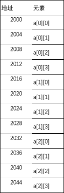

6.数组
===========================================================

假设要统计一列动车上有多少旅客,我们可以先统计每节车厢多少人,然后将每节车厢的人数相加,就是一列动车的全部人数。

假设动车有20节车厢,按照前面学习定义变量的方法,则需要定义20个int型变量存放每节车厢人数,勉强可以接受。如果一列动车有100节车厢则需要定义100个int型变量int carriage1,carriage2...carriage100,显然这种方式是不合适的。此外,这种方法不能准确描述数据之间的关联,这是一列动车不同车厢的人数的相同属性。

我们编写代码的初衷的方便的解决问题,使用定义很多变量的方法存放大量的数据,显然违背了我们编写代码的初衷。下面就要介绍C语言的另一个概念 ``数组`` ,用来存储大量类型相同的数据。

5.1.一维数组
-----------------------------------------------------------

数组是存储一类数据的集合,先需要指定数组的数据类型,然后指定数组的大小。如上面的例子,可以使用int关键字来定义数组,20节车厢因此数组的长度为20,所以可以定义int carriage[20];数组名的命名遵循标识符的命名规则,与变量的命名规则相同。

5.1.1.定义一维数组
~~~~~~~~~~~~~~~~~~~~~~~~~~~~~~~~~~~~~~~~~~~~~~~~~~~~~~~~~~~     

.. code-block:: c
   :caption: 定义一维数组的一般形式
   :linenos:

   数据类型 数组名[常量表达式];
   int a[10];

数组int a[10];

======    ======   ======    ======   ======    ======   ======    ======   ======   =======
a[0]      a[1]     a[2]      a[3]      a[4]      a[5]     a[6]      a[7]     a[8]     a[9]
======    ======   ======    ======   ======    ======   ======    ======   ======   =======

  
1. 数据类型表示数组中只能存放什么数据类型的数据,且存储的数据类型必须一致。
2. 数组名是标识符的一种,因此需要满足标识符的命名规则。
3. 定义数组是必须指定数组的长度,且固定长度,在定义时候要是确定的长度,不能使用可变的长度。
   

例如int a[10];数组a只能够存放整形数据,不能够存放浮点型数据。数组能够存储10个int的数据,分别是a[0],a[1],a[2],a[3],a[4],a[5],a[6],a[7],a[8],a[9],不包括a[10],[]内的0-9数字被 ``数组下标`` ,数组下标从0开始。数组在定义时候需要指定数组长度,如float score[20+18];是合法的。不能使用动态的数组长度,如int a[n];

5.1.2.引用一维数组
~~~~~~~~~~~~~~~~~~~~~~~~~~~~~~~~~~~~~~~~~~~~~~~~~~~~~~~~~~~

所谓引用一维数组,就是取出数组中各个元素的数值,且只能逐个引入不能整体引入。

.. code-block:: c
   :caption: 一维数组的引用
   :linenos:

   数组名[下标];
   int temp = a[5];

.. note::

   生活中使用计数都是从1开始,比如小区的25栋,就是从1开始的第25栋的楼。而数组的下标是从0开始的,比如a[5]就是数组的第6个数据。一个长度为10的数组的下标取值为0到9,数组的下标不包含数组的长度。

.. code-block:: c
   :caption: 一维数组的引用举例
   :linenos:

   /***************************************************************
   * @file       array_example1.c
   * @brief      计算语文、数学、英语的平均成绩
   * @author     单片机设计电子网
   * @version    
   * @date       2022年9月18日
   **************************************************************/

   #include <stdio.h>                  //预处理命令

   float score[3] = {98.6,77,66.5};    //定义float型数组,长度为3,并初始化为98.6,77,66.5,后面介绍
   float total = 0;

   int main() 
   {
      for(char i=0;i<3;i++)            //for语句循环3次
      {
          total = +score[i];
      }
      printf("%2.2f\n",total/3);       //i分别为0,1,2即数组的第一个、第二个、第三个值
      return 0;                        //函数出口,一般为0,程序出错返回1
   }

5.1.3.初始化一维数组
~~~~~~~~~~~~~~~~~~~~~~~~~~~~~~~~~~~~~~~~~~~~~~~~~~~~~~~~~~~

.. code-block:: c
   :caption: 一维数组的引用
   :linenos:

   int a[10] = {0,1,2,3,4,5,6,7,8,9};  //在定义时候对数组全部元素初始化。
   int a[10] = {0,1,2,3,4};            //在定义时候对数组部分元素初始化,未初始化部分元素全部自动初始化为0。
   int a[10] = {0};                    //组全部元素初始化为0。
   int a[] = {1,2,3,4,5};              //对数组全部初始化时候,由于数组元素个数等于数组长度,可以省略指定数组长度。
   int a[10];                          //如果没有对数组初始化,系统会自动初始化为0,字符型数组初始化为'\0',指针数组初始化为NULL空指针

1. 在定义时候对数组全部元素初始化。int a[10] = {0,1,2,3,4,5,6,7,8,9};
2. 在定义时候对数组部分元素初始化,未初始化部分元素全部自动初始化为0。int a[10] = {0,1,2,3,4};
3. 数组全部元素初始化为0。int a[10] = {0};
4. 对数组全部初始化时候,由于数组元素个数等于数组长度,可以省略指定数组长度。int a[] = {1,2,3,4,5};
5. 如果没有对数组初始化,系统会自动初始化为0,字符型数组初始化为'\0',指针数组初始化为NULL空指针。int a[10];

.. code-block:: c
   :caption: 一维数组使用举例
   :linenos:
   
   /***************************************************************
   * @file       array_example2.c
   * @brief      fibonacci数列
   * @author     单片机设计电子网
   * @version    
   * @date       2022年9月18日
   **************************************************************/

   #include <stdio.h>                    //预处理命令

   int main(void)
   {
       int i;
       int f[20] = {1,1};               //数组初始化,f[0]=1;f[1]=1;其余默认初始化为0
       for(i=2;i<20;i++)                //for语句,循环18次
       {
           f[i] = f[i-2] + f[i-1];      //从f[2]开始计算,f[2] = f[0] + f[1];
       }
       for(i=0;i<20;i++)               //for语句,循环20次,即打印20个数据
       {
           if(i%5==0)                  //每打印5个数据换一次行
           {
               printf("\n");           //打印转义字符'\n'即换行
           } 
           printf("%12d",f[i]);        //格式化输出,占12个字符的位置,防止数据挨在一块
       }
       printf("\n");                   //结尾处换行
       return 0;
   }

~~~~~~~~~~~~~~~~~~~~~~~~~~~~~~~~~~~~~~~~~~~~~~~~~~~~~~~~~~~

.. code-block:: c
   :caption: 一维数组使用举例
   :linenos:

   /***************************************************************
   * @file       array_example3.c
   * @brief      冒泡排序
   * @author     单片机设计电子网
   * @version    
   * @date       2022年9月18日
   **************************************************************/

   #include <stdio.h>

   int main() 
   {
      int temp;
      int arr[] = {22,34,3,32,82,55,89,50,37,5,64,35,9,70};
      int len = (int) sizeof(arr) / sizeof(*arr);
      
      for (int i = 0; i < len - 1; i++)
      {
         for (int j = 0; j < len - 1 - i; j++)
         {
            if (arr[j] > arr[j + 1]) 
            {
               temp = arr[j];
               arr[j] = arr[j + 1];
               arr[j + 1] = temp;
            }
         }
      }

      for (int i = 0; i < len; i++)
      {
         printf("%d ", arr[i]);
      }  
      return 0;
   }

~~~~~~~~~~~~~~~~~~~~~~~~~~~~~~~~~~~~~~~~~~~~~~~~~~~~~~~~~~~

5.1.4.一维数组的存储结构
~~~~~~~~~~~~~~~~~~~~~~~~~~~~~~~~~~~~~~~~~~~~~~~~~~~~~~~~~~~

5.2.二维数组
--------------------------

二维数组也被称为矩阵,一般形象的描述为行和列的方式。前面举例统计一列动车中乘客的数量,按照20节车厢,则定义int carriage[20];将下标0-19的20个元素全部相加即可得到这列动车全部的乘客人数。如果需要统计每天经过某个站台的动车全部乘客人数,假设每天有30列动车经过,每列动车有20个车厢,该如何计算呢？

按照一维数组的思路,可以定义30个一维数组int carriage1[20],carriage2[20]...carriage30[20];同样存在一维数组使用前的问题,需要定义30个变量,使计算变得繁琐。有没有一种简便的方法呢！这就引入二维数组的概念。

5.2.1.定义二维数组
~~~~~~~~~~~~~~~~~~~~~~~~~~~

.. code-block:: c
   :caption: 二维数组定义举例
   :linenos:
   
   数据类型 数组名[常量表达式][常量表达式];
   int a[3][4];            //定义一个int型二维数组a,包含12个元素。此二维数组是由包含3个元素的一维数组组成,而这个一维数组的元素又是一个一维数组。

二维数组也叫矩阵,那么二维数组在存储单元中是按照矩阵一样在存储单元中存储的吗？

其实二维数组是在存储单元中按照顺序存储的,比如int a[3][4];二维数组a中元素存储结构为:

======= ======= ======= ======= ======= ======= ======= ======= ======= ======= ======= =======
a[0][0] a[0][1] a[0][2] a[0][3] a[1][0] a[1][1] a[1][2] a[1][3] a[2][0] a[2][1] a[2][2] a[2][3]
======= ======= ======= ======= ======= ======= ======= ======= ======= ======= ======= =======

假设数组a在存储单元中存放的地址为2000字节开始,则有:

------------------------------------------

5.2.2.引用二维数组
~~~~~~~~~~~~~~~~~~~~~~~~~~~~~~~

和一维数组一样,只能一个一个的操作二维数组的各个元素,不能整体的操作数组。假设一个小区有25栋楼,每栋楼有30家住户。统计该小区的全部人口数,则可以定义数组int people[25][30];二维数组可以理解为特殊的一维数组,只不过这个特殊的一维数组的元素又是一个一维数组。如本例中小区25栋楼为一个一维数组,这个一维数组元素中又包含一栋30户居民这个一维数组。本例也可写为int people[30][25];理解为小区有一栋楼有30户居民,整个小区有25个这样的楼。

.. code-block:: c
   :caption: 引用二维数组
   :linenos:
   
   /***************************************************************
   * @brief      引用二维数组
   * @author     单片机设计电子网
   **************************************************************/
   #include <stdio.h>
   
   int people[25][30];                                   //定义一个二维数组
   int people_count = 0;                                 //定义int型变量people_count,存放全小区的人数

   int main(void)
   {
      for(int i=0;i<25;i++)                              //第一层for语句嵌套,执行25次
      {
         for(int j=0;j<30;j++)                           //第二层for语句嵌套,执行30次,执行顺序是第一层for语句执行1次,第二层for语句执行30次
         {
            people[i][j] = 3 + j%3;                      //给数组元素赋值,变量j对3取余结果为0、1、2,则二维数组赋值范围为3、4、5
         }
      }

      for(int i=0;i<25;i++)                              //第一层for语句嵌套,执行25次
      {
         for(int j=0;j<30;j++)                           //第二层for语句嵌套,执行30次,执行顺序是第一层for语句执行1次,第二层for语句执行30次
         {
            people_count = people_count + people[i][j];  //初始people_count=0,加上第一户居民然后加上第二户居民,依次累加。得到全小区的居民人数。
            //people_count += people[i][j];              //两种写法均可
         }
      }

      printf("该小区的全部居民人数为:%d\n",people_count);

       return 0;
   }

.. code-block:: c
   :caption: 二维数组的引用一般形式
   :linenos:
   
   数组名[下标][下标];

5.2.3.初始化二维数组
~~~~~~~~~~~~~~~~~~~~~~~~~~~

.. code-block:: c
   :caption: 数组的引用
   :linenos:

   int a[3][4] = {{1,2,3,4},{5,6,7,8},{9,10,11,12}};        //分行给二维数组初始化
   int a[3][4] = {1,2,3,4,5,6,7,8,9,10,11,12};              //与上面效果一直,但是这个方法容易遗漏
   int a[3][4] = {{0},{1,2},{1,2,3}};                       //元素部分赋值,其余自动赋值为0
   int a[][4]  = {1,2,3,4,5,6,7,8,9,10,11,12};              //全部赋值情况下,省略一维数组长度
   int a[3][4];                                             //如果没有对数组初始化,系统会自动初始化为0,字符型数组初始化为'\0',指针数组初始化为NULL空指针

1. 分行给二维数组初始化。int a[3][4] = {{1,2,3,4},{5,6,7,8},{9,10,11,12}};
2. 全部初始化。int a[3][4] = {1,2,3,4,5,6,7,8,9,10,11,12};
3. 元素部分赋值,其余自动赋值为0。int a[3][4] = {{0},{1,2},{1,2,3}};
4. 全部赋值情况下,省略一维数组长度。int a[][4]  = {1,2,3,4,5,6,7,8,9,10,11,12}; 
5. 如果没有对数组初始化,系统会自动初始化为0,字符型数组初始化为'\0',指针数组初始化为NULL空指针。int a[3][4];

5.3.字符数组
---------------------------

5.3.1.定义字符数组
~~~~~~~~~~~~~~~~~~~~~~~~~~~

5.3.2.引用字符数组
~~~~~~~~~~~~~~~~~~~~~~~~~~~

5.3.3.初始化字符数组
~~~~~~~~~~~~~~~~~~~~~~~~~~~

5.4.字符串处理函数
----------------------------

   C语言中提供一系列的字符串处理函数,通过这些函数可以方便的对字符串进行切片、连接的等操作。

5.4.1.put和get函数
~~~~~~~~~~~~~~~~~~~~~~~~

   put()函数可以输出字符串,例如char str[]={"hello,world!"};put(str);向屏幕输出字符串hello,world!,但是可以使用printf("%s",str);代替,因此使用put()函数就不多。

   get()函数可以获取输入的字符串,char str[20] = "\0";gets(str);printf("%s\n", str);get()函数将键盘输入的字符串存储在str数组中,然后通过printf()函数打印。同样get()函数也可以通过scanf("%s",&str)来代替。

5.4.2.获取字符串长度
~~~~~~~~~~~~~~~~~~~~~~~~~

   strlen()函数是用来计算字符串长度的函数,直到字符串中第一个'\n'结束。例如char str[10]={"Apple"};printf("%d",strlen(str));输出为5,在前面字符数组的部分初始化已经知道,未被初始化部分填充'\n'。所以输出5。改写为char str[10]={"Apple"};str[3]='\n';printf("%d",strlen(str));输出的结果是3,只计算了前三位的长度,后面的全部被忽略。

   sizeof是一个关键字,其作用是返回一个对象或类型所占的内存字节数。
   sizeof有三种语法形式:
   1.sizeof (object);     //sizeof (对象)
   2.sizeof object;       //sizeof 对象
   3.sizeof (type_name);  //sizeof (类型)

   1.基本数据类型的sizeof,计算数据类型sizeof(int)的结果是4,计算变量int a=5;sizeof(a);结果也是4,也可以写作int a=5;sizeof a;
   2.结构体的sizeof,struct S1{char a;int b;};sizeof(S1); 值为8,字节对齐,在char之后会填充3个字节。  
   3.联合体的sizeof,union u{int a;float b;double c;char d;};sizeof(u); //值为8  
   4.数组的sizeof
   5.指针的sizeof
   6.函数的sizeof

   strlen与sizeof的区别

5.4.3.字符串连接函数
~~~~~~~~~~~~~~~~~~~~~~~~~~

   strlen(str1,str2);strcat()函数用来将两个函数连接起来,将字符串2连接在字符串1的后面。
   char str1[20]={"hello,"};char str2[]={"world!"};printf("%s",strcat(str1,str2));

5.4.4.字符串拷贝函数
~~~~~~~~~~~~~~~~~~~~~~~~~

   strcpy()函数的一般形式是strcpy(数字符数组,字符串),将字符串的值复制到字符数组中,需要注意以下几点:
   1.第一个参数字符数组长度必须足够大,能够完全容纳下第二个参数字符串。
   2.第一个参数字符数组必须写成数组的形式,第二个参数字符串也可以是字符数组或者字符串常量。
   3.第二个参数字符串及其后的'\0'只会覆盖第一个参数字符数组中的前字符串长度加1的长度,其余保持原来内容。
   4.不可以使用赋值语句来拷贝字符常量或者字符数组给一个字符数组。
   strncpy()函数一般形式是strncpy(字符数组,字符串,n),将字符串中的前n位拷贝到字符数组中。

5.4.5.字符串比较函数
~~~~~~~~~~~~~~~~~~~~~~~~~

   strcmp()函数的一般形式是strcmp(字符串1,字符串2),比较的规则是:将字符串自左到右的字符逐个比较ASCLL码的值,直到出现不同或者'\n'。比较第一个不同位置的ASCLL值,ASCLL大则字符串大。由ASCLL码规律可知,排在26字母靠后的ASCLL值大,小写字母ASCLL大于大写字母ASCLL。比较结果:
   1.如果字符串1等于字符串2,函数返回值为0。
   2.如果字符串1大于字符串2,函数返回值为正整数。
   3.如果字符串1小于字符串2,函数返回为负整数。

5.4.6.其他字符串相关函数
~~~~~~~~~~~~~~~~~~~~~~~~~~~~~