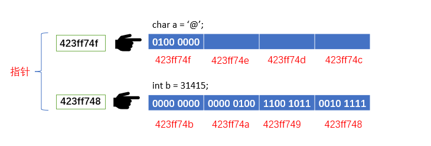
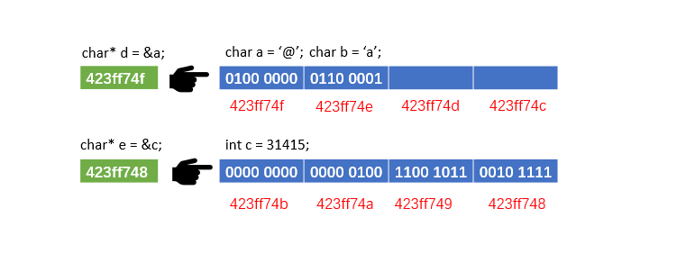
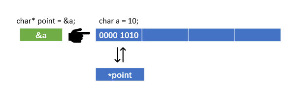
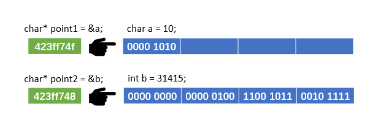
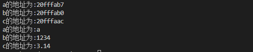
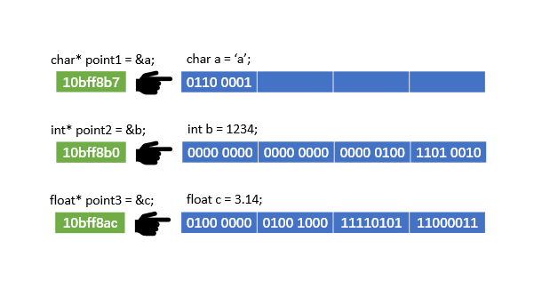
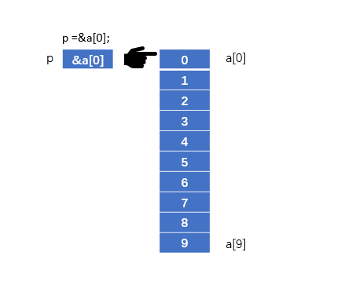
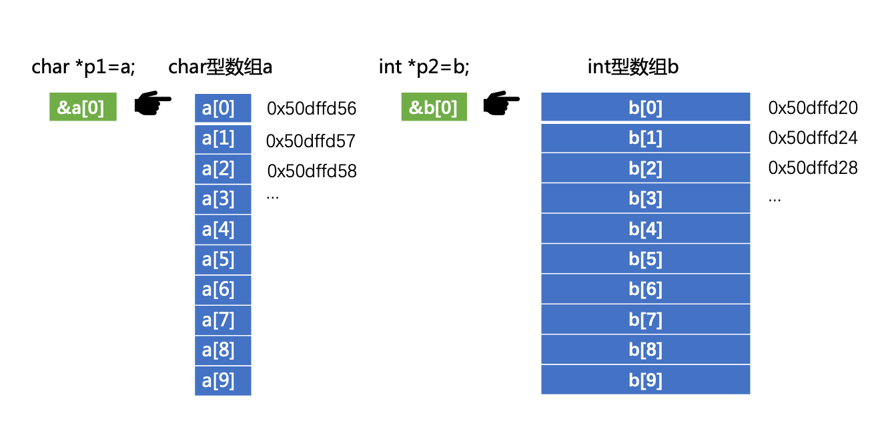
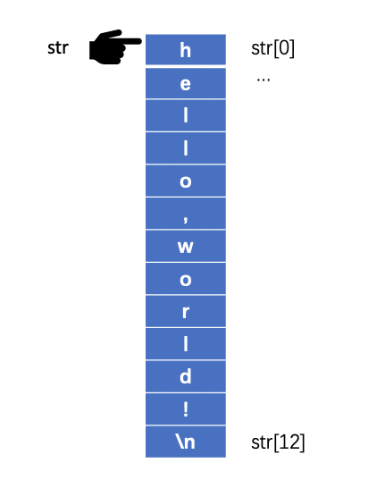

7.指针
=================================

``指针是C语言中最重要的概念`` ,可以说精通了指针就等于精通了C语言。指针理解起来相对复杂,这也是C语言难学的原因。

6.1.什么是指针？
--------------------------

在定义变量的时候编译系统会为变量分配内存单元,如int型变量分配4个字节内存单元,float型变量分配4个字节内存单元,char型变量分配1个字节内存单元。 

**内存中的每个字节的内存单元都有一个独一无二的编号** ,这个编号也被称为 ``地址`` 。通过地址就能访问变量,也可以说地址指向该变量单元。

例如在网上买东西的时候需要填写地址,通常这个地址是全国唯一的,快递员根据这个地址就能够将东西送到收货人的手上。我们就可以说填写的地址 ``指向`` 这个收货人。C语言中形象的将地址说成指针, ``地址就等于指针`` 。

------------------------------------------

在内存中变量的地址是以16进制数表示的,操作系统一般有32位系统和64位系统,这里的位数是指操作系统的寻址空间,32位系统的最大寻址空间为2\ :sup:`32`\ (4字节数据)约为4G,所以32位操作系统的电脑最大只能插4GB的内存条,而64位操作系统的最大寻址空间位2\ :sup:`64`\(8字节数据)约为1800万TB,现在主流的操作系统都是64位,所以下面以64位的CPU、64位的操作系统、64位的编译器来描述指针。

编译系统每次为变量分配的地址不同,如下程序每次编译的输出结果都不一样。我们知道数据类型char修饰的变量占用1个字节,取值范围是-128到127,显然下面的指针p1取值范围以及长度与char修饰的变量不吻合。前面说到只要在64位的CPU、64位的操作系统、64位的编译器情况下指针的长度都是8个字节,那既然所以指针的长度都是确定的8个字节,为什么还要在指针变量前面还用char、int、float等来修饰呢？这个问题将在后面的学习介绍。

.. code-block:: c
   :caption: 指针的长度
   :linenos:

   #include <stdio.h>

   int main(void)
   {
      char a='*';
      int b=123;
      float c=3.14;

      char *p1=&a;   
      int *p2=&b;  
      float *p3=&c;  

      printf("指针p1的值:%p\n",p1);
      printf("指针p1的长度:%lu\n",sizeof(p1));
      printf("指针p2的值:%p\n",p2);
      printf("指针p2的长度:%lu\n",sizeof(p2));
      printf("指针p3的值:%p\n",p3);
      printf("指针p3的长度:%lu\n",sizeof(p3));

      return 0;
   }

输出如下::

   指针p1的值:0x16b29f33b
   指针p1的长度:8
   指针p2的值:0x16b29f334
   指针p2的长度:8
   指针p3的值:0x16b29f330
   指针p3的长度:8

6.2.指针变量
------------------------

定义一个变量用来存放另外一个变量的地址,存放另外一个变量地址的变量称为 ``指针变量`` ,变量的地址也称为该变量的指针。指针变量的值就是地址,这个地址指向另外一个变量。

---------------------------------------

前面已经知道定义一个变量用来存放另外一个变量的指针,则称存放指针的变量为 ``指针变量`` 。

.. code-block:: c
   :caption: 指针变量
   :linenos:

   #include <stdio.h>

   int main(void)
   {
      int a=10;                                  //定义int型变量,初始值为10
      int *point;                                //定义int型指针变量,*是指针变量的标志
      point=&a;                                  //通过取址符&来获取变量a的地址,再将a的地址赋值给指针变量,即指针变量point指向变量a
      printf("a的值为:%d\n",a);                   //通过直接取值的方式输出a的值
      printf("a的值为:%d\n",*point);              //通过间接取值的方式输出a的值
      return 0;
   }

- 定义了int型指针变量point,指针变量point并没有指向任何变量。通过取址符&获取变量a的地址,再将a的地址赋值给指针变量point,此时指针变量point就指向变量a,当然也可以简化为 ``int *point = &a;`` 。
- ``int *point;`` 中的 ``*`` 表示该变量是指针变量,而 ``printf("a的值为:%d\n",*point);`` 中的 ``*`` 表示指针变量point指向的变量a的值。

---------------------------------------

.. note::
   ``&取址符`` :获取变量的地址。

   ``*取值符`` :获取指针变量所指向的变量的值。同时也可以用作定义指针变量。
  

6.2.1.如何定义指针变量
~~~~~~~~~~~~~~~~~~~~~~~~~~

**数据类型 \*指针变量名;** ``int *point;`` 

定义指针变量必须指定指针变量的数据类型,此数据类型表示该指针变量可以指向哪种数据类型的变量。如int型指针变量可以指向int型变量,而不能指向float型变量。除了上面的写法可以定义指针变量,使用 ``int* point2;`` 也是合法的。即将 ``*`` int型指针变量可以叫做 ``int指针`` ,同理float型指针变量可以叫做 ``float指针`` 。

---------------------------------------

定义int指针就限定了只能够存放int型变量的地址。同理定义float指针只能够存放float型变量的地址。由此可以总结出一个变量的指针的两层含义:一是指针变量存储该变量的地址,二是指向变量的数据类型。

1.指针变量前面的*表示该变量是指针型变量。如int \*point;表示point是指针变量,变量名为point,而不是*point是指针变量。
2.在定义指针变量的时候必须指定数据类型。

.. code-block:: c
   :caption: 数组的引用
   :linenos:

   #include <stdio.h>

   int main(void)
   {
      char a='a';                              
      int b=123;                                
      float c=3.14;                              

      char *point1=&a;                               //定义char指针
      int *point2=&b;                                //定义int指针
      float *point3=&c;                              //定义float指针

      printf("a的地址为:%x\n",point1);                //打印变量a的地址
      printf("b的地址为:%x\n",point2);                //打印变量b的地址
      printf("c的地址为:%x\n",point3);                //打印变量c的地址

      printf("a的地址为:%c\n",*point1);               //打印变量a的值
      printf("b的地址为:%d\n",*point2);               //打印变量b的值
      printf("c的地址为:%1.2f\n",*point3);            //打印变量c的值
      return 0;
   }

---------------------------------------

如上程序,编译系统是按照 ``从高到低的内存分配规则``,先定义变量a分配地址0x20fffab7,然后定义变量b分配地址0x20fffab0,最后定义变量c分配地址0x20fffaac。

---------------------------------------

6.2.2.如何引用指针变量
~~~~~~~~~~~~~~~~~~~~~~~~~~~

   1.给指针变量赋值,point = &a;
   2.引用指针变量指向的变量,如果执行point = &a;则可以通过printf("%d",*p);来输出变量a的值,也可以通过*point = 10;的方式将变量a赋值为10。
   3.引用指针变量的值,如果执行point = &a;指针变量的值就是变量a的地址。

   & 取值符,&a表示获取变量a的地址。
   * 指针运算符,在定义变量的时候表示这个变量是指针变量,在引用指针变量时表示指针变量所指向的变量的值。

6.2.3.指针变量作为函数参数
~~~~~~~~~~~~~~~~~~~~~~~~~~~~~~

   函数的参数中不单可以是整形、浮点型、字符型,还可以是指针类型。它可以将一个变量的指针传递到函数中。

   思考:我们已经可以将变量的值传递到函数中,为什么还要传递变量的指针呢？

   示例:输入两个整数,比较大小后输出。

.. code-block:: c
   :caption: 数组的引用
   :linenos:

   #include <stdio.h>

   void swap(int *point1,int *point2);

   int main(void)
   {
       int a,b;
       int *point3,*point4;
       
       printf("请输入两个整数:");
       scanf("%d,%d",&a,&b);
       
       point3 = &a;
       point4 = &b;
       
       if(a < b)
       {
           swap(point3,point4); 
       }
       printf("max=%d,min=%d",a,b);
       return 0;
   }

   void swap(int *point1,int *point2)
   {
       int temp;
       
       temp = *point1;
       *point1 = *point2;
       *point2 = temp;
   }

分析:point3 = &a;point4 = &b;将变量a和b的地址赋给指针变量,当a小于b时候通过swap()函数交换了变量a和b的地址,所以a输出原b的值,b输出原a的值。

思考:如果上面的示例改为如下写法结果又是什么呢。

.. code-block:: c
   :caption: 数组的引用
   :linenos:

   #include <stdio.h>

   void swap(int num1,int num2);

   int main(void)
   {
       int a,b;
       
       printf("请输入两个整数:");
       scanf("%d,%d",&a,&b);
       
       if(a < b)
       {
           swap(a,b); 
       }
       printf("max=%d,min=%d",a,b);
       return 0;
   }

   void swap(int num1,int num2)
   {
       int temp;
       
       temp = num1;
       num1 = num2;
       num2 = temp;
   }

分析:当a小于b时将变量a和b的值分别赋给函数的参数num1和num1,在函数内进行了变量num1和num2值的交换,并没要交换变量a和b的值,因此上面代码不能实现比较大小的功能。

6.3.通过指针引用数组
-----------------------------

6.3.1.数组元素的指针
~~~~~~~~~~~~~~~~~~~~~~~~~~~~~~~~~

每个字节的内存单元都拥有独一无二的地址,定义数组时编译系统会为数组的各个元素分配内存单元,可以通过地址找到该数组元素,所以 ``数组元素的指针就是数组元素的地址`` 。

.. code-block:: c
   :caption: 定义并初始化数组的指针变量
   :linenos:

   int a[10] = {1,2,3,4,5,6,7,8,9,10};
   int *p;
   p = &a[0];

定义一个包含10个元素的数组,并将指针变量p指向数组a的第一个元素a[0],还可以在指针变量定义的时候初始化指针变量 ``int *p=&a[0];``  , ``数组名a代表数组第一个元素的地址`` 所以上面还可以写作 ``int *p=a;`` ,下面三种写法是等效的。

.. code-block:: c
   :caption: 三种定义以及初始化数组指针变量的方式
   :linenos:

   int a[10] = {1,2,3,4,5,6,7,8,9,10};

   /*1.定义指针变量p,然后将指针变量指向数组的第一个元素a[0]*/
   int *p;
   p = &a[0];

   /*2.定义指针变量p,同时将指针变量指向数组的第一个元素a[0]*/
   int *p=&a[0];

   /*3.定义指针变量p,同时用数组名初始化该指针变量*/
   int *p=a;

---------------------------------------

6.3.2.通过指针引用数组元素
~~~~~~~~~~~~~~~~~~~~~~~~~~~~~~~~~~~~~

当指针指向数组元素的时候,指针可以进行加减运算,例如指针变量p指向数组元素a[0],则p+1指向数组的a[1]元素。 ``p+1指向同一数组的下一个元素,p-1指向同一数组的上一个元素``。

.. code-block:: c
   :caption: 通过指针引用数组
   :linenos:

   #include <stdio.h>

   int main(void)
   {
      char a[10]={1,2,3,4,5,6,7,8,9,10};     
      int b[10]={1,2,3,4,5,6,7,8,9,10};        

      char *p1=a;                             
      int *p2=b;                                

      printf("a[0]的地址为:0x%x\n",p1);                  //打印变量a的地址
      printf("a[1]的地址为:0x%x\n",p1+1);                //打印变量b的地址
      printf("a[2]的地址为:0x%x\n",p1+2);                //打印变量b的地址

      printf("b[0]的地址为:0x%x\n",p2);                  //打印变量a的地址
      printf("b[1]的地址为:0x%x\n",p2+1);                //打印变量b的地址
      printf("b[2]的地址为:0x%x\n",p2+2);                //打印变量b的地址
      return 0;
   }

输出如下::

   a[0]的地址为:0x50dffd56 
   a[1]的地址为:0x50dffd57 
   a[2]的地址为:0x50dffd58 
   b[0]的地址为:0x50dffd20 
   b[1]的地址为:0x50dffd24 
   b[2]的地址为:0x50dffd28 

通过打印可以看出通过p+1指向数组的下一个元素,不是简单的指向下一个字节,而是加上数组元素占用的字节数。例如数组元素是char占用一个字节,则p1指向的数组a[0]的地址是0x50dffd56,而p1+1指向的数组a[1]的地址是0x50dffd57,p1+2指向数组a[2]的地址是0x50dffd58,每个元素地址相差1字节,float型数组b的元素占用4个字节,p2与p2+1的地址相差4个字节。

---------------------------------------

有三种方法可以引用数组的值,分别是下标法、数组名计算数组元素地址、指针变量指向数组元素。

.. code-block:: c
   :caption: 通过指针引用数组
   :linenos:

   #include <stdio.h>
   int main()
   {
      int a[10]={1,2,3,4,5,6,7,8,9,10};
      for(int i=0;i<10;i++)
      {
         printf("%d ",a[i]);
      }
      return 0;
   }

.. code-block:: c
   :caption: 通过指针引用数组
   :linenos:

   #include <stdio.h>
   int main()
   {
      int a[10]={1,2,3,4,5,6,7,8,9,10};
      for(int i=0;i<10;i++)
      {
         printf("%d ",*(a+i));
      }
      return 0;
   }

.. code-block:: c
   :caption: 通过指针引用数组
   :linenos:

   #include <stdio.h>
   int main()
   {
      int a[10]={1,2,3,4,5,6,7,8,9,10};
      int *p=&a[];
      for(int i=0;i<10;i++)
      {
         printf("%d ",*(p+i));
      }
      return 0;
   }

6.3.3.数组名作为函数参数
~~~~~~~~~~~~~~~~~~~~~~~~~~~~~~~~~~~~~

首先看一个数组元素的数值传递的示例

.. code-block:: c
   :caption: 数组元素的数值传递
   :linenos:

   #include <stdio.h>

   void swap(int a,int b);

   int main()
   {
      int array[10]={1,2,3,4,5,6,7,8,9,10};
      swap(array[0],array[1]);
      printf("array[0]的值为:%d\n",array[0]);
      printf("array[1]的值为:%d\n",array[1]);
      return 0;
   }

   void swap(int a,int b)
   {
      int temp = 0;
      temp =a;
      a=b;
      b=temp; 
      printf("a的值为:%d\n",a);
      printf("b的值为:%d\n",b);
   }

输出如下::

   a的值为:2
   b的值为:1
   array[0]的值为:1
   array[1]的值为:2

初始数组array[0]的的值为1,array[1]的值为2,swap()函数中将array[0]传递给形参a,将array[1]传递给形参b,在swap()函数中交换形参a和b的数值,所以输出a的值为2,b的值为1。由于传递的是数值swap()函数内部的值交换并未改变实参,所以array[0]和array[1]并无发生改变。

.. code-block:: c
   :caption: 数组名作为函数参数的地址传递
   :linenos:

   #include <stdio.h>

   void swap(int a[]);

   int main()
   {
      int array[10]={1,2,3,4,5,6,7,8,9,10};

      swap(array);

      printf("array[0]的值为:%d\n",array[0]);
      printf("array[1]的值为:%d\n",array[1]);
      return 0;
   }

   void swap(int a[])
   {
      int temp = 0;
      temp =a[0];
      a[0]=a[1];
      a[1]=temp; 
      printf("swap()函数内array[0]的值为:%d\n",a[0]);
      printf("swap()函数内array[1]的值为:%d\n",a[1]);
   }

swap()函数的实参是数组名array即数组第一个元素的地址,swap()函数中交换了a[0]和a[1]的数值,等同于交换了array[0]和array[1]的数值。

6.4.通过指针引用字符串
-----------------------------

6.4.1.引用字符串的两种方法
~~~~~~~~~~~~~~~~~~~~~~~~~~~~~~~~~~~

.. code-block:: c
   :caption: 数组名作为函数参数的地址传递
   :linenos:

   #include <stdio.h>

   int main()
   {
      char str[]={"hello,world!"};

      printf("%s\n",str);
      printf("%c\n",str[6]);
      return 0;
   }

---------------------------------------

.. code-block:: c
   :caption: 数组名作为函数参数的地址传递
   :linenos:

   #include <stdio.h>

   int main()
   {
      char *str="hello,world!";

      printf("%s\n",str);
      printf("%c\n",str[6]);

      return 0;
   }

.. code-block:: c
   :caption: 数组名作为函数参数的地址传递
   :linenos:

   #include <stdio.h>

   int main()
   {
      char *str="hello,world!";

      printf("%s\n",str);
      printf("%c\n",str[6]);

      return 0;
   }

程序中定义指针变量str,并用字符串常量"hello,world!"初始化这个指针变量。编译系统实际上是按照字符数组的方式来处理这个字符常量,只不过没有为这个特殊字符数组分配名字,无法通过数组名的方式访问该字符串常量。

字符指针变量str初始化是将字符串的第一个元素的地址赋值给指针变量str,而不是将字符串常量"hello,world!"赋值给指针变量str。

6.5.指向函数的指针
---------------------------

6.6.返回指针值的函数
---------------------------

6.7.指针数组和多重指针
-------------------------------

6.8.动态内存分配与指向它的指针变量
--------------------------------------------

