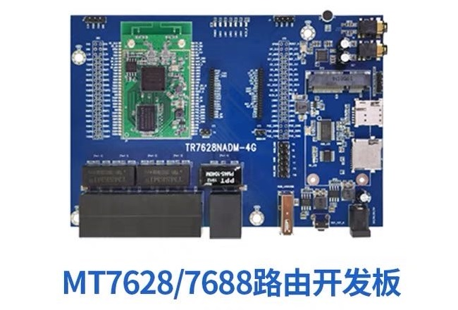

01.OpenWrt-教程介绍
===========================================================

1.1 如何学好OpenWrt
-----------------------------------------------------------

OpenWrt究竟应该怎么学,这是我一直在思考的问题!

谈到OpenWrt有相关软硬件知识的人会想到路由器,路由器是OpenWrt系统最主要的使用场景.OpenWrt是基于Linux系统构建起来的,所以其他Linux系统能够做的事情OpenWrt都是可以做到.

OpenWrt项目开始于2004年,截止到最新openwrt-22.03版本已经有18个年头,经过这么多年的发展OpenWrt已经高度的集成,扩展性也非常的高,一般的开发者甚至可以不编译OpenWrt源码就可以定制自己的OpenWrt固件,这都得益于OpenWrt的OPKG包管理机制,OpenWrt项目在开始的时候就因整合了各种软件而名声大躁,后续的OpenWrt版本也不断的集成常用的软件.

所以入门OpenWrt智能路由开发过程: **在已有的OpenWrt开发板和固件基础上按部就班的验证板子的全部功能,这些功能都可以通过在线安装的方式实现,对OpenWrt有最基本的了解** .当然这对于初学者也绝非易事,需要知道如何连接到板子的shell,如何给板子升级固件,如何使用命令安装软件,如何使用vi编辑器编写配置文件等,基本的网络知识也是必不可少.这样由 ``毛坯房``经过自己的调试开发逐渐的变为 ``精装房``,这个过程也就是OpenWrt学习的过程.教程 ``一起学OpenWrt(基础篇)定位是OpenWrt入门`` ,不需要编译代码,玩转板子上的功能即可.

如果止步于此只会使用已有的固件,那么也只能算入门OpenWrt,想要精通OpenWrt开发,编译源码是必然要走的路.这将在后续的进阶教程中介绍到.

.. important::

   对于入门阶段,需要 ``效率`` 和 ``熟练`` ,效率是作为入门学习不能花太多的时间,主要时间应该在后续的进阶基于源码开发中,也不要给自己 ``加戏`` 搞些需要花很多时间或者难度较大可问题,更不要为了省钱使用一些不了解且没有任何资料的开发板,教程使用的开发板在淘宝100元左右,根据自己实际情况选购,快速跑通入门获得成就感,不然很可能半途而废. 熟练是入门教程就是使用板子功能,所以需要熟练的使用即可,这些操作在后续的进阶开发中也会使用到,有的操作需要自己实际使用后才能够理解深刻.建议对于初学者在一周内完成学习,有一定的经验学习在一天内完成学习.
   

1.2 教程内容
-----------------------------------------------------------

   01.OpenWrt-写在前面---------------------------教程介绍
   02.OpenWrt-进入开发板系统---------------------进入板子shell,可以输入命令
   03.OpenWrt-系统固件烧录-----------------------介绍tftp、sysupgrade、界面等几种烧录固件方式
   04.OpenWrt-连接有线网络-----------------------通过网线是板子连接到网络
   05.OpenWrt-烧录mac地址------------------------烧录mac地址,使板子的ip地址固定
   06.OpenWrt-系统定制---------------------------系统定制,修改主机名称、密码、banner等
   07.OpenWrt-luCI界面---------------------------使用路由后台管理界面
   08.OpenWrt-连接wifi网络-----------------------通过wifi连接网络和释放热点
   09.OpenWrt-防火墙-----------------------------使用路由的防火墙和防火墙的配置
   10.OpenWrt-flash分区结构----------------------flash存储的介绍
   11.OpenWrt-uci命令接口------------------------uci配置命令
   12.OpenWrt-OPKG包管理-------------------------OpenWrt“应用商店”使用
   13.OpenWrt-基本外设---------------------------串口、i2c等基本硬件外设的使用
   14.OpenWrt-串口透传---------------------------网络转串口用于远程调试其他设备
   15.OpenWrt-U盘和TF卡存储----------------------挂载U盘和TF卡
   16.OpenWrt-rootfs扩容------------------------使用U盘和TF卡对flash扩容
   17.OpenWrt-搭建nas文件服务器------------------搭建一个nas文件服务器
   18.OpenWrt-连接LTE网络------------------------配置LTE连接网络
   19.OpenWrt-LTE网络wifi热点--------------------配置LTE释放热点,4G路由

1.3 需要准备的材料
-----------------------------------------------------------

1. 电脑,教程使用windows系统
2. 路由器(家用路由器即可)和网线,开发OpenWrt路由前提现有一个路由器.
3. OpenWrt开发板(mt7628an芯片)和电源适配器
4. 串口线(USB转串口工具)
5. TF卡或U盘
6. EC20 LTE模块(可选),4G热点实验.

