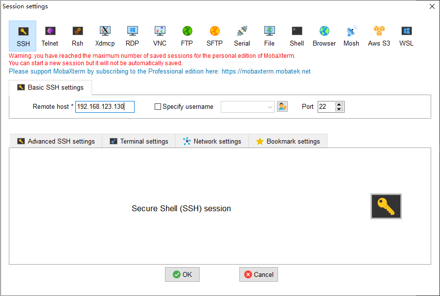

03.OpenWrt-进入系统执行命令
===========================================================

进入系统就是连接到系统shell,可是输入命令.说到shell第一个想到windows系统的PowerShell,在windows系统上多使用图形界面的方式进行与系统交互,毕竟windows的精髓就是图形界面,很少使用PowerShell命令.其实PowerShell的功能也非常强大,有时候记住一些常用命令可以极大的提高工作效率.

3.1 OpenWrt的shell
-----------------------------------------------------------

OpenWrt系统虽然有WEB界面,但是没有像手机或者电脑的界面使用那么方便,即使用界面操作,在安装软件时还是需要输入opkg包管理器相关命令.所以在使用OpenWrt系统时一般都使用shell命令的方式与系统交互,所谓进入开发板系统就是通过什么方式连接到板子的shell,使用户能够 ``输入``命令到系统,同时能够接收系统 ``输出``的信息.

.. figure:: ../media/PowerShell.png
   :alt: PowerShell界面
   :align: center

------

3.2 通过串口连接到OpenWrt开发板shell
-----------------------------------------------------------

使用 ``usb转串口线`` 连接到OpenWrt开发板的串口,通过串口的方式进入系统,这是嵌入式软件调试最常使用的一种方法.这种方法不能够发送或者接收文件,需要通过U盘或TF卡来拷贝.

------

1. 安装usb转串口工具驱动,在 ``设备管理器`` (快捷键win+R,devmgmt.msc)可以查看到串口号说明安装成功. 
2. 将串口线连接到OpenWrt开发板, ``串口线Tx接板子Rx,串口线Rx接板子Tx`` (串口线的反接原则).
3. shell终端软件推荐使用 ``mobaxterm``,当然可以使用任意一款自己喜欢的串口助手软件,在终端中选择串口线的 ``端口号``并设置 ``波特率57600`` .

------

进入OpenWrt开发板的shell后可以看到串口输出日志.

3.3 通过SSH连接到OpenWrt开发板
-----------------------------------------------------------

OpenSSH是一款开源的软件,可以实现shell的远程连接,还可以实现文件的收发.就像 ``远程操控`` OpenWrt一样.需要OpenWrt开发板安装了OpenSSH服务端,这种方法多用于没有串口线的情况.

3.3.1 获取板子的ip地址
~~~~~~~~~~~~~~~~~~~~~~~~~~~~~~~~~~~~~~~~~~~~~~~~~~~~~~~~~~~

通过SSH连接OpenWrt开发板的shell需要知道板子的ip地址,有如下几种方式可以获取板子的ip地址.

1. 串口方式进入系统,然后使用ifconfig命令获取板子ip.
3. 进入板子所连接的路由器管理界面,查看板子的ip地址.
3. 通过 ``Advanced IP Scanner``软件扫描和主机在同一个局域网下的板子ip地址.

3.3.1 安装OpenSSH软件
~~~~~~~~~~~~~~~~~~~~~~~~~~~~~~~~~~~~~~~~~~~~~~~~~~~~~~~~~~~

板子默认已经安装了OpenSSH,不需要手动安装,可以通过ssh命令来确认是否已经安装OpenSSH.这里使用OPKG包管理工具来安装,在后面会介绍到.如果固件中没有集成则需要通过串口的方式进入板子的shell来安装.

OpenSSH分为客户端和服务端,这时板子是作为SSH服务端,而 ``mobaxterm``是作为SSH客户端,而在串口方式进入shell时mobaxterm是作为串口助手软件,同一个软件不同功能.

.. prompt:: bash

   pip install tox

.. code-block:: shell
   :caption: 安装OpenSSH
   :linenos:

   opkg update
   opkg install openssh-server

.. code-block:: console
   :caption: 安装OpenSSH
   :linenos:

   root@Togetek:~# ssh -h
   Dropbear SSH client v2015.67 https://matt.ucc.asn.au/dropbear/dropbear.html
   Usage: ssh [options] [user@]host[/port] [command]
   -p <remoteport>
   -l <username>
   -t    Allocate a pty
   -T    Don't allocate a pty
   -N    Don't run a remote command
   -f    Run in background after auth
   -y    Always accept remote host key if unknown
   -y -y Don't perform any remote host key checking (caution)
   -s    Request a subsystem (use by external sftp)
   -i <identityfile>   (multiple allowed, default ~/.ssh/id_dropbear)
   -A    Enable agent auth forwarding
   -L <[listenaddress:]listenport:remotehost:remoteport> Local port forwarding
   -g    Allow remote hosts to connect to forwarded ports
   -R <[listenaddress:]listenport:remotehost:remoteport> Remote port forwarding
   -W <receive_window_buffer> (default 24576, larger may be faster, max 1MB)
   -K <keepalive>  (0 is never, default 0)
   -I <idle_timeout>  (0 is never, default 0)
   -J <proxy_program> Use program pipe rather than TCP connection
   -c <cipher list> Specify preferred ciphers ('-c help' to list options)
   -m <MAC list> Specify preferred MACs for packet verification (or '-m help')
   -V    Version

------

登录账号是 ``root``,没有密码(如果有admin).

