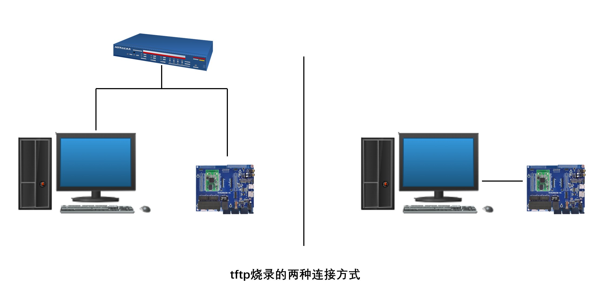
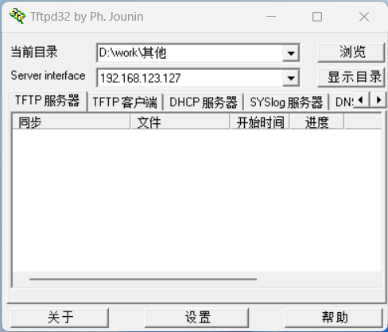
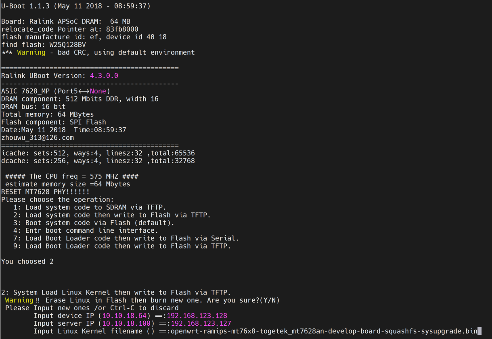

04.OpenWrt-系统固件烧录
===========================================================

4.1 tft软件烧录
-----------------------------------------------------------

tftp是运行在windows的软件,是将windows主机作为服务端,OpenWrt开发板作为客户端,通过tftp协议将数据发送到开发板进行数据升级.

4.1.1 tftp升级的连接方式
~~~~~~~~~~~~~~~~~~~~~~~~~~~~~~~~~~~~~~~~~~~~~~~~~~~~~~~~~~~

------

tftp烧录有两种连接方式:

1. windows主机通过有线或者无线的方式连接到路由器,OpenWrt开发板通过有线连接到路由器,也是最方便的方式.
2. OpenWrt开发板通过有线的方式直接连接到windows主机的网口.

4.1.2 tftp软件设置
~~~~~~~~~~~~~~~~~~~~~~~~~~~~~~~~~~~~~~~~~~~~~~~~~~~~~~~~~~~

------

1. 打开软件后, ``浏览`` 选择固件所在的目录.
2. 在 ``Server interface`` 中选择本机的ip地址.

4.1.3 进入tftp升级固件模式
~~~~~~~~~~~~~~~~~~~~~~~~~~~~~~~~~~~~~~~~~~~~~~~~~~~~~~~~~~~

在OpenWrt开发板上电的2s左右按下键盘的数字 ``2`` 键使板子进入tftp升级的模式.

------

同一局域网下烧录时:

1. ``Input device IP`` 设为和windows主机在同一网段下,可以设为windows主机IP的最后一位加1或者减1.
2. ``Input server IP`` 设为windows主机的IP地址.
3. ``Input Linux Kernel filename ()`` 设置为固件的名称,按下回车键开始烧录.

网线直连烧录时:

1. ``Input device IP`` 使用默认的IP地址.
2. ``Input server IP`` 使用默认的IP地址,需要在window系统中将IP地址设置为这个IP.
3. ``Input Linux Kernel filename ()`` 设置为固件的名称,按下回车键开始烧录

4.2 sysupgrade烧录
-----------------------------------------------------------

sysupgrade烧录是进入系统后使用sysupgrade命令的方式烧录,需要先将烧录的固件拷贝到/tmp目录,可以通过TF卡、U盘或者SSH拷贝的方式.

.. code-block:: shell
   :caption: sysupgrade -h
   :linenos:

   root@Togetek:~# sysupgrade -h
   Usage: /sbin/sysupgrade [<upgrade-option>...] <image file or URL>
         /sbin/sysupgrade [-q] [-i] <backup-command> <file>

   upgrade-option:
         -d <delay>   add a delay before rebooting
         -f <config>  restore configuration from .tar.gz (file or url)
         -i           interactive mode
         -c           attempt to preserve all changed files in /etc/
         -n           do not save configuration over reflash
         -T | --test
                        Verify image and config .tar.gz but do not actually flash.
         -F | --force
                        Flash image even if image checks fail, this is dangerous!
         -q           less verbose
         -v           more verbose
         -h | --help  display this help

   backup-command:
         -b | --create-backup <file>
                        create .tar.gz of files specified in sysupgrade.conf
                        then exit. Does not flash an image. If file is '-',
                        i.e. stdout, verbosity is set to 0 (i.e. quiet).
         -r | --restore-backup <file>
                        restore a .tar.gz created with sysupgrade -b
                        then exit. Does not flash an image. If file is '-',
                        the archive is read from stdin.
         -l | --list-backup
                        list the files that would be backed up when calling
                        sysupgrade -b. Does not create a backup file.

在/tmp目录下执行命令,等待升级完成.

.. code-block:: shell
   :caption: sysupgrade升级
   :linenos:

   sysupgrade -F -n openwrt-ramips-mt76x8-togetek_mt7628an-develop-board-squashfs-sysupgrade.bin

4.3 UCI界面烧录
-----------------------------------------------------------

这种方法和tftp烧录类似,OpenWrt开发板和Iwndows主机可以直连也可以在同一局域网下,在浏览器中输入板子的IP地址,在界面中调用sysupgrade升级.

4.4 编程器烧录
-----------------------------------------------------------

这种方法多用于工厂批量烧录,在一个空白的flash中烧录uboot和kernel,所以前面三种方法的前提都是先通过编程器烧录了uboot或者uboot和kernel的完整固件.这种方法需要将flash芯片拆下来放入编程器中烧录比较麻烦,除非固件已经损坏,否者不适用这个方法.

