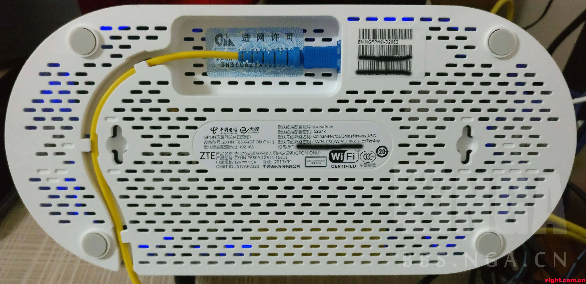

05.OpenWrt-连接有线网络
===========================================================

路由器作为重要的网络设备不光可以连接网络,也可是通过有线或者无线的方式给其他设备连接网络.

5.1 网络的基础知识
-----------------------------------------------------------

5.1.1 常用的网络设备
~~~~~~~~~~~~~~~~~~~~~~~~~~~~~~~~~~~~~~~~~~~~~~~~~~~~~~~~~~~

**光调制解调器**:俗称 ``光猫`` .现在使用的基本都是光纤入户,光纤中传递的是光信号,进过光猫的转换为电信号.安装人员在安装的时候写入入网信息,此时光猫已经接入互联网.如果把电脑的网口接入光猫的网口就可以让电脑上网.

------

**路由器**:连接两个不同网络的设备.光猫的网口分配ip为192.168.3.x,光猫的网口连接了电脑A(ip:192.168.3.124)和路由器(ip:192.168.3.149),此时电脑A和这台路由器就是在同一局域网下.路由器网口分配ip为192.168.5.x,路由器的网口连接了电脑B(ip:192.168.5.140),此时电脑A和电脑B不在同一局域网下.所以路由器是连接两个不同网络设备.

------

**交换机**:网络转发的设备.一般的家用路由器有5个网口,其中4个作为lan,则这4个网口连接的设备是在同一局域网下.但是有的时候需要多个设备连接到同一局域网下时就需要使用交换机.假设猫的网口下连接了电脑A和交换机,如果在交换机的网口下又接了电脑B和电脑C,由于交换机是信息的转发装置,所以电脑A、B、C仍在同一个局域网.

------

5.1.2 wan和lan
~~~~~~~~~~~~~~~~~~~~~~~~~~~~~~~~~~~~~~~~~~~~~~~~~~~~~~~~~~~

网口分为wan(wide area network)和lan(local area network),wan连接到上级网络设备,是自身网络的输入端,lan连接到下级网络设备,是自身网络的输出端.
以家用路由器为例,一般有5个网口,其中1个wan口,4个lan口,wan口接到光猫的lan口,此时光猫的lan作为网络的输出端,而路由器的wan口作为自身网络的输入端,lan口作为自身网络的输出端,给电脑等网络设备上网.

5.1.3 调试网络常用命令
~~~~~~~~~~~~~~~~~~~~~~~~~~~~~~~~~~~~~~~~~~~~~~~~~~~~~~~~~~~

**ifconfig**

命令用于获取网卡配置与网络状态等信息,使用最多就是用来查看IP地址.

.. code-block:: console
   :caption: ifconfig命令
   :linenos:

	root@Togetek:~# ifconfig
	br-lan    Link encap:Ethernet  HWaddr 1C:59:74:82:9C:06
			inet addr:192.168.8.1  Bcast:192.168.8.255  Mask:255.255.255.0
			inet6 addr: fe80::1e59:74ff:fe82:9c07/64 Scope:Link
			inet6 addr: fd17:1ebb:468e::1/60 Scope:Global
			UP BROADCAST RUNNING MULTICAST  MTU:1500  Metric:1
			RX packets:0 errors:0 dropped:0 overruns:0 frame:0
			TX packets:163 errors:0 dropped:0 overruns:0 carrier:0
			collisions:0 txqueuelen:0
			RX bytes:0 (0.0 B)  TX bytes:19088 (18.6 KiB)

	eth0      Link encap:Ethernet  HWaddr 1C:59:74:82:9C:07
			inet6 addr: fe80::1e59:74ff:fe82:9c07/64 Scope:Link
			UP BROADCAST RUNNING MULTICAST  MTU:1500  Metric:1
			RX packets:100 errors:0 dropped:0 overruns:0 frame:0
			TX packets:724 errors:0 dropped:0 overruns:0 carrier:0
			collisions:0 txqueuelen:1000
			RX bytes:69469 (67.8 KiB)  TX bytes:215237 (210.1 KiB)
			Interrupt:5

	eth0.1    Link encap:Ethernet  HWaddr 1C:59:74:82:9C:07
			UP BROADCAST RUNNING MULTICAST  MTU:1500  Metric:1
			RX packets:0 errors:0 dropped:0 overruns:0 frame:0
			TX packets:92 errors:0 dropped:0 overruns:0 carrier:0
			collisions:0 txqueuelen:0
			RX bytes:0 (0.0 B)  TX bytes:14027 (13.6 KiB)

	eth0.2    Link encap:Ethernet  HWaddr 1C:59:74:82:9C:07
			inet addr:10.168.4.164  Bcast:10.168.4.255  Mask:255.255.255.0
			inet6 addr: fe80::1e59:74ff:fe82:9c07/64 Scope:Link
			UP BROADCAST RUNNING MULTICAST  MTU:1500  Metric:1
			RX packets:100 errors:0 dropped:0 overruns:0 frame:0
			TX packets:590 errors:0 dropped:0 overruns:0 carrier:0
			collisions:0 txqueuelen:0
			RX bytes:67669 (66.0 KiB)  TX bytes:191952 (187.4 KiB)

	lo        Link encap:Local Loopback
			inet addr:127.0.0.1  Mask:255.0.0.0
			inet6 addr: ::1/128 Scope:Host
			UP LOOPBACK RUNNING  MTU:65536  Metric:1
			RX packets:2364 errors:0 dropped:0 overruns:0 frame:0
			TX packets:2364 errors:0 dropped:0 overruns:0 carrier:0
			collisions:0 txqueuelen:0
			RX bytes:159972 (156.2 KiB)  TX bytes:159972 (156.2 KiB)

	ra0       Link encap:Ethernet  HWaddr 1C:59:74:82:9C:06
			inet6 addr: fe80::1e59:74ff:fe82:9c06/64 Scope:Link
			UP BROADCAST RUNNING MULTICAST  MTU:1500  Metric:1
			RX packets:0 errors:0 dropped:0 overruns:0 frame:0
			TX packets:0 errors:0 dropped:0 overruns:0 carrier:0
			collisions:0 txqueuelen:1000
			RX bytes:0 (0.0 B)  TX bytes:0 (0.0 B)
			Interrupt:6

**ping**

ping用于确定本地主机是否能与另一台主机成功交换(发送与接收)数据包,通常用来确定网络是否正常.

如 :guilabel:`ping baidu.com` 可以确认设备是否连接了互联网,使用ping其他设备的ip可以确定两个设备是否在同一局域网.

.. code-block:: console
   :caption: ping命令
   :linenos:

	root@Togetek:~# ping baidu.com
	PING baidu.com (39.156.66.10): 56 data bytes
	64 bytes from 39.156.66.10: seq=0 ttl=51 time=22.183 ms
	64 bytes from 39.156.66.10: seq=1 ttl=51 time=21.658 ms
	64 bytes from 39.156.66.10: seq=2 ttl=51 time=21.727 ms
	64 bytes from 39.156.66.10: seq=3 ttl=51 time=21.485 ms
	
	--- baidu.com ping statistics ---
	4 packets transmitted, 4 packets received, 0% packet loss
	round-trip min/avg/max = 21.485/21.763/22.183 ms

