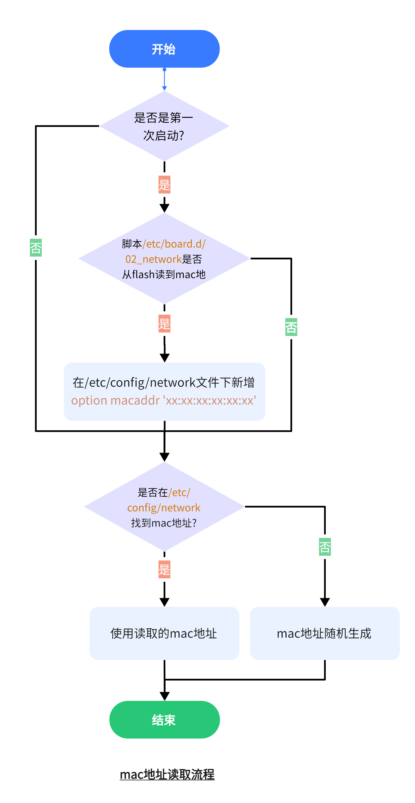

06.OpenWrt-写入mac地址
===========================================================

一般连接网络设备都有mac地址,电脑连接到路由器网络,只要网络环境不改变,电脑的ip地址就不会变化.这是因为路由器识别到这台电脑的mac地址,会把同一个ip再次分配给这台电脑.比如在使用vmware安装ubuntu虚拟机的时候,在桥接模式下,每次开机ip地址都会改变,这是由于虚拟机的mac地址每次开机都随机生成.网络上有很多方法固定虚拟机的ip地址,但是没有从本质上了解ip变化的原因,只要给虚拟机设置一个固定的mac地址,ip地址每次都变化的问题就迎刃而解.

实际的mac地址所在分区是一个只读分区,只在出厂之前烧录一次,路由器厂商是需要购买mac地址,所以更加不会多次烧录mac地址.这里去掉了只读限制,可以在系统中写入mac地址是为了方便理解mac地址.

6.1 mac地址写入流程
-----------------------------------------------------------

.. code-block:: console
   :caption: 读取mac地址脚本
   :linenos:

   root@Togetek:/# cat /etc/board.d/02_network

   . /lib/functions.sh
   . /lib/functions/uci-defaults.sh
   . /lib/functions/system.sh

   ramips_setup_interfaces()
   {
         local board="$1"

         case $board in
         alfa-network,awusfree1|\
         d-team,pbr-d1|\
         dlink,dap-1325-a1|\
         glinet,microuter-n300|\
         glinet,vixmini|\
         hak5,wifi-pineapple-mk7|\
         mediatek,linkit-smart-7688|\
         minew,g1-c|\
         onion,omega2p|\
         onion,omega2|\
         ravpower,rp-wd009|\
         tama,w06|\
         tplink,re200-v2|\
         tplink,re200-v3|\
         tplink,re200-v4|\
         tplink,re220-v2|\
         tplink,re305-v1|\
         tplink,re305-v3|\
         tplink,tl-wr802n-v4|\
         tplink,tl-wa801nd-v5|\
         widora,neo-16m|\
         widora,neo-32m)
                  ucidef_add_switch "switch0"
                  ucidef_add_switch_attr "switch0" "enable" "false"
                  ucidef_set_interface_lan "eth0"
                  ;;
         asus,rt-ac1200|\
         asus,rt-ac1200-v2|\
         hilink,hlk-7628n|\
         hilink,hlk-7688a|\
         hiwifi,hc5861b|\
         kroks,kndrt31r16|\
         skylab,skw92a|\
         tplink,archer-c20-v4|\
         tplink,archer-c20-v5|\
         tplink,archer-c50-v3|\
         tplink,archer-c50-v4|\
         tplink,tl-mr3420-v5|\
         tplink,tl-wr840n-v4|\
         tplink,tl-wr840n-v5|\
         tplink,tl-wr841n-v13|\
         tplink,tl-wr841n-v14|\
         tplink,tl-wr842n-v5|\
         tplink,tl-wr850n-v2|\
         unielec,u7628-01-16m|\
         wrtnode,wrtnode2p|\
         wrtnode,wrtnode2r|\
         zyxel,keenetic-extra-ii)
                  ucidef_add_switch "switch0" \
                           "1:lan" "2:lan" "3:lan" "4:lan" "0:wan" "6@eth0"
                  ;;
         asus,rt-n10p-v3|\
         asus,rt-n11p-b1|\
         asus,rt-n12-vp-b1|\
         hiwifi,hc5661a|\
         mediatek,mt7628an-eval-board|\
         togetek,mt7628an-develop-board|\
         mercury,mac1200r-v2|\
         totolink,lr1200|\
         wavlink,wl-wn570ha1|\
         wavlink,wl-wn575a3)
                  ucidef_add_switch "switch0" \
                           "0:lan" "1:lan" "2:lan" "3:lan" "4:wan" "6@eth0"
                  ;;
         buffalo,wcr-1166ds|\
         elecom,wrc-1167fs|\
         wavlink,wl-wn577a2|\
         wavlink,wl-wn578a2)
                  ucidef_add_switch "switch0" \
                           "3:lan" "4:wan" "6@eth0"
                  ;;
         comfast,cf-wr617ac)
                  ucidef_add_switch "switch0" \
                           "1:lan:3" "2:lan:2" "3:lan:1" "4:wan" "6@eth0"
                  ;;
         comfast,cf-wr758ac-v1|\
         comfast,cf-wr758ac-v2|\
         tplink,tl-wr902ac-v3|\
         wavlink,wl-wn576a2)
                  ucidef_add_switch "switch0" \
                           "4:lan" "6@eth0"
                  ;;
         cudy,wr1000)
                  ucidef_add_switch "switch0" \
                           "2:lan:2" "3:lan:1" "4:wan" "6@eth0"
                  ;;
         duzun,dm06|\
         glinet,gl-mt300n-v2)
                  ucidef_add_switch "switch0" \
                           "1:lan" "0:wan" "6@eth0"
                  ;;
         hiwifi,hc5761a)
                  ucidef_add_switch "switch0" \
                           "0:lan" "1:lan" "4:wan" "6@eth0"
                  ;;
         iptime,a3|\
         totolink,a3)
                  ucidef_add_switch "switch0" \
                           "2:lan:2" "3:lan:1" "0:wan" "6@eth0"
                  ;;
         iptime,a604m)
                  ucidef_add_switch "switch0" \
                           "1:lan:4" "2:lan:3" "3:lan:2" "4:lan:1" "0:wan" "6@eth0"
                  ;;
         jotale,js76x8-8m|\
         jotale,js76x8-16m|\
         jotale,js76x8-32m)
                  ucidef_add_switch "switch0" \
                           "0:lan" "1:lan" "2:lan" "6@eth0"
                  ;;
         kroks,kndrt31r19)
                  ucidef_add_switch "switch0" \
                           "0:lan" "6@eth0"
                  ucidef_add_switch_attr "switch0" "enable" "false"
                  ucidef_set_interface_lan "eth0"
                  ucidef_set_interface "wan" device "/dev/cdc-wdm0" protocol "qmi"
                  ;;
         motorola,mwr03)
                  ucidef_add_switch "switch0" \
                           "1:lan" "2:lan" "3:lan" "0:wan" "6@eth0"
                  ;;
         netgear,r6020|\
         netgear,r6080|\
         netgear,r6120|\
         wavlink,wl-wn531a3)
                  ucidef_add_switch "switch0" \
                           "0:lan:4" "1:lan:3" "2:lan:2" "3:lan:1" "4:wan" "6@eth0"
                  ;;
         rakwireless,rak633)
                  ucidef_add_switch "switch0" \
                           "0:wan" "1:lan" "2:lan" "3:lan" "4:lan" "6t@eth0"
                  ;;
         tplink,tl-mr3020-v3)
                  ucidef_add_switch "switch0" \
                           "0:lan" "6@eth0"
                  ;;
         tplink,tl-mr6400-v4)
                  ucidef_add_switch "switch0" \
                           "1:lan" "2:lan" "3:lan" "4:wan" "6@eth0"
                  ;;
         tplink,tl-mr6400-v5)
                  ucidef_add_switch "switch0" \
                           "0:lan" "1:lan" "2:lan" "3:wan" "6@eth0"
                  ;;
         vocore,vocore2|\
         vocore,vocore2-lite)
                  ucidef_add_switch "switch0" \
                           "0:lan" "2:lan" "6t@eth0"
                  ;;
         wiznet,wizfi630s)
                  ucidef_add_switch "switch0" \
                           "0:wan" "3:lan" "4:lan" "6@eth0"
                  ;;
         xiaomi,mi-router-4a-100m|\
         xiaomi,mi-router-4a-100m-intl)
                  ucidef_add_switch "switch0" \
                           "4:lan:1" "2:lan:2" "0:wan" "6@eth0"
                  ;;
         xiaomi,mi-router-4c)
                  ucidef_add_switch "switch0" \
                           "4:lan:1" "2:lan:2" "1:wan" "6@eth0"
                  ;;
         xiaomi,miwifi-3c)
                  ucidef_add_switch "switch0" \
                           "0:wan" "2:lan:2" "4:lan:1" "6@eth0"
                  ;;
         xiaomi,miwifi-nano)
                  ucidef_add_switch "switch0" \
                           "0:lan:2" "2:lan:1" "4:wan" "6@eth0"
                  ;;
         zbtlink,zbt-we1226)
                  ucidef_add_switch "switch0" \
                           "0:lan:2" "1:lan:1" "4:wan" "6@eth0"
                  ;;
         esac
   }

   ramips_setup_macs()
   {
         local board="$1"
         local lan_mac=""
         local wan_mac=""
         local label_mac=""

         case $board in
         asus,rt-ac1200)
                  wan_mac=$(mtd_get_mac_binary factory 0x22)
                  ;;
         elecom,wrc-1167fs)
                  wan_mac=$(mtd_get_mac_binary factory 0x22)
                  label_mac=$wan_mac
                  ;;
         buffalo,wcr-1166ds)
                  wan_mac=$(mtd_get_mac_ascii board_data "mac")
                  lan_mac=$wan_mac
                  label_mac=$wan_mac
                  ;;
         comfast,cf-wr617ac)
                  lan_mac=$(mtd_get_mac_binary factory 0xe000)
                  wan_mac=$(macaddr_add "$lan_mac" 1)
                  ;;
         cudy,wr1000|\
         hilink,hlk-7628n|\
         hilink,hlk-7688a|\
         wavlink,wl-wn531a3|\
         wavlink,wl-wn577a2|\
         wavlink,wl-wn578a2)
                  wan_mac=$(mtd_get_mac_binary factory 0x2e)
                  label_mac=$(mtd_get_mac_binary factory 0x4)
                  ;;
         duzun,dm06|\
         netgear,r6020|\
         netgear,r6080|\
         netgear,r6120|\
         wrtnode,wrtnode2p|\
         wrtnode,wrtnode2r|\
         zyxel,keenetic-extra-ii)
                  wan_mac=$(macaddr_add "$(mtd_get_mac_binary factory 0x4)" 1)
                  ;;
         hiwifi,hc5661a|\
         hiwifi,hc5761a|\
         hiwifi,hc5861b)
                  lan_mac=$(mtd_get_mac_ascii bdinfo "Vfac_mac ")
                  label_mac=$lan_mac
                  [ -n "$lan_mac" ] || lan_mac=$(cat /sys/class/net/eth0/address)
                  wan_mac=$(macaddr_add "$lan_mac" 1)
                  ;;
         iptime,a3|\
         iptime,a604m|\
         totolink,a3)
                  wan_mac=$(mtd_get_mac_binary u-boot 0x1fc40)
                  ;;
         jotale,js76x8-8m|\
         jotale,js76x8-16m|\
         jotale,js76x8-32m|\
         skylab,skw92a|\
         totolink,lr1200)
                  wan_mac=$(mtd_get_mac_binary factory 0x2e)
                  ;;
         mercury,mac1200r-v2)
                  wan_mac=$(macaddr_add "$(mtd_get_mac_binary factory_info 0xd)" 1)
                  ;;
         motorola,mwr03)
                  label_mac=$(mtd_get_mac_binary factory 0x4)
                  wan_mac=$(macaddr_add "$label_mac" 2)
                  ;;
         onion,omega2|\
         onion,omega2p|\
         vocore,vocore2|\
         vocore,vocore2-lite|\
         wavlink,wl-wn576a2)
                  label_mac=$(mtd_get_mac_binary factory 0x4)
                  ;;
         rakwireless,rak633|\
         unielec,u7628-01-16m|\
         wavlink,wl-wn575a3)
                  wan_mac=$(macaddr_add "$(mtd_get_mac_binary factory 0x28)" 1)
                  ;;
         tplink,archer-c20-v4|\
         tplink,archer-c50-v3|\
         tplink,tl-mr3420-v5|\
         tplink,tl-wr840n-v4|\
         tplink,tl-wr840n-v5|\
         tplink,tl-wr841n-v13|\
         tplink,tl-wr841n-v14|\
         tplink,tl-wr842n-v5|\
         tplink,tl-wr850n-v2)
                  wan_mac=$(macaddr_add "$(mtd_get_mac_binary factory 0xf100)" 1)
                  ;;
         tplink,archer-c20-v5|\
         tplink,archer-c50-v4)
                  wan_mac=$(macaddr_add "$(mtd_get_mac_binary rom 0xf100)" 1)
                  ;;
         wavlink,wl-wn570ha1|\
         zbtlink,zbt-we1226)
                  wan_mac=$(macaddr_add "$(mtd_get_mac_binary factory 0x2e)" 1)
                  ;;
         wiznet,wizfi630s)
                  label_mac=$(mtd_get_mac_binary factory 0x4)
                  wan_mac=$(mtd_get_mac_binary factory 0x28)
                  ;;
         xiaomi,mi-router-4a-100m|\
         xiaomi,mi-router-4a-100m-intl|\
         xiaomi,mi-router-4c)
                  wan_mac=$(mtd_get_mac_binary factory 0x4)
                  ;;
         togetek,mt7628an-develop-board)
                  lan_mac=$(mtd_get_mac_binary factory 0x2e)
                  wan_mac=$(mtd_get_mac_binary factory 0x28)
                  ;;
         esac

         [ -n "$lan_mac" ] && ucidef_set_interface_macaddr "lan" $lan_mac
         [ -n "$wan_mac" ] && ucidef_set_interface_macaddr "wan" $wan_mac
         [ -n "$label_mac" ] && ucidef_set_label_macaddr $label_mac
   }

   board_config_update
   board=$(board_name)
   ramips_setup_interfaces $board
   ramips_setup_macs $board
   board_config_flush

   exit 0

.. code-block:: console
   :caption: mac地址配置文件
   :linenos:

   root@Togetek:/# cat /etc/config/network

   config interface 'loopback'
         option device 'lo'
         option proto 'static'
         option ipaddr '127.0.0.1'
         option netmask '255.0.0.0'

   config globals 'globals'
         option ula_prefix 'fd0a:6181:d013::/48'

   config device
         option name 'br-lan'
         option type 'bridge'
         list ports 'eth0.1'

   config device
         option name 'eth0.1'
         option macaddr '00:01:02:03:04:07'

   config interface 'lan'
         option device 'br-lan'
         option proto 'static'
         option ipaddr '192.168.1.1'
         option netmask '255.255.255.0'
         option ip6assign '60'

   config device
         option name 'eth0.2'
         option macaddr 'ac:db:da:5b:6f:08'

   config interface 'wan'
         option device 'eth0.2'
         option proto 'dhcp'

   config interface 'wan6'
         option device 'eth0.2'
         option proto 'dhcpv6'

   config switch
         option name 'switch0'
         option reset '1'
         option enable_vlan '1'

   config switch_vlan
         option device 'switch0'
         option vlan '1'
         option ports '0 1 2 3 6t'

   config switch_vlan
         option device 'switch0'
         option vlan '2'
         option ports '4 6t'

------

1. 只在烧录固件或者恢复出厂设置后第一次才启动执行脚本/etc/board.d/02_network,其他时候启动该脚本不执行.脚本从flash中读取wan和lan mac地址,并写入/etc/config/network文件.如果没有从flash中读到mac地址则/etc/config/network文件中 ``option macaddr 'ac:db:da:5b:6f:08'`` 将不生成.
2. 文件/etc/config/network是mac地址的配置文件,通过修改此文件 ``option macaddr 'ac:db:da:5b:6f:08'`` 方法可以也可以固定mac地址,但是恢复出厂设置后mac地址会被重置.
3. ifconfig命令从/etc/config/network读取mac地址,如果 ``option macaddr 'ac:db:da:5b:6f:08'`` 不存在则mac地址每次开机随机产生.

6.2 factory分区
-----------------------------------------------------------

.. code-block:: console
   :caption: flash分区结构
   :linenos:

   root@Togetek:/# cat /proc/mtd
   dev:    size   erasesize  name
   mtd0: 00030000 00010000 "u-boot"
   mtd1: 00010000 00010000 "u-boot-env"
   mtd2: 00010000 00010000 "factory"
   mtd3: 00fb0000 00010000 "firmware"
   mtd4: 0021f407 00010000 "kernel"
   mtd5: 00d90bf9 00010000 "rootfs"
   mtd6: 00800000 00010000 "rootfs_data"

在OpenWrt系统中会把mac地址和wifi校准参数等写在flash的factory分区中,这样在批量烧录的时候可以将系统固件和mac地址单独烧录,通过编程器批量烧录方法会在后面介绍到,这里是在进入系统后通过命令的方式写入mac地址.

6.3 系统中写入mac地址
-----------------------------------------------------------

.. code-block:: shell
   :caption: 写入mac地址
   :linenos:

   # 拷贝出factory分区
   dd if=/dev/mtd2 of=/tmp/factory.bin
   # WAN口地址修改命令
   echo -e -n "\xAC\xDB\xDA\x5B\x6F\x08" |dd of=/tmp/factory.bin  bs=1 count=6 conv=notrunc bs=1 count=6 seek=40
   # 刷新art分区命令
   mtd write /tmp/factory.bin factory

.. csv-table:: mac地址位置
  :align: center
  :header: 偏移地址, 名称
  :widths: 15, 40

   0x04 , WIIF MAC
   0x28 , LAN MAC
   0x2E , WAN MAC

mac地址的偏移地址不是一成不变,系统读取mac地址位置与写入的mac地址位置一致即可.

.. prompt:: bash

   hexdump -C /dev/mtd2

.. code-block:: console
   :caption: 读取factory分区的值
   :linenos:

   root@Togetek:/# hexdump -C /dev/mtd2
   00000000  28 76 00 02 00 01 02 03  04 05 00 00 00 00 00 00  |(v..............|
   00000010  ff ff ff ff ff ff ff ff  ff ff ff ff ff ff ff ff  |................|
   00000020  00 00 00 00 20 00 00 00  ac db da 5b 6f 08 00 01  |.... ......[o...|
   00000030  02 03 04 07 22 34 00 20  ff ff 00 01 00 00 00 00  |...."4. ........|
   00000040  00 00 22 00 00 00 00 00  30 00 00 00 00 00 00 00  |..".....0.......|
   00000050  82 00 00 94 40 b6 c0 ca  20 85 84 84 40 ca 23 00  |....@... ...@.#.|
   00000060  00 00 00 00 00 00 00 00  00 00 00 00 00 00 00 00  |................|
   *
   000000a0  c6 c6 c4 c4 c4 c0 c0 c4  c4 c4 c4 c4 c0 c0 00 00  |................|
   000000b0  00 00 00 00 00 00 00 00  00 00 00 00 00 00 00 00  |................|
   000000c0  00 00 00 00 00 00 00 00  00 1a 22 2a 31 35 01 35  |.........."*15.5|
   000000d0  39 40 46 4d 7f 7f 7f 00  00 00 00 00 00 00 00 00  |9@FM............|
   000000e0  11 1d 11 1d 1c 35 1c 35  1e 35 1e 35 17 19 17 19  |.....5.5.5.5....|
   000000f0  02 00 00 00 bc 00 00 88  0a 00 00 00 00 00 00 00  |................|
   00000100  ff ff ff ff ff ff ff ff  ff ff ff ff ff ff ff ff  |................|
   *
   00000120  00 00 00 00 00 00 00 00  00 00 00 00 00 00 77 00  |..............w.|
   00000130  11 1d 11 1d 15 7f 15 7f  17 7f 17 7f 10 3b 10 3b  |.............;.;|
   00000140  ff ff ff ff 11 00 ff ff  ff ff ff ff ff ff ff ff  |................|
   00000150  ff ff ff ff ff ff ff ff  ff ff ff ff ff ff ff ff  |................|
   *
   00010000
