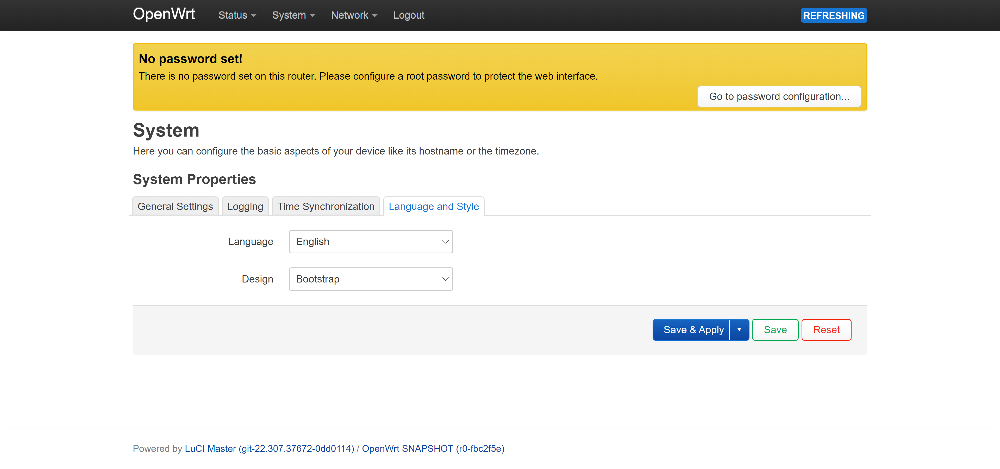

08.OpenWrt-luCI路由管理界面
===========================================================

luCI是OpenWrt的配置接口,也就是路由管理界面,网络设备例如电脑连接了OpenWrt的lan口或者与OpenWrt在同一局域网下,在电脑浏览器上输入板子ip地址就可以登录OpenWrt的路由管理界面.

------

8.1 汉化
-----------------------------------------------------------

修改路径 System -> System -> Language and Style

------

8.2 固件升级
-----------------------------------------------------------

修改路径 System -> System -> Backup/Flash Fireware

