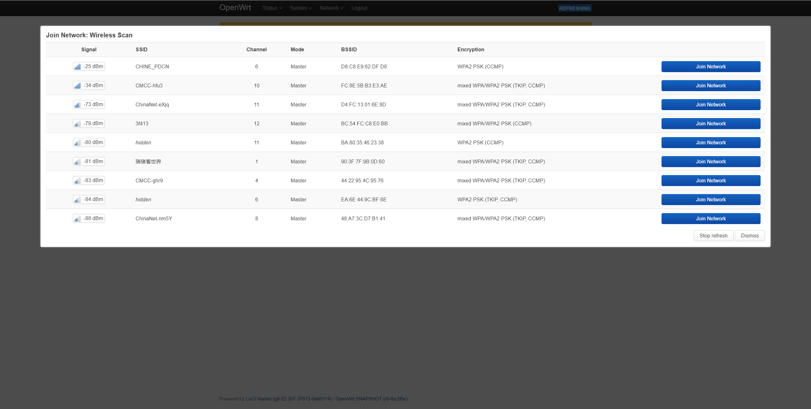
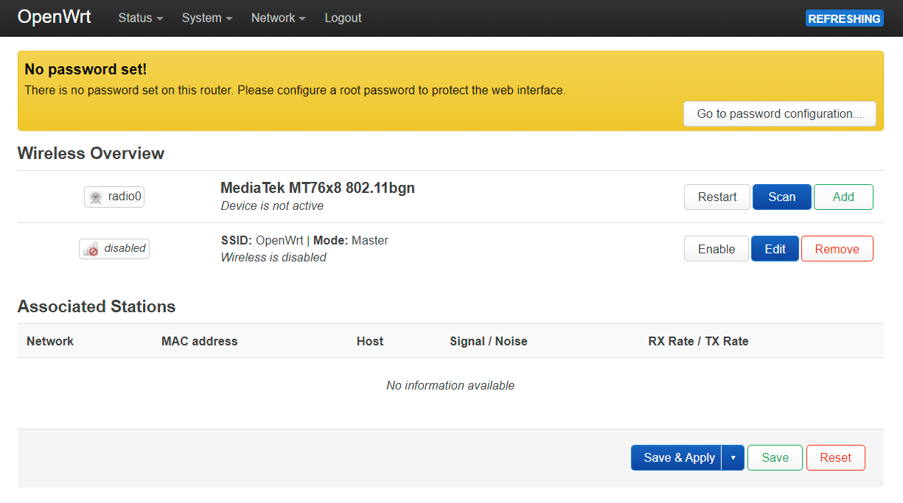
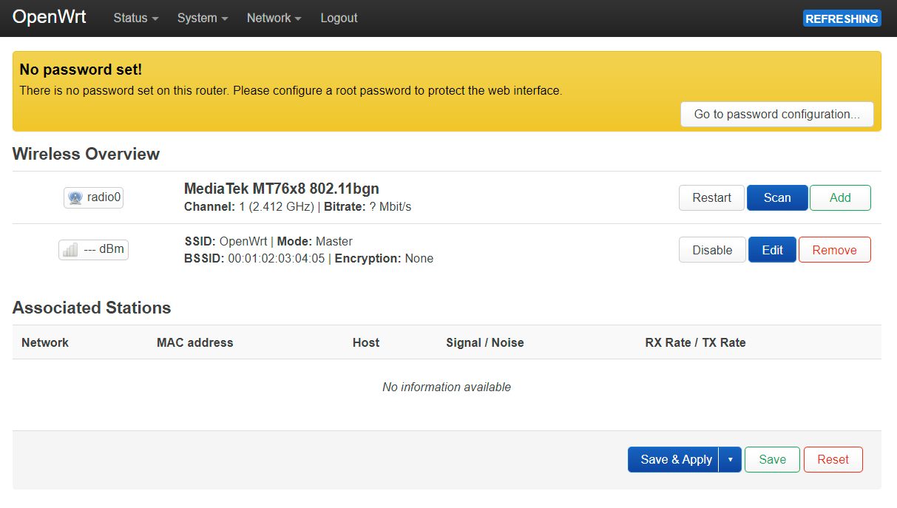

09.OpenWrt-连接wifi网络
===========================================================

9.1 连接其他wifi热点上网
-----------------------------------------------------------

.. code-block:: console 
   :caption: 连接其他wifi热点前
   :linenos:

   root@Togetek:/# cat /etc/config/wireless

   config wifi-device 'radio0'
        option type 'mac80211'
        option path 'platform/10300000.wmac'
        option channel '1'
        option band '2g'
        option htmode 'HT20'
        option disabled '1'

   config wifi-iface 'default_radio0'
        option device 'radio0'
        option network 'lan'
        option mode 'ap'
        option ssid 'OpenWrt'
        option encryption 'none'

------

.. code-block:: console 
   :caption: 连接其他wifi热点后
   :linenos:

    root@Togetek:/# cat /etc/config/wireless

    config wifi-device 'radio0'
            option type 'mac80211'
            option path 'platform/10300000.wmac'
            option channel '1'
            option band '2g'
            option htmode 'HT20'
            option cell_density '0'

    config wifi-iface 'default_radio0'
            option device 'radio0'
            option network 'lan'
            option mode 'ap'
            option ssid 'OpenWrt'
            option encryption 'none'
            option disabled '1'

    config wifi-iface 'wifinet1'
            option device 'radio0'
            option mode 'sta'
            option network 'wwan'
            option ssid 'CHINE_PDCN'
            option encryption 'psk2'
            option key 'xlmqwa1006'

如上是在界面设置连接其他wifi热点,也可以通过修改如下文件手动修改.然后重启网络.

.. code-block:: console 
   :caption: 使能连接其他wifi热点
   :linenos:

    config wifi-device 'radio0'
            option type 'mac80211'
            option path 'platform/10300000.wmac'
            option channel '1'
            option band '2g'
            option htmode 'HT20'
            option cell_density '0'
            option disabled '1'

.. code-block:: console 
   :caption: 增加无线网络配置
   :linenos:

    config wifi-iface 'wifinet1'
            option device 'radio0'
            option mode 'sta'
            option network 'wwan'
            option ssid 'CHINE_PDCN'
            option encryption 'psk2'
            option key 'xlmqwa1006'

.. prompt:: bash

   /etc/init.d/wireless restart

9.2 打开wifi热点供其他设备上网
-----------------------------------------------------------

------

.. code-block:: console 
   :caption: 打开wifi网络前
   :linenos:

    root@Togetek:/# cat /etc/config/wireless

   config wifi-device 'radio0'
        option type 'mac80211'
        option path 'platform/10300000.wmac'
        option channel '1'
        option band '2g'
        option htmode 'HT20'
        option disabled '1'

   config wifi-iface 'default_radio0'
        option device 'radio0'
        option network 'lan'
        option mode 'ap'
        option ssid 'OpenWrt'
        option encryption 'none'
        option disabled '1'

------

.. code-block:: console 
   :caption: 打开wifi网络后
   :linenos:

    root@OpenWrt:/# cat /etc/config/wireless

   config wifi-device 'radio0'
        option type 'mac80211'
        option path 'platform/10300000.wmac'
        option channel '1'
        option band '2g'
        option htmode 'HT20'

   config wifi-iface 'default_radio0'
        option device 'radio0'
        option network 'lan'
        option mode 'ap'
        option ssid 'OpenWrt'
        option encryption 'none'

如上是在界面中开或关wifi热点后 ``/etc/config/wireless`` 后配置文件的变化,所以可直接修改此文件达到开关wifi热点的功能.修改完成后执行如下命令完成配置.

.. prompt:: bash

   /etc/init.d/wireless restart

