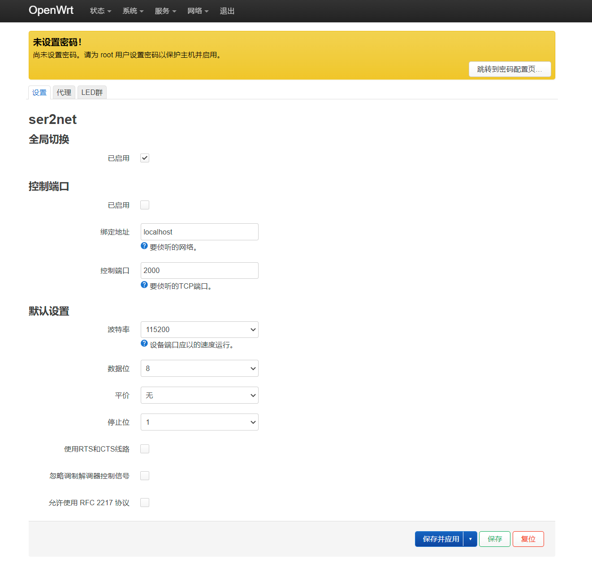
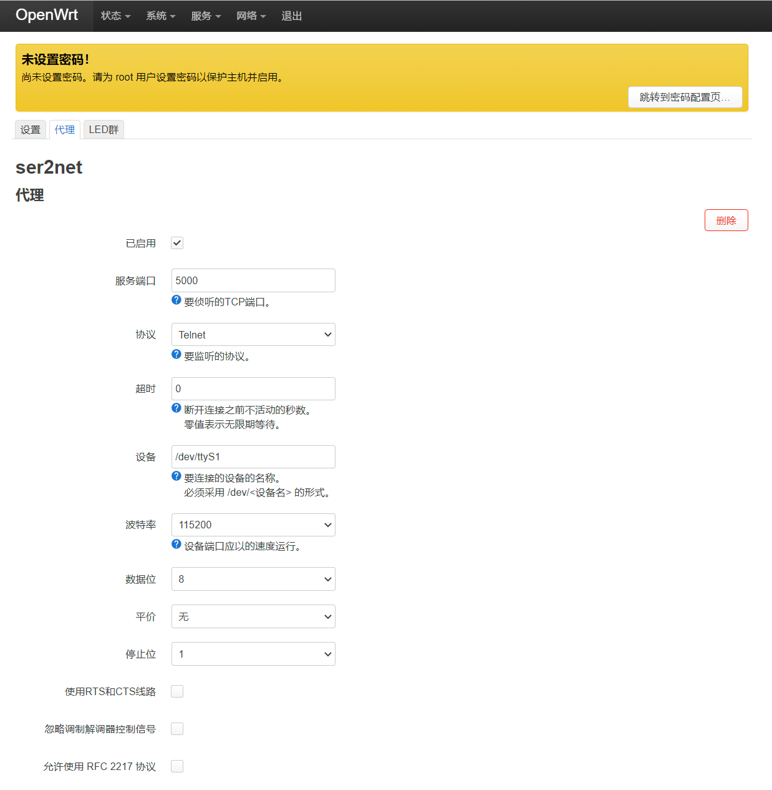
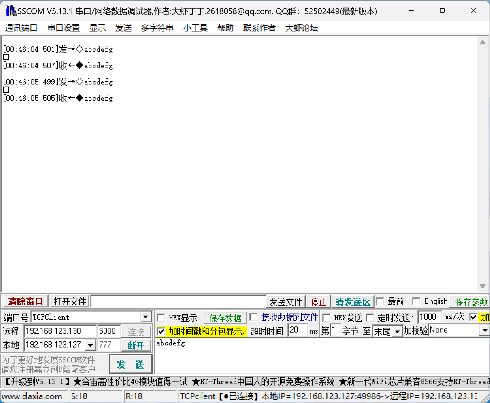

15.OpenWrt-网络转串口透传
===========================================================

将开发板作为串口数据的转发设备,例如在远程调试的时候,可以将其他设备的串口接到OpenWrt开发板的串口,通过网络远程连接到OpenWrt,OpenWrt开发板接收到数据原封不动的转发到串口,以此来控制其他设备.

15.1 ser2net 路由管理配置界面
-----------------------------------------------------------

------

默认即可,不要用改动.

------

首先点击 ``已开启`` 开启网络转串口功能,配置将网络转到那个串口,最后 ``保存并应用`` .

15.2 ser2net tcp client配置界面
-----------------------------------------------------------

使用 ``sscom`` 软件作为tcp客户端,需要设置监听的设备IP地址,也就是板子的IP地址,同时端口为5000,只需要与路由管理界面的一致即可.通过此软件接受和发送数据,也就是说 ``sscom`` 是作为网络转串口中的网络端角色,tcp client网络方式发送命令到串口,串口接在待控制设备的串口.

