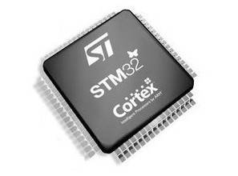
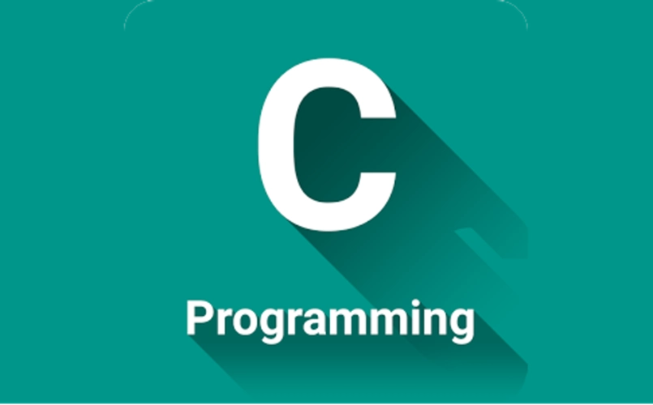
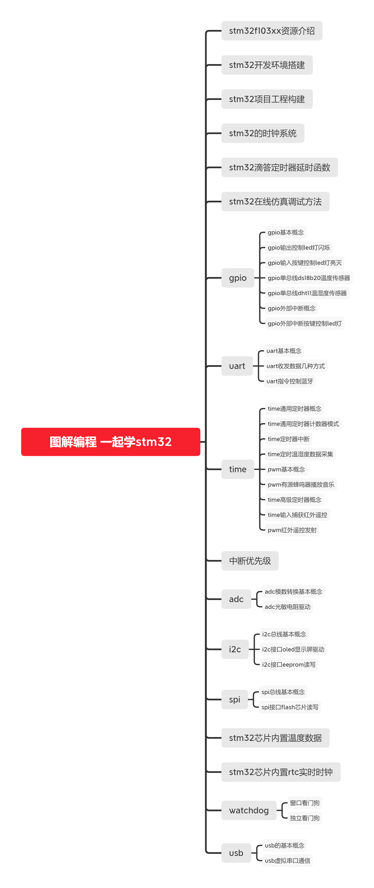
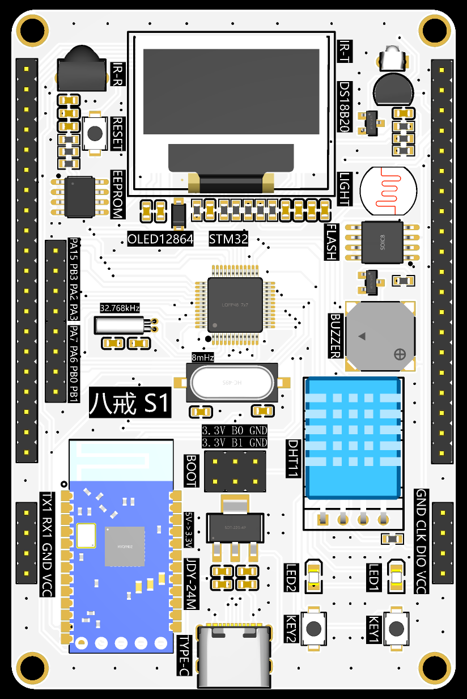
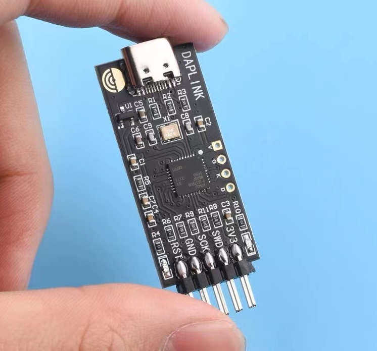

第01章.单片机设计电子网一起学stm32课程介绍🏃
===========================================================

本章主要是对 :guilabel:`单片机设计电子网` 推出的stm32系列开发课程 ``一起学stm32`` 的介绍.以及在学习的时候需要准备哪些东西.

1.1 学习编程的一般过程🏃
-----------------------------------------------------------

课程开始的时候一起来探究下学习编程的过程是怎样的,有助于我们在学的过程中思考自己的学习方法,提高学习效率.

1.1.1 C语言编程思维的形成过程🏃
~~~~~~~~~~~~~~~~~~~~~~~~~~~~~~~~~~~~~~~~~~~~~~~~~~~~~~~~~~~

学习编程在笔者看来就是学习一种 ``思维方式`` ,以C语言为例.

1. 首先学习一些基本 ``概念`` ,比如变量、函数、指针等,只需要知道就可以.
2. 然后学习一些使用 ``规定`` ,比如C语言的标识符区分大小写、C语言的语句以冒号结束等.只需要记住就可以.
3. 最后通过大量练习,潜移默化中似乎习惯了这种 ``思维方式`` ,我们自己也就学会了使用这些 ``概念`` 和 ``规定`` 又有了自己的理解.

当我们不假思考就能够写出代码的时候,我们就学会了编程.

.. code-block:: c
   :caption: C语言打印计算圆的面积结果
   :linenos:

   /***************************************************************
   * @brief      计算圆的面积
   * @author     单片机设计电子网
   * @version    
   * @date       2023年1月15日
   **************************************************************/

   #include <stdio.h>

   #define PI (3.14)                                  //定义宏,圆周率的值为3.14

   /***************************************************************
   *  @brief     计算圆的面积
   *  @param     无   
   *  @note      无
   *  @Sample usage:     无 
   **************************************************************/
   int main(void)
   {
      int r = 3;                                      //定义int型变量r为半径,初始值为3
      float area = r*r*PI;                            //定义float型变量area面积,变量值为 r*r*PI
      printf("半径为%d的圆面积为%f\r\n",r,area);       //printf打印计算结果,%d表示为整数,%f表示为浮点数

      return 0;
   }

1.1.2 stm32编程思维的形成过程🏃
~~~~~~~~~~~~~~~~~~~~~~~~~~~~~~~~~~~~~~~~~~~~~~~~~~~~~~~~~~~

回到stm32编程思维形成的过程如下.

1. 开始的时候会介绍gpio、串口、定时器、i2c、spi等 ``概念`` ,这些概念就像基石一样,知道即可.

2. 在stm32中还会学到如何使用gpio读取ds18b20温度传感器的数据,使用串口控制at命令的蓝牙模块.开始时可能不能理解为什么这样配置,先要学会 ``抄代码`` ,这些外设的使用就像 ``规定`` 一样,使用多了就知道如何使用了.

3. 最终拿到任何没有使用过的外设都能够自己编写驱动软件,这样就认为已经具有了stm32的编程思维,这样也就有了自学的能力.

.. code-block:: c
   :caption: stm32 GPIO控制led的亮灭
   :linenos:

   /**
  * @brief  The application entry point.
  * @retval int
  */
   int main(void)
   {
      /* USER CODE BEGIN 1 */

      /* USER CODE END 1 */

      /* MCU Configuration--------------------------------------------------------*/

      /* Reset of all peripherals, Initializes the Flash interface and the Systick. */
      HAL_Init();

      /* USER CODE BEGIN Init */

      /* USER CODE END Init */

      /* Configure the system clock */
      SystemClock_Config();

      /* USER CODE BEGIN SysInit */

      /* USER CODE END SysInit */

      /* Initialize all configured peripherals */
      MX_GPIO_Init();
      /* USER CODE BEGIN 2 */

      /* USER CODE END 2 */

      /* Infinite loop */
      /* USER CODE BEGIN WHILE */
      while (1)
      {
         /* USER CODE END WHILE */

         /* USER CODE BEGIN 3 */

         HAL_GPIO_WritePin(LED1_GPIO_Port,LED1_Pin,GPIO_PIN_RESET);      //led1点亮,led的正极接到3.3V,负极输出低电平时led亮起
         HAL_GPIO_WritePin(LED2_GPIO_Port,LED2_Pin,GPIO_PIN_SET);	       //led2熄灭
         HAL_Delay(1000);									                      //led1点亮、led2熄灭状态保持1s

         HAL_GPIO_WritePin(LED1_GPIO_Port,LED1_Pin,GPIO_PIN_SET);        //led1熄灭
         HAL_GPIO_WritePin(LED2_GPIO_Port,LED2_Pin,GPIO_PIN_RESET);	    //led2点亮
         HAL_Delay(1000);									                      //led1熄灭、led2点亮状态保持1s
      }
      /* USER CODE END 3 */
   }

.. important::

   - 学习编程并不难,难的是不敢开始和畏惧的心.

1.2 疑问解答🏃
-----------------------------------------------------------

1.2.1 什么是stm32?🏃
~~~~~~~~~~~~~~~~~~~~~~~~~~~~~~~~~~~~~~~~~~~~~~~~~~~~~~~~~~~

简单来说stm32是意法半导体公司推出的一款基于arm cortex内核的32位单片机.stm32单片机是一个总称,ST公司购买了ARM公司内核授权后设计出不同的芯片,如课程使用的 ``单片机设计电子网-八戒S1 stm32单片机开发板`` 就是根据stm32的其中一款单片机设计.

课程使用stm32f103c8t6设计的开发板原因?

这是一款定位为中端的单片机,也是stm32系列单片机中使用较广泛的一款单片机,有一些的优点:

1. 拥有64kb的ram、128kb的flash,以及丰富的外设接口.
2. 同时价格也很便宜,使用广泛.
3. 丰富的资料,非常适合入门学习.

------

1.2.2 学习stm32需要C语言基础吗?🏃
~~~~~~~~~~~~~~~~~~~~~~~~~~~~~~~~~~~~~~~~~~~~~~~~~~~~~~~~~~~

stm32使用C语言开发,但是也不是一定都用C语言,比如一些stm32内置python解释器,也是可以使用python开发.但是目前的主流stm32开发还是C语言,因此需要使用先学习C语言.但不需要C语言功底非常好才能学习stm32,stm32这类嵌入式的开发是C语言应用的一个方向,学好stm32也能够在一定的程度上提升C语言编程能力.

------

1.2.3 什么是嵌入式软件开发?🏃
~~~~~~~~~~~~~~~~~~~~~~~~~~~~~~~~~~~~~~~~~~~~~~~~~~~~~~~~~~~

说到嵌入式,你可能会想到嵌入式洗碗机、嵌入式油烟机,就像洗碗机、油烟机被嵌入到橱柜一样.

嵌入式软件开发中的 ''嵌入式'' 其实也有这个意思,嵌入式软件开发的硬件被镶嵌入到盒子中,比如使用的手机,电路板被嵌入到手机壳中,再比如电子车钥匙,电路板被嵌入到钥匙壳中.

当然这里的嵌入式还有相对于电脑这样的 ``通用`` 设备而言,嵌入式设备往往具有特定的功能,考虑到价钱、体积等多方面因素而 ``专用`` 的.不像通用的电脑,有的人用来打游戏、有的人用来做PPT、有的人用来写代码等.

1.2.4 课程体系的设计是怎样?🏃
~~~~~~~~~~~~~~~~~~~~~~~~~~~~~~~~~~~~~~~~~~~~~~~~~~~~~~~~~~~

------

1.3 课程内容🏃
-----------------------------------------------------------

由 :guilabel:`单片机设计电子网` 开发的 ``一起学stm32`` 系列stm32开发课程,包括 ``在线技术文档`` 、 ``在线视频课程`` 、 ``程序源码`` 三部分组成.课程的内容是贴合stm32拥有的功能来设计,所以如下课程内容中,从零开始手把手学stm32.

1.3.1 在线技术文档🏃
~~~~~~~~~~~~~~~~~~~~~~~~~~~~~~~~~~~~~~~~~~~~~~~~~~~~~~~~~~~

在线技术文档也就是上课使用的讲义,在课程开始的时候都会先讲讲义,这里包括主要的概念,协议的分析、原理图的讲解等.

http://www.togetek.com/

.. grid:: 1
    :gutter: 2
    :padding: 0

    .. grid-item-card:: 在线技术文档
      :img-top: ../media/单片机设计电子网log.png
      :width: 40%
      :link: http://www.togetek.com/

1.3.2 在线视频课程🏃
~~~~~~~~~~~~~~~~~~~~~~~~~~~~~~~~~~~~~~~~~~~~~~~~~~~~~~~~~~~

视频的内容也是根据在线技术文档录制.如下是待录制的视频目录.

| 第01章.单片机设计电子网一起学stm32课程介绍  
| 第02章.单片机设计电子网八戒S1开发板资源介绍
| 第03章.stm32开发环境搭建
| 第04章.stm32工程构建编译下载
| 第05章.stm32时钟系统
| 第06章.stm32滴答定时器延时函数
| 第07章.stm32在线仿真调试方法
| 第08章.gpio基本概念
| 第09章.gpio输出控制led灯闪烁
| 第10章.gpio输入按键控制led灯亮灭
| 第11章.gpio单总线ds18b20温度传感器
| 第12章.gpio单总线dht11温湿度传感器
| 第13章.gpio外部中断概念
| 第14章.gpio外部中断按键控制led灯
| 第15章.uart基本概念
| 第16章.uart收发数据几种方式
| 第17章.uart指令控制蓝牙
| 第18章.time通用定时器概念
| 第19章.time通用定时器计数器模式
| 第20章.time定时器中断
| 第21章.time定时温湿度数据采集
| 第22章.pwm基本概念
| 第23章.pwm有源蜂鸣器播放音乐
| 第24章.time高级定时器概念 
| 第25章.time输入捕获中断红外遥控
| 第26章.pwm红外遥控发射
| 第27章.nvic中断优先级管理
| 第28章.adc模数转换基本概念
| 第29章.adc光敏电阻
| 第30章.i2c总线基本概念
| 第31章.i2c接口oled显示屏
| 第32章.i2c接口eeprom读写
| 第33章.spi总线基本概念
| 第34章.spi接口flash芯片读写
| 第35章.stm32芯片内置温度数据
| 第36章.stm32芯片内置rtc实时时钟
| 第37章.watchdog之窗口看门狗
| 第38章.watchdog之独立看门狗
| 第39章.usb基本概念.
| 第40章.usb虚拟串口通信.

1.3.3 程序源码🏃
~~~~~~~~~~~~~~~~~~~~~~~~~~~~~~~~~~~~~~~~~~~~~~~~~~~~~~~~~~~

程序源码也是课程非常重要的一部分,在课程中将手把手的编写全部的程序源码.

1.4 需要准备的材料🏃
-----------------------------------------------------------

学习stm32需要一些必备的硬件设备,如下列举了学stm32需要的设备.其他需要的东西也会在后续的课程中涉及到.

1.4.1 单片机设计电子网-八戒S1 stm32单片机开发板🏃
~~~~~~~~~~~~~~~~~~~~~~~~~~~~~~~~~~~~~~~~~~~~~~~~~~~~~~~~~~~

这是单片机设计电子网专门为stm32的学习而设计的stm32开发板,开发板上几乎涵盖了stm32f103xx芯片所拥有的全部外设功能,所以学完这套开发板上的功能就等于入门了stm32.这些外设包括:led、按键、ds18b20温度传感器、dht11温湿度传感器、红外发射、红外接收、无缘蜂鸣器、光敏电阻、spi flash芯片、eeprom芯片、蓝牙模块、oled显示模块等.

------

1.4.2 dap-link下载器🏃
~~~~~~~~~~~~~~~~~~~~~~~~~~~~~~~~~~~~~~~~~~~~~~~~~~~~~~~~~~~

dap-link下载器主要有两个作用:第一个是通过swd接口将固件下载到单片机、第二个是通过串口与其他外设通信.

软件下载不用多说就是将编译生成的固件通过swd接口下载到芯片内部的flash中.stm32可以通过多种下载器下载固件,串口线只有部分的下载器拥有这个功能,比如dap-link、部分的j-link拥有,而st-link却没有串口线功能.一般使用的电脑是没有串口的功能,而单片机与电脑通信的重要方式之一就是串口,所以就使用串口线将电脑的usb接口转换为单片机的串口接口,而这个工具就是串口线.就像sd卡插到电脑需要读卡器一样,读卡器就是将电脑的usb接口转换为sd的接口.

课程使用dap-link的原因就是dap-link拥有如下优点:

1. 价格便宜,只需十几块钱.
2. 拥有下载和串口两个功能.
3. 软件免驱.不需要手动安装驱动.
4. 设计小巧,携带方便.

------

1.4.3 windows系统电脑🏃
~~~~~~~~~~~~~~~~~~~~~~~~~~~~~~~~~~~~~~~~~~~~~~~~~~~~~~~~~~~

硬件配置:i5以及以上CPU、8G及以上的内存、500G及以上的硬盘.
系统:windows10或者windows11系统.

电脑开机和使用过程很卡顿,主要原因如下:

系统原因:

1. windows系统通病,windows系统的电脑使用时间久了都会有越用越卡的情况,所以每隔一两年重新安装系统.
2. 杀毒软件捣鬼,其实windows系统自带杀毒软件,只要系统有更新提示及时更新即可,不需要单独安装任何杀毒软件.安装的杀毒软件往往是电脑开机慢的元凶.
3. 流氓软件作祟,需要使用第三方软件直接到软件的官网下载,不要到可能会恶意安装垃流氓软件的网站下载软件.

硬件原因:

1. 排在第1位是cpu,笔记本推荐使用i5及以上的cpu,台式机至少也要使用较近几年的i3 cpu,amd的cpu在同等性能的cpu也可以.
2. 排在第2位是硬盘,如果是机械硬盘建议换为固态硬盘,换为固态硬盘后能够显著的提高开机和软件的打开速度.
3. 排在第3位是内存,开发stm32最低要求是8G内存,最好为16G,大容量内存可以允许打开更多的软件而不卡顿.

1.5 需要注意的事项🏃
-----------------------------------------------------------

抓住重点,对于不重要的内容不需要花太多的时间,持续的学习,知道学完课程.不能够贪快、贪多.

1.5.1 重点内容的标注🏃
~~~~~~~~~~~~~~~~~~~~~~~~~~~~~~~~~~~~~~~~~~~~~~~~~~~~~~~~~~~

学习stm32和学习其他的任何知识都是一样的,都需要抓住重点.为了课程的完整性,本课程中也包括一些介绍的内容,问了方便读者抓住重点,为此将课程的内容按照重要的程度分为3个等级,分别是 ``了解`` 、 ``理解`` 和 ``掌握`` .
对应在每个章节中都用🏃图标来标注.

.. note::

   - 🏃图标:了解,知道就可以.比如什么是单片机、单片机和电脑的区别、单片机的特点.
   - 🏃🏃图标:理解,能够自己解释的通顺.比如单片机的组成部分、gpio的概念、i2c协议等.
   - 🏃🏃🏃图标:掌握,是本课程的核心内容,比如gpio使用、串口的使用、定时器的使用.

读者可以根据内容的重要性,对于重要的内容着重的学习,其他的内容可以略过.

1.5.2 避免贪快贪多🏃
~~~~~~~~~~~~~~~~~~~~~~~~~~~~~~~~~~~~~~~~~~~~~~~~~~~~~~~~~~~

学习过程中存在的问题:

1. 在学stm32的时候看多个老师的视频,其实只有跟着一个老师学完全开始学会,不能够贪多.
2. 学习stm32不能够图快,有的同学恨不得一天看完全部的视频,这样看电视剧的方式学stm32是学不会的,每一个重要知识点都要掌握后才学后面的内容,不能够贪快.
3. 学习是一个持续的过程,学stm32的时候最好不要同时学其他东西,集中精力.持续的学完整个课程,最好不要断断续续.

