第02章.单片机设计电子网八戒S1开发板资源介绍🏃
===========================================================

本章主要是对 ``单片机设计电子网八戒S1开发板`` 板上的资源做介绍.按照不同的功能划分,第一个部分是stm32最小系统 ,第二部分是stm32驱动外设.在stm32单片机中也是分为两个主要部分,第一个部分是 cortex m3 内核,第二个部分是芯片内部外设.

.. figure:: ../media/单片机设计电子网八戒S1开发板.png
   :alt: 单片机设计电子网八戒S1开发板原理图
   :align: center

------

2.1 stm32单片机及最小系统🏃
-----------------------------------------------------------

stm32芯片的内部大致分为两个部分, ``cortex m3 内核和芯片内部外设`` .

2.1.1 什么是单片机呢?🏃
~~~~~~~~~~~~~~~~~~~~~~~~~~~~~~~~~~~~~~~~~~~~~~~~~~~~~~~~~~~

单片机(single-chip microcomputer)也被叫做mcu,即单片微型计算机,是一种集成电路芯片.

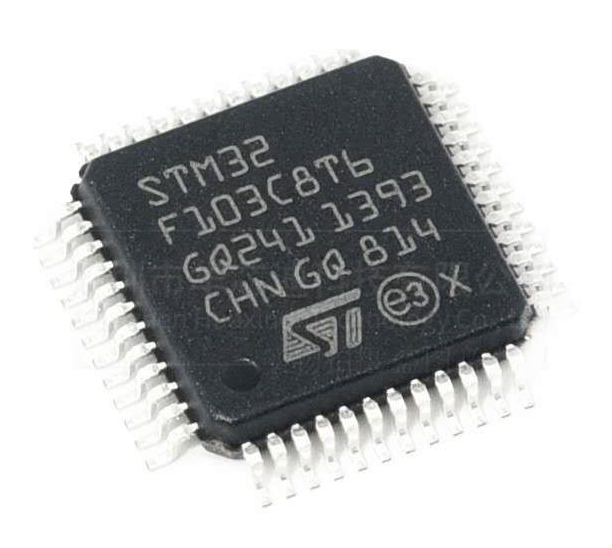

------

2.1.2 计算机的组成部分🏃🏃
~~~~~~~~~~~~~~~~~~~~~~~~~~~~~~~~~~~~~~~~~~~~~~~~~~~~~~~~~~~

冯.诺伊曼1954年发表EDVAC计算机报告,提出计算机的 ``五大结构及存储程序的设计思想,奠定现代计算机的设计基础``.

-----------------------------------------------------------

.. note::
   -  控制器(Control):整个计算机的中枢神经,其功能是对程序规定的控制信息进行解释,根据其要求进行控制,调度程序、数据、地址,协调计算机各部分工作及内存与外设的访问等。
   -  运算器(Datapath):运算器的功能是对数据进行各种算术运算和逻辑运算,即对数据进行加工处理。
   -  存储器(Memory):功能是存储程序、数据和各种信号、命令等信息,并在需要时提供这些信息。
   -  输入(Input system):输入设备的作用是将程序、原始数据、文字、字符、控制命令或现场采集的数据等信息输入到计算机。常见的输入设备有键盘、鼠标器、光电输入机、磁带机、磁盘机、光盘机等。
   -  输出(Output system):计算机的中间结果或最后结果、机内的各种数据符号及文字或各种控制信号等信息输出出来。微机常用的输出设备有显示终端CRT、打印机、激光印字机、绘图仪及磁带、光盘机等。

2.1.3 单片机的组成部分🏃🏃
~~~~~~~~~~~~~~~~~~~~~~~~~~~~~~~~~~~~~~~~~~~~~~~~~~~~~~~~~~~

如下以stm32为例,说明单片机的组成部分.

1. cortex-m3内核,由ARM公司设计并授权给芯片设计厂商使用.
2. sram是ram的一种,用来存放运行时的数据.
3. flash存放代码的存储器.
4. 定时器、串口、gpio、usb等芯片内部的外设接口.
5. 控制总线,连接内部的各个模块.

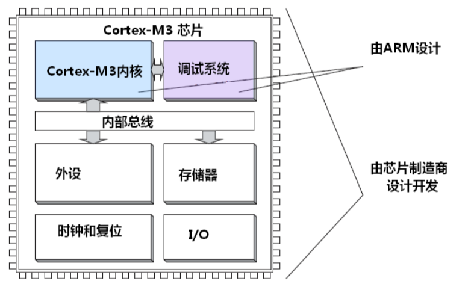

------

如上是微观的单片机内部组成,从宏观上说芯片内部主要分为两个部分,第一个是由arm公司设计的内核,第二个是由芯片设计厂商设计的芯片内部外设.

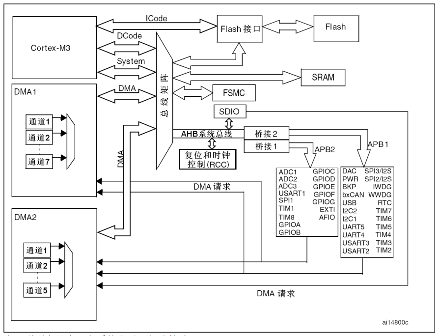

------

.. tip::

   学习stm32最主要的是学习芯片内部的外设以及这些内部外设驱动的传感器或其他设备.

2.1.4 单片机与电脑的区别🏃
~~~~~~~~~~~~~~~~~~~~~~~~~~~~~~~~~~~~~~~~~~~~~~~~~~~~~~~~~~~

.. csv-table:: 单片机与电脑的区别
  :align: center
  :header: 对比项, 电脑, 单片机
  :widths: 30,30,30

  频率,       2~5Ghz,            72Mhz
  内存容量,    GB级如16GB,       KB级如64KB
  硬盘容量,    TB级如1TB,        KB级如128KB
  功耗,        数百瓦,          小于0.5瓦
  价格,        数千元,          几十元
  用途,        通用型计算机,    专用型计算机

单片机的特点:价格便宜、体积小巧、功耗低、集成度高等.

2.1.5 单片机的用途🏃
~~~~~~~~~~~~~~~~~~~~~~~~~~~~~~~~~~~~~~~~~~~~~~~~~~~~~~~~~~~

1. 家用电器:家庭使用的洗衣机、油烟机、空调等都是由单片机作为控制单元.
2. 仪器仪表:气压检测、温度检测等.
3. 工业控制:车床、机器人、机械臂等
4. 汽车电子:胎压检测、防抱死系统等.

------

2.1.6 读懂芯片型号🏃
~~~~~~~~~~~~~~~~~~~~~~~~~~~~~~~~~~~~~~~~~~~~~~~~~~~~~~~~~~~

以 ``单片机设计电子网八戒S1开发板`` 使用的stm32f103c8t6为例.

stm32:ST公司基于arm 32位内核的微控制器产品.
f:通用目的.
103:产品线.
C:48个pin(引脚).
8:64kb的flash容量.
T:LQFP封装.
6:工作温度-40到85℃.

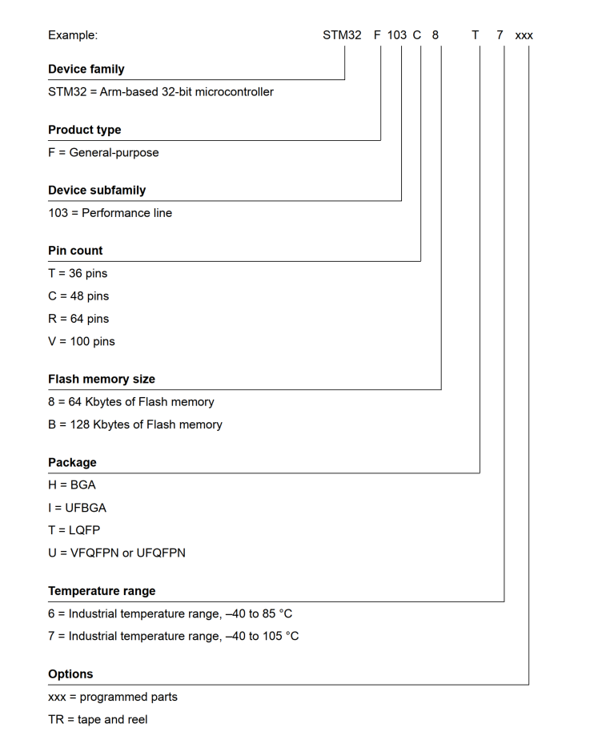

------

2.1.7 stm32单片机最小系统🏃
~~~~~~~~~~~~~~~~~~~~~~~~~~~~~~~~~~~~~~~~~~~~~~~~~~~~~~~~~~~

所谓 "stm32单片机最小系统"是指stm32正常工作所必须的电路组成部分.

1. ``复位电路`` : stm32在RST引脚保持低电平1-4.5ms时复位,复位有两种方式,第一种就是按键复位,第二种是上电复位.按键复位,当按键按下的时候RST引脚接通GND复位.上电复位,如下图,rc电路上电时对电容充电,RST接如低电平,电容充满电后RST接到高电平.

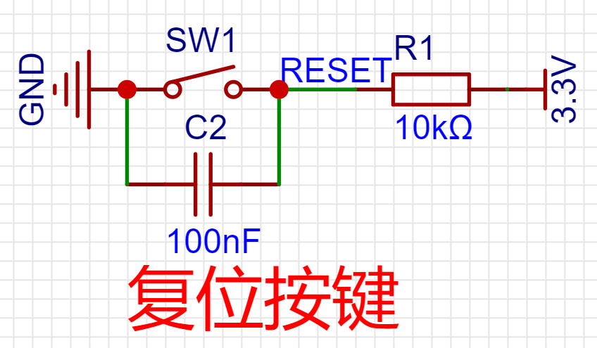

------

2. ``boot选择电路`` : boot选择电路主要的应用场合是串口isp下载的时候.

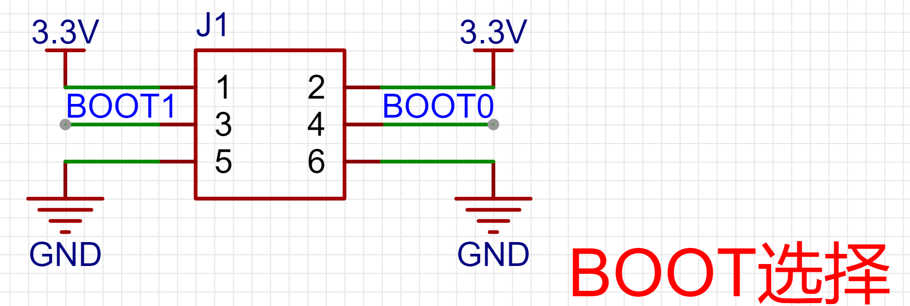

------

====== ====== ================= ==================================================
boot0  boot1  启动方式           说明
====== ====== ================= ==================================================
0       x      主闪存存储器       默认的启动方式,SWD直接下载到flash.程序从flash启动.
1       0      系统存储器         串口isp下载固件到flash,按下复位后从flash启动
1       1      内置SRAM          程序被下载到SRAM区域,不改变flash中的固件内容.
====== ====== ================= ==================================================

3. ``下载电路`` : ``单片机设计电子网八戒S1开发板`` 通过SWD接口的下载器下载程序,这种下载方式具有速度快、接线简单、可以debug等优点.

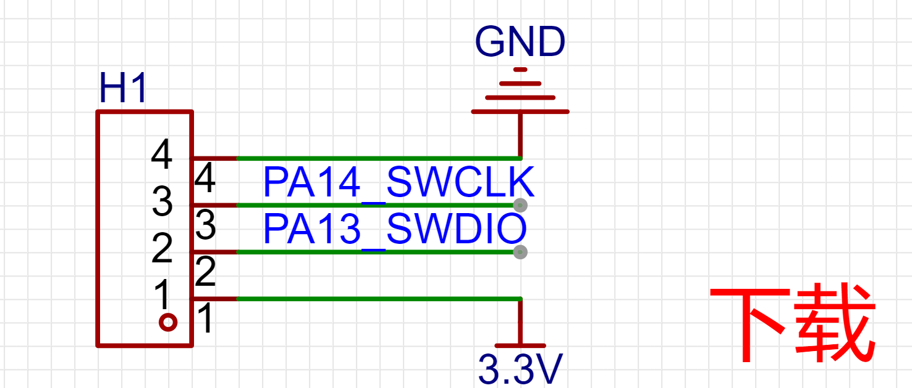

------

4. ``晶振电路`` :stm32的晶振分为高速和低速两种,高速晶振可以选择8~16MHz供系统时钟,倍频后系统时钟可以达到72Mhz.低速晶振32.768KHz供RTC使用.

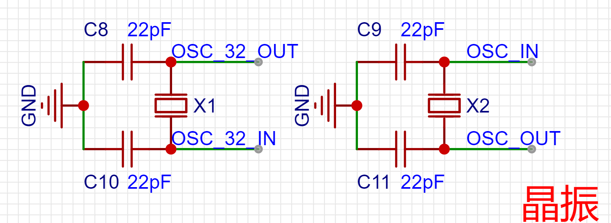

------

5. ``供电电路``: 开发板可以通过下载器的电源供电,也可以使用TYPE-C接口的数据线供电.stm32的工作电压是3.3V,通过稳压芯片将5V转为3.3V.

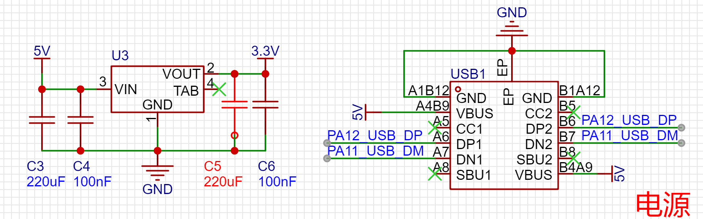

------

2.2 stm32芯片的内核🏃
-----------------------------------------------------------

stm32芯片内部第一个主要的组成部分-内核.

2.2.1 cortex m3内核🏃
~~~~~~~~~~~~~~~~~~~~~~~~~~~~~~~~~~~~~~~~~~~~~~~~~~~~~~~~~~~

cortex m3处理器内核是单片机的中央处理单元(CPU).其内部的数据路径是 32 位的，寄存器是 32 位的，存储器接 口也是 32 位的。

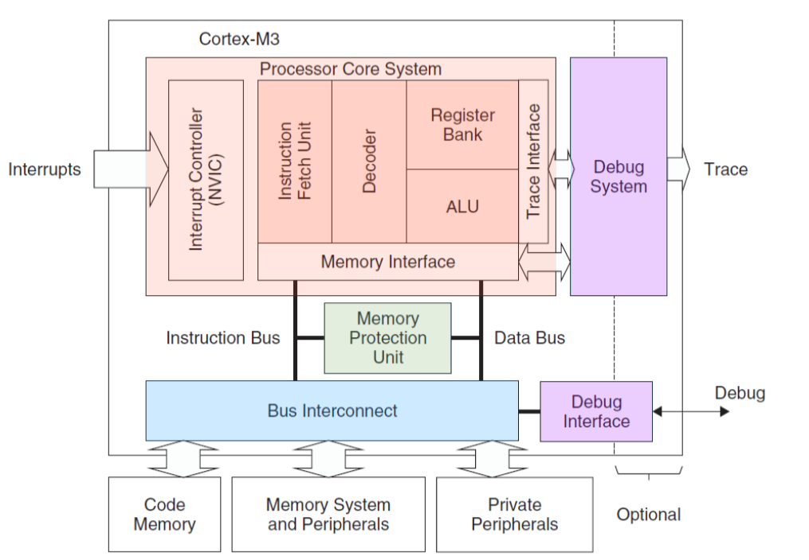

------

2.2.2 内核滴答定时器🏃
~~~~~~~~~~~~~~~~~~~~~~~~~~~~~~~~~~~~~~~~~~~~~~~~~~~~~~~~~~~

系统计时器SysTick是一个24位倒计时计时器.将此用作实时操作系统(RTOS)滴答计时器或作为简单计数器.课程中是将滴答定时器作为延时函数的时钟源.

2.2.3 内核可编程中断与中断优先级🏃
~~~~~~~~~~~~~~~~~~~~~~~~~~~~~~~~~~~~~~~~~~~~~~~~~~~~~~~~~~~

中断也被叫做异常是微处理器的一种常见特性.中断一般是由硬件(例如外设、外部引脚)产生,当中断产生以后 CPU 就会中断当前的程序执行流程转而去处理中断服务中指定的操作.例如早上开始一直在家工作,如果没有打扰会一直的工作到中午,突然预约的快递上门取件到了,这时候放下手上正在做的工作,转而去处理预约的快递事情,处理完后继续的工作.

cortex m3 内核支持 256 个中断(16 个内核+240 外部)和可编程 256 级中断优先级的设置,与其相关的中断控制和中断优先级控制寄存器(NVIC、SYSTICK 等)也都属于cortex m3 内核的部分.但STm32 目前支持的中断共为 84 个(16 个内核+68 个外部),和 16 级可编程中断优先级
的设置(仅使用中断优先级设置 8bit 中的高 4 位)

.. csv-table:: 内核可编程中断与中断优先级
  :align: center
  :header: 类型,位置,优先级,描述
  :widths: 30,30,30,30

   -,0,-,在复位时栈顶从向量表的第一个入口加载
   Reset 复位,1,-3(最高),"在上电和热复位(warm reset)时调用"
   Non-maskable Interrupt 不可屏蔽中断(NMI),2,-2,不可屏蔽中断(来自外部 NMI 输入脚)
   Hard Fault 硬故障,3,-1,"所有被除能的 fault,都将“上访”成硬 fault "
   Memory Management 存储器管理,4,可配置,"存储器管理 fault,MPU 访问犯规以及访问非法位置"
   Bus Fault 总线故障,5,可配置,"总线错误(预取流产(Abort)或数据流产)"
   Usage Fault 使用故障,6,可配置,"由于程序错误导致的异常"
   -,7~10,-,保留
   SVCall 系统服务调用,11,可配置,"利用 SVC 指令调用系统服务"
   Debug Monitor 调试监控,12,可配置,"调试监视器(断点，数据观察点，或者是外部调试请求)"
   -,13,-,保留
   PendSV 可挂起的系统服务请求,14,可配置,"为系统设备而设的 “可悬挂请求” (pendable request)"
   SysTick 系统节拍定时器,15,可配置,"系统滴答定时器(System tick timer)"

2.3 stm32芯片内部外设🏃
-----------------------------------------------------------

stm32芯片内部第二个主要的组成部分-芯片内部的外设.stm32单片机的芯片内部的外设决定了stm32单片机能够驱动的外设(传感器、控制器等).

2.3.1 gpio🏃
~~~~~~~~~~~~~~~~~~~~~~~~~~~~~~~~~~~~~~~~~~~~~~~~~~~~~~~~~~~

gpio(general-purpose inputs/outputs),通过下图可以看出stm32f103c8t6拥有48个引脚,其中一部分被供电或者晶振等占用,这是让单片机工作所必须的引脚.剩下的37个引脚是用户可以通过软件进行配置的gpio,这些引脚可以配置为输入或者输出模式.当然这些引脚也可以配置为其他功能,比如作为i2c的scl和sda引脚.

.. figure:: ../media/stm32f103c8t6_gpio.png
   :alt: stm32f103c8t6的gpio
   :width: 50%
   :align: center

------

gpio作为输出功能,比如可以使用gpio控制led的亮灭,再比如控制继电器的开合,当明白了原理后会发现,这些都是通过电平高低来控制的,本质上是一样的.

gpio作为输入功能,比如按键,就是检测电平的变化,按键按下时检测到低电平,按键松开时检测到高电平.

2.3.2 i2c🏃
~~~~~~~~~~~~~~~~~~~~~~~~~~~~~~~~~~~~~~~~~~~~~~~~~~~~~~~~~~~

i2c是一组非常重要的总线,可以通过scl和sda两个引脚控制多个传感器或设备,设备间通过地址的方式来区分.比如手机主板上有加速度传感器,可以检测是否拿起手机,也有光照传感器,可以检测环境的光照强度变化,这些设备都是通过同一组i2c线连接到主控芯片,各种i2c设备都有唯一的地址,这样就能够区分是哪个设备发来的数据.

stm32f103c8t6有两组i2c控制器,分别为i2c1和i2c2.i2c的scl和sda的引脚并不是固定的,以i2c1为例,默认接法是SCL-PB6,SDA-PB7.也可以被映射到SCL-PB8,SDA-PB9.

2.3.3 spi🏃
~~~~~~~~~~~~~~~~~~~~~~~~~~~~~~~~~~~~~~~~~~~~~~~~~~~~~~~~~~~

spi是另外一种非常重要的总线,多用在速度要求较高的场合,比如读写sd卡或者mmc等存储设备.

stm32f103c8t6有两组spi总线,可以作为主模式或者从模式,18 Mbit/s的通信全双工和单工通信模式.

2.3.4 usart🏃
~~~~~~~~~~~~~~~~~~~~~~~~~~~~~~~~~~~~~~~~~~~~~~~~~~~~~~~~~~~

usart就是我们常说的串口.在stm32中的串口有同步串口和异步串口的区别,但常用的是异步串口也就是uart,所以后续说到串口都是指异步串口.stm32f103c8t6有三组串口.这三组串口的io也是可以映射到其他io上.

2.3.5 usb🏃
~~~~~~~~~~~~~~~~~~~~~~~~~~~~~~~~~~~~~~~~~~~~~~~~~~~~~~~~~~~

usb是生活中听到比较多的接口,stm32f103c8t6上用作一路usb2.0接口,后续的教程中也会有usb作为虚拟串口的介绍.

2.3.6 can🏃
~~~~~~~~~~~~~~~~~~~~~~~~~~~~~~~~~~~~~~~~~~~~~~~~~~~~~~~~~~~

can是在工控和汽车电子中是一种非常重要的总线,stm32f103c8t6拥有一路can总线,在教程中并没涉及到can 总线的使用,需要购买can总线相关的调试设备,会极大的增加学习成本,所以没有相关教程,如果需要使用can的时候,自己查找下资料也是可以学会的.

2.3.7 timer🏃
~~~~~~~~~~~~~~~~~~~~~~~~~~~~~~~~~~~~~~~~~~~~~~~~~~~~~~~~~~~

这是学习stm32的重点,后续的课程中也会花大量的时间学如何使用定时器.比如控制电机的转动,计时控制等都涉及到定时器.

2.3.8 rtc🏃
~~~~~~~~~~~~~~~~~~~~~~~~~~~~~~~~~~~~~~~~~~~~~~~~~~~~~~~~~~~

rtc是实时时钟,掌握了使用rtc就可以开发万年历.

2.4 其他开发板外设🏃
-----------------------------------------------------------

2.2.1 led灯🏃
~~~~~~~~~~~~~~~~~~~~~~~~~~~~~~~~~~~~~~~~~~~~~~~~~~~~~~~~~~~

gpio输出的使用.

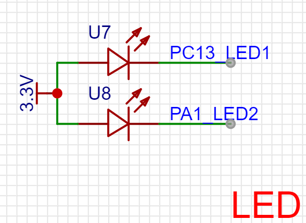

------

2.2.2 按键🏃
~~~~~~~~~~~~~~~~~~~~~~~~~~~~~~~~~~~~~~~~~~~~~~~~~~~~~~~~~~~

gpio输入的使用.

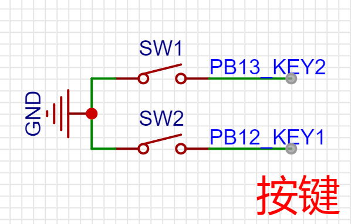

------

2.2.3 ds18b20温度传感器🏃
~~~~~~~~~~~~~~~~~~~~~~~~~~~~~~~~~~~~~~~~~~~~~~~~~~~~~~~~~~~

gpio输入输出控制的单总线协议的使用.

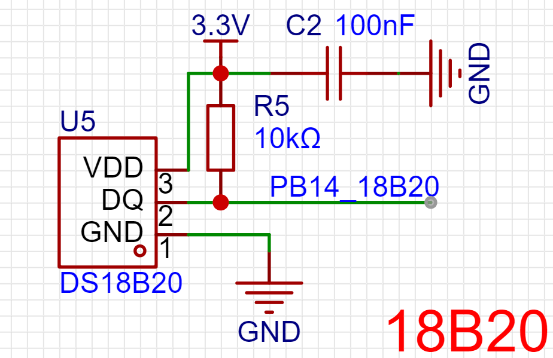

------

2.2.4 dht11温湿度传感器🏃
~~~~~~~~~~~~~~~~~~~~~~~~~~~~~~~~~~~~~~~~~~~~~~~~~~~~~~~~~~~

gpio输入输出控制的单总线协议的使用.

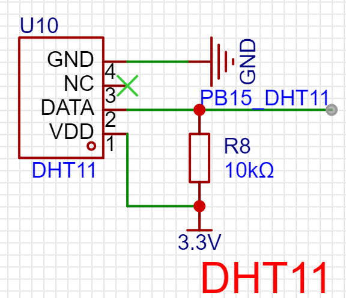

------

2.2.5 红外接收🏃
~~~~~~~~~~~~~~~~~~~~~~~~~~~~~~~~~~~~~~~~~~~~~~~~~~~~~~~~~~~

通过红外接收可以熟悉定时器的捕获使用,可以复制红外遥控器的码值.

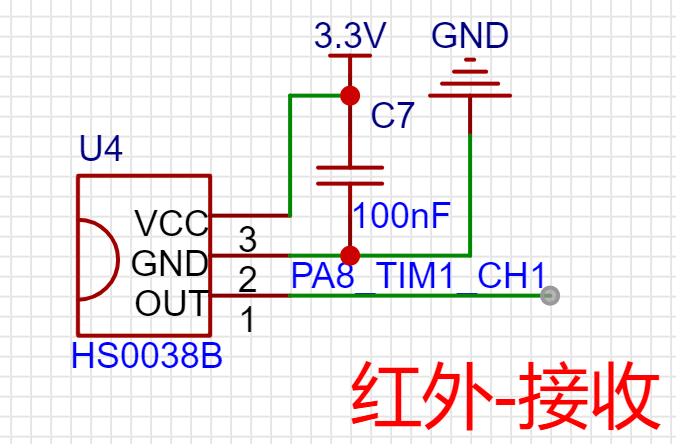

------ 

2.2.6 红外发射🏃
~~~~~~~~~~~~~~~~~~~~~~~~~~~~~~~~~~~~~~~~~~~~~~~~~~~~~~~~~~~

过红外接收可以熟悉定时器的pwm输出,可以模拟红外遥控器的输出.

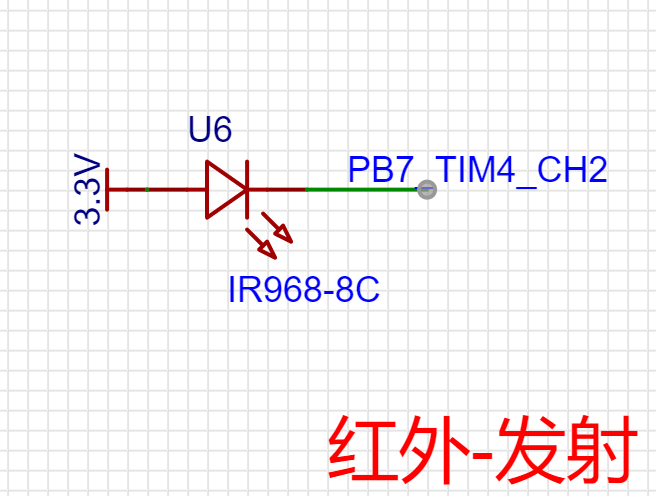

------

2.2.7 无源蜂鸣器🏃
~~~~~~~~~~~~~~~~~~~~~~~~~~~~~~~~~~~~~~~~~~~~~~~~~~~~~~~~~~~

通过无源蜂鸣器播放音乐,可以熟悉定时器的使用.

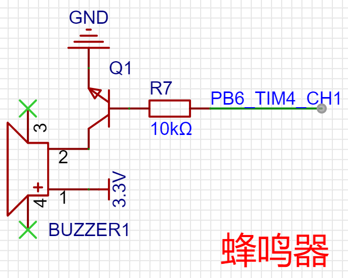

------

2.2.8 光敏电阻🏃
~~~~~~~~~~~~~~~~~~~~~~~~~~~~~~~~~~~~~~~~~~~~~~~~~~~~~~~~~~~

通过eeprom芯片主要是熟悉adc的使用,即模拟信号转换为数字信号.

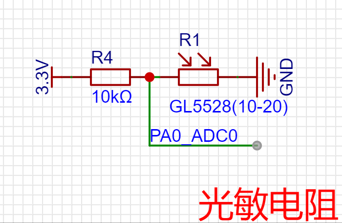

------

2.2.9 at24c02🏃
~~~~~~~~~~~~~~~~~~~~~~~~~~~~~~~~~~~~~~~~~~~~~~~~~~~~~~~~~~~

通过eeprom芯片主要是熟悉i2c协议.

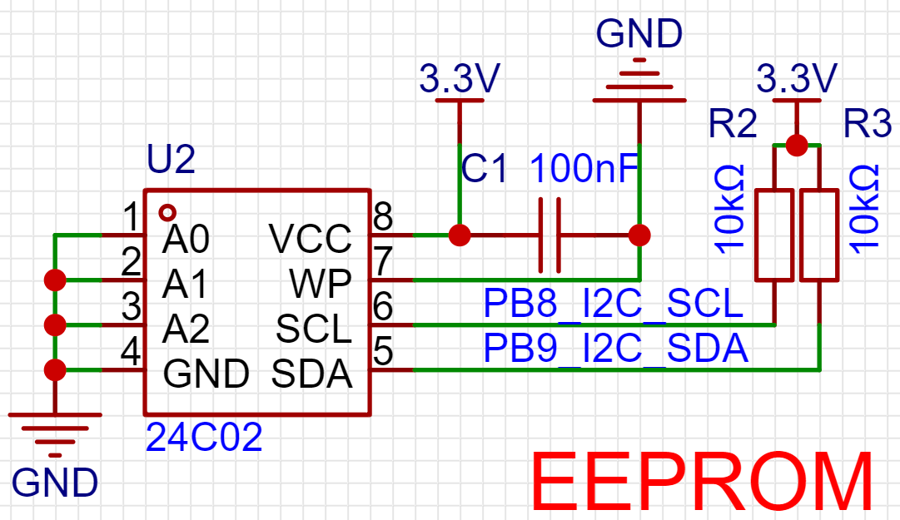

------

2.2.10 oled显示屏🏃
~~~~~~~~~~~~~~~~~~~~~~~~~~~~~~~~~~~~~~~~~~~~~~~~~~~~~~~~~~~

这个是i2c协议的另外一个应用,与at24c02是挂载在同一个i2c总线上.

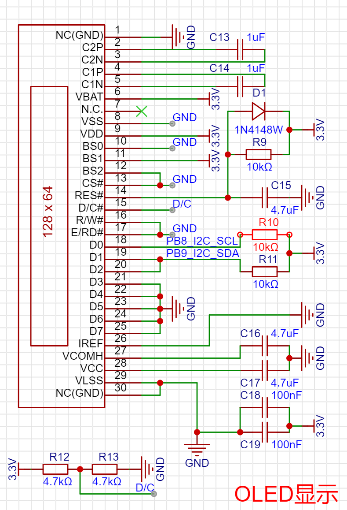

------

2.2.11 spi flash🏃
~~~~~~~~~~~~~~~~~~~~~~~~~~~~~~~~~~~~~~~~~~~~~~~~~~~~~~~~~~~

通过flash芯片主要是熟悉spi协议.

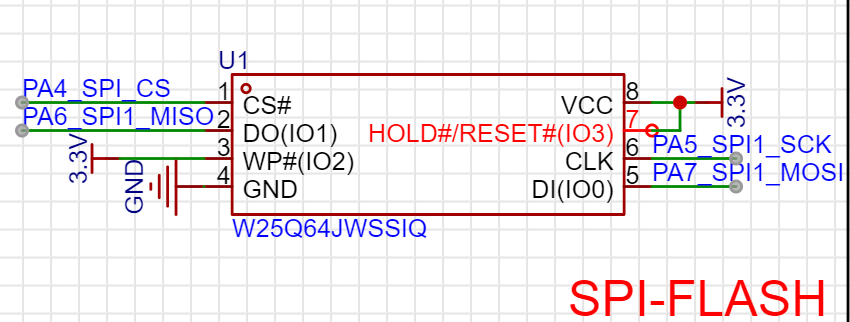

------

2.2.12 蓝牙模块🏃
~~~~~~~~~~~~~~~~~~~~~~~~~~~~~~~~~~~~~~~~~~~~~~~~~~~~~~~~~~~

使用的是JDY-24M的蓝牙模块,通过串口at指令的方式与stm32通信,在配合手机app可以实现多种玩法.

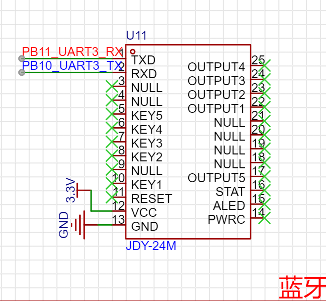

------

2.2.13 usb🏃
~~~~~~~~~~~~~~~~~~~~~~~~~~~~~~~~~~~~~~~~~~~~~~~~~~~~~~~~~~~

TYPE-C接口的USB母头,在后续的课程中涉及到,这样就不需要串口线的,可以与电脑通过USB2.0协议通信.也是开发板的供电接口.

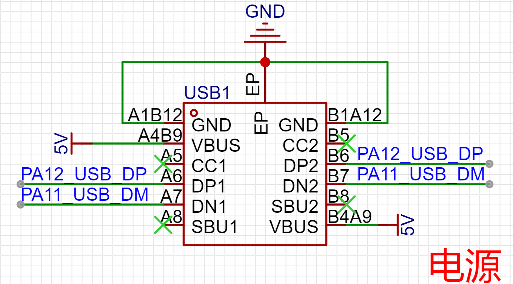
