第04章.stm32工程构建编译下载🏃
===========================================================

以往使用keil开发stm32需要自己一步一步的新建一个工程,也可以基于已有的工程模板修改.现在使用stm32cubme这个软件就可以直接生成一个工程,同时可以进行外设的初始化配置.所以后面就以 ``keil+stm323cubemx`` 的方式学习. stm323cubemx生成项目的工程以及外设的初始化,keil编译、调试、下载程序.

4.1 stm32cubemx新建stm32工程🏃
-----------------------------------------------------------

1. 根据使用的mcu的型号创建工程.

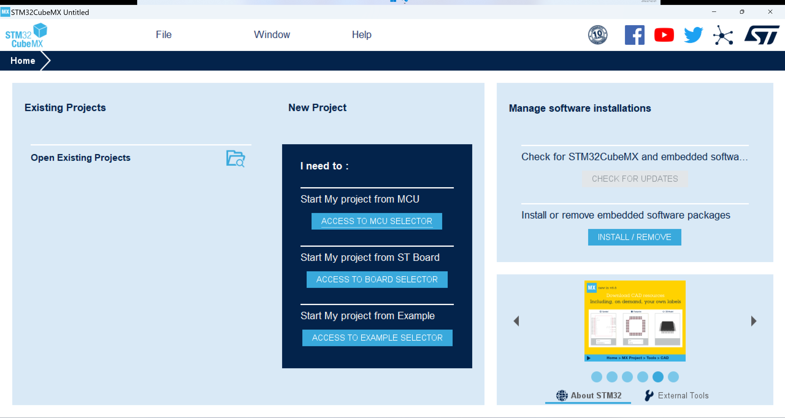

------

2. 键入使用的stm32单片机的型号.

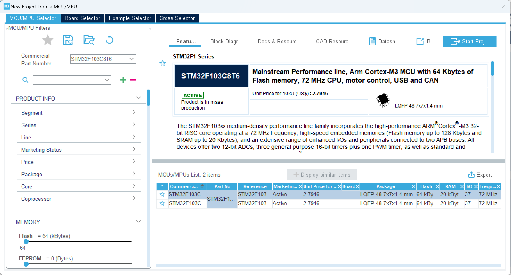

------

3. 选择时钟源,这里配置了高速时钟源和低速时钟源两种.

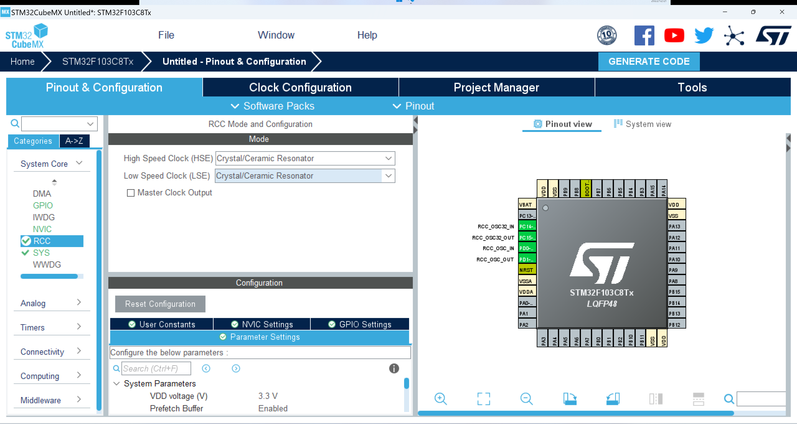

------

4. 配置下载器的种类,不论使用jlink还是stlink下载器使用的都是swd接口,所以需要先配置下载的方式,如果不配置可能会导致下一次无法下载的问题.

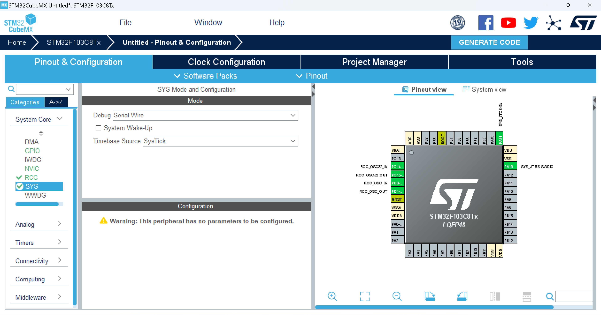

------

5. 这里需要配置工程的名称以及工程的路径,stm32cubemx可以生成多种工程文件,我们使用的是mdk,所以配置为mdk.

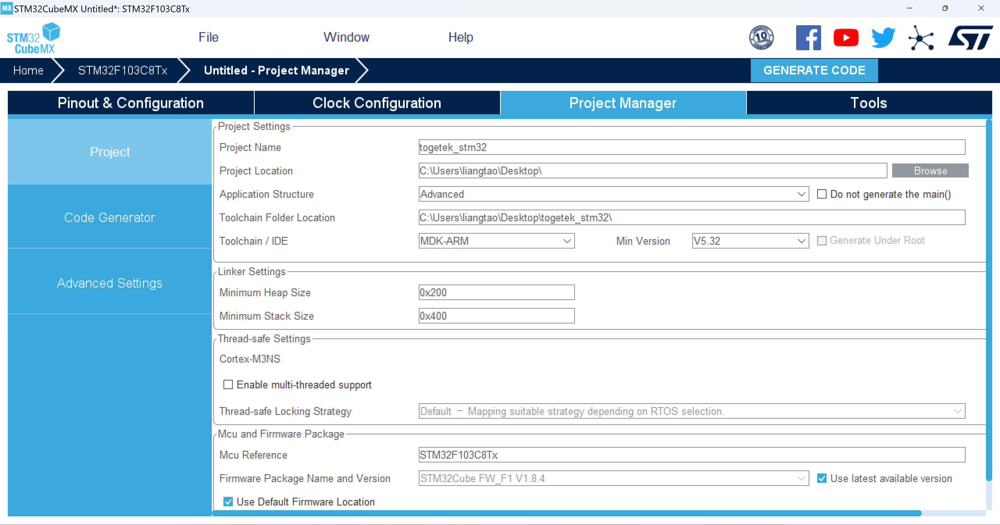

------

6. 这里也要勾选"Generate peripheral initalization as pair of '.c/h' files per peripheral"

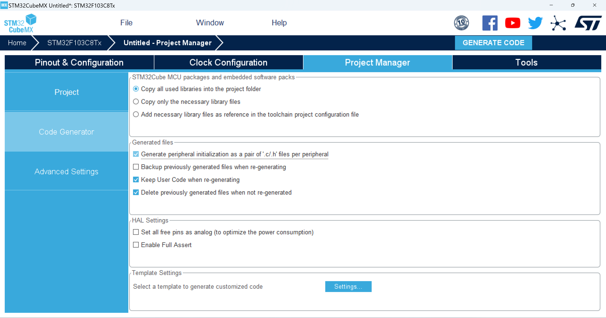

------

7. 点击“Open Project”即可打开MDK的工程.

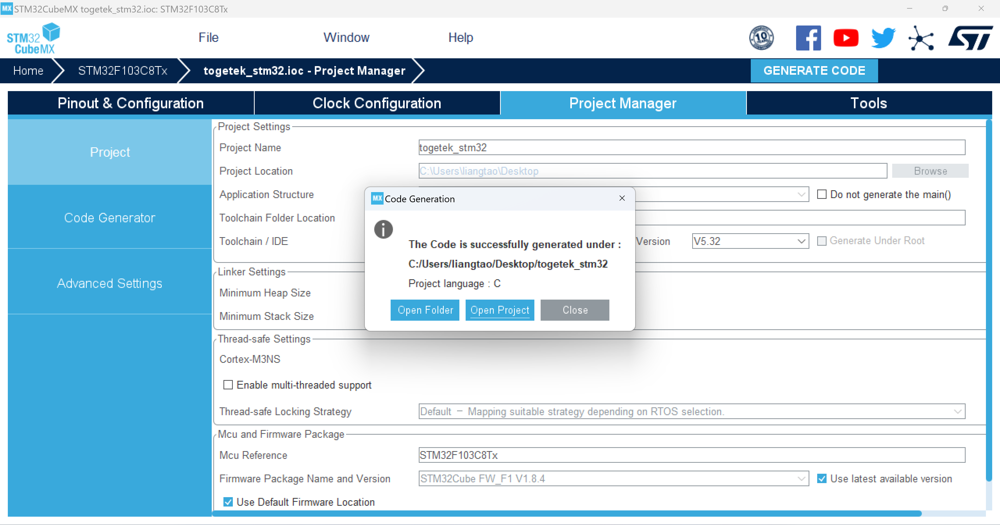

------

4.2 keil编译stm32工程🏃
-----------------------------------------------------------

1. 打开keil后的主界面.

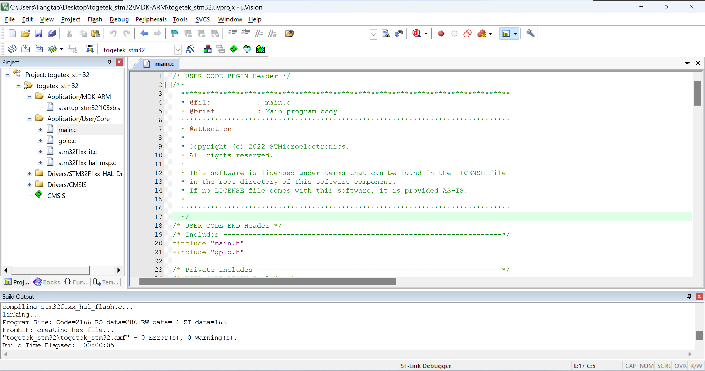

------

2. 如下图示,编译按钮.

------

4.3 下载程序到开发板🏃
-----------------------------------------------------------

stm32的下载按照接口分有:swd下载、串口isp下载、jtag下载.这三种下载方式对应不同的接线方式,jtag接口下载由于需要连接较多的线,所以教程中不涉及到.最方便的下载方式是swd接口下载,只需要两根下载线即可,而且速度很快,串口下载需要选择boot模式而且速度慢,只有在没有下载器的时候才会使用串口isp下载.

4.3.1 通过下载器下载程序到开发板🏃
~~~~~~~~~~~~~~~~~~~~~~~~~~~~~~~~~~~~~~~~~~~~~~~~~~~~~~~~~~~

1. 选择使用的下载器类型.

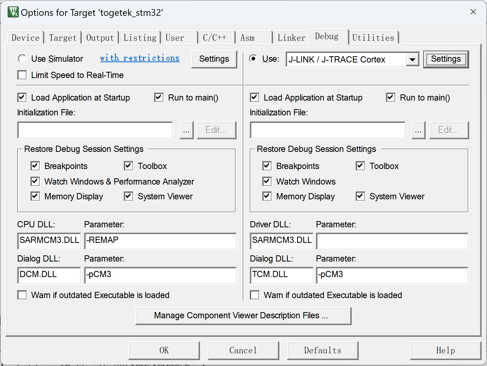

------

2. 下载器的Port,选择 "SW"

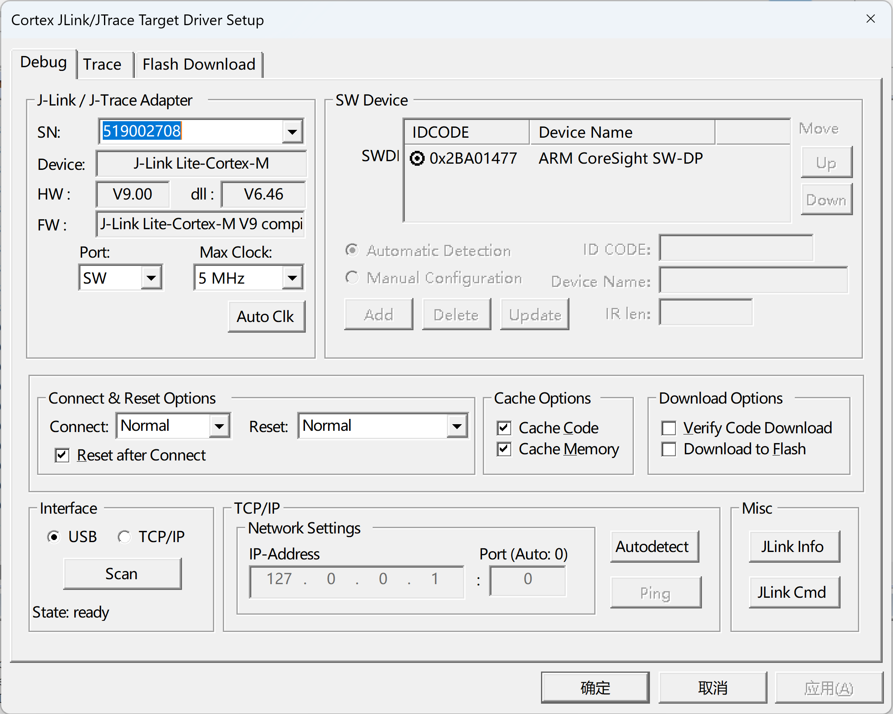

------

3. 勾选“Reset and Run”

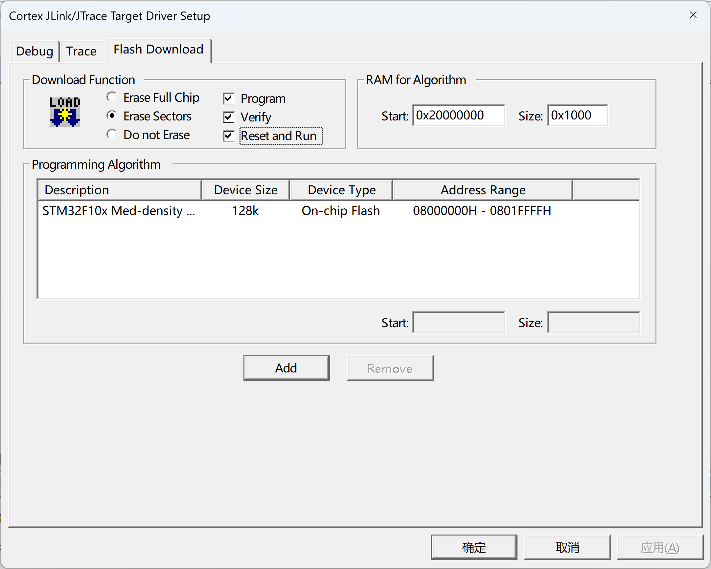

------

4. 点击“LOAD”,下载程序

------

5. 下载完成日志.

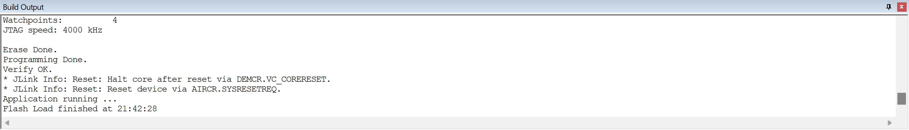

4.3.2 通过串口线下载程序到单片机🏃
~~~~~~~~~~~~~~~~~~~~~~~~~~~~~~~~~~~~~~~~~~~~~~~~~~~~~~~~~~~

如下图,使用flymcu软件将固件下载到单片机,端口号选择ch340的端口.波特率默认选择115200.左下键关于RTS和DTR的选择默认即可,实测选择任意一个都能下载进去.其他配置如图即可.

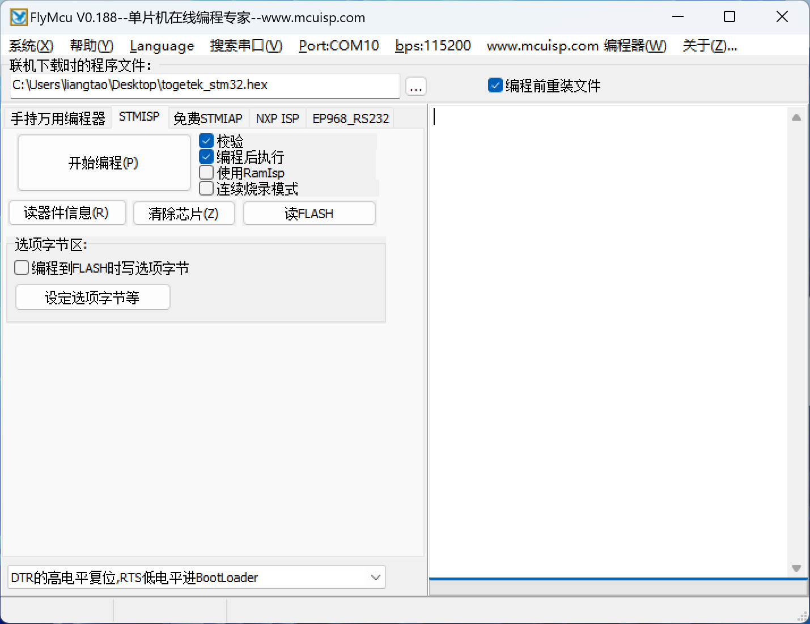

------

检查keil中是否勾选生成hex文件,如果没有勾选则需要在勾选后再次编译代码,生成的hex文件位于togetek\MDK-ARM\togetek文件夹下.导入到flymcu.

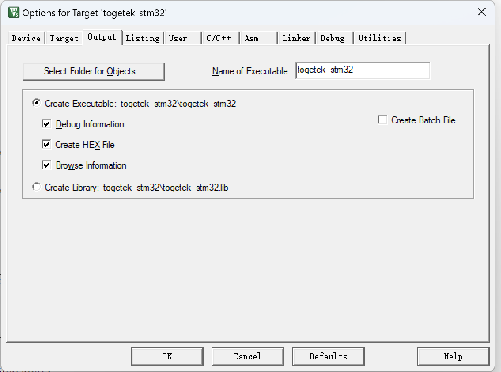

------

.. figure:: ./../media/boot模式选择.png
   :alt: keil生成hex文件
   :width: 60%
   :align: center

------

4.3.3 stm32几种下载方式的对比🏃
~~~~~~~~~~~~~~~~~~~~~~~~~~~~~~~~~~~~~~~~~~~~~~~~~~~~~~~~~~~

.. csv-table:: stm32几种下载方式的对比
  :align: center
  :header: 对比,swd接口,串口isp接口,jtag接口
  :widths: 30,30,30,30

  接线,swclk和swdio,rx和tx,多根下载线
  速度,快,慢,快
  支持仿真,支持,不支持,支持
  设备,dap-link、j-link、st-link,串口线,j-link

