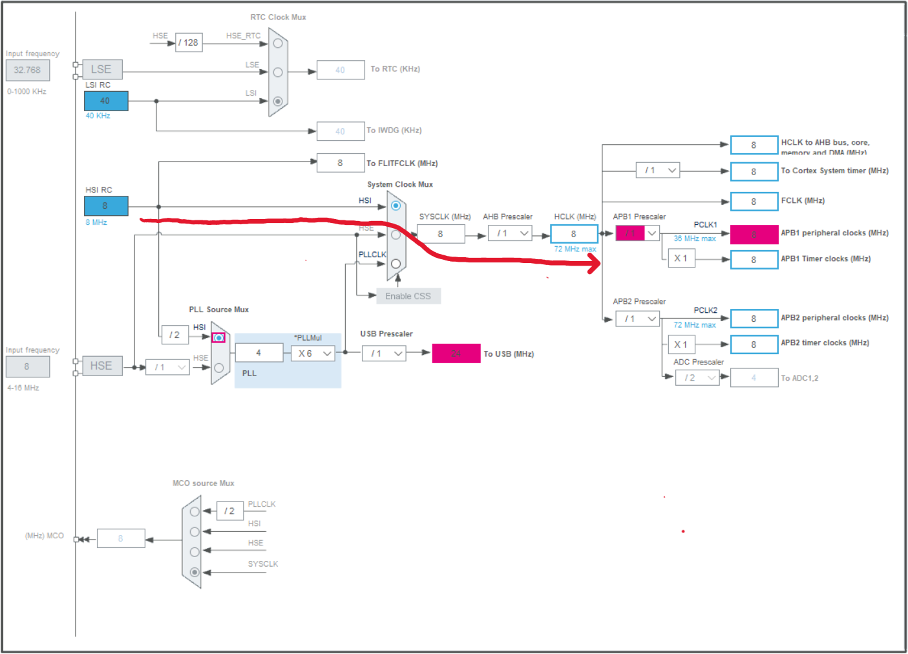
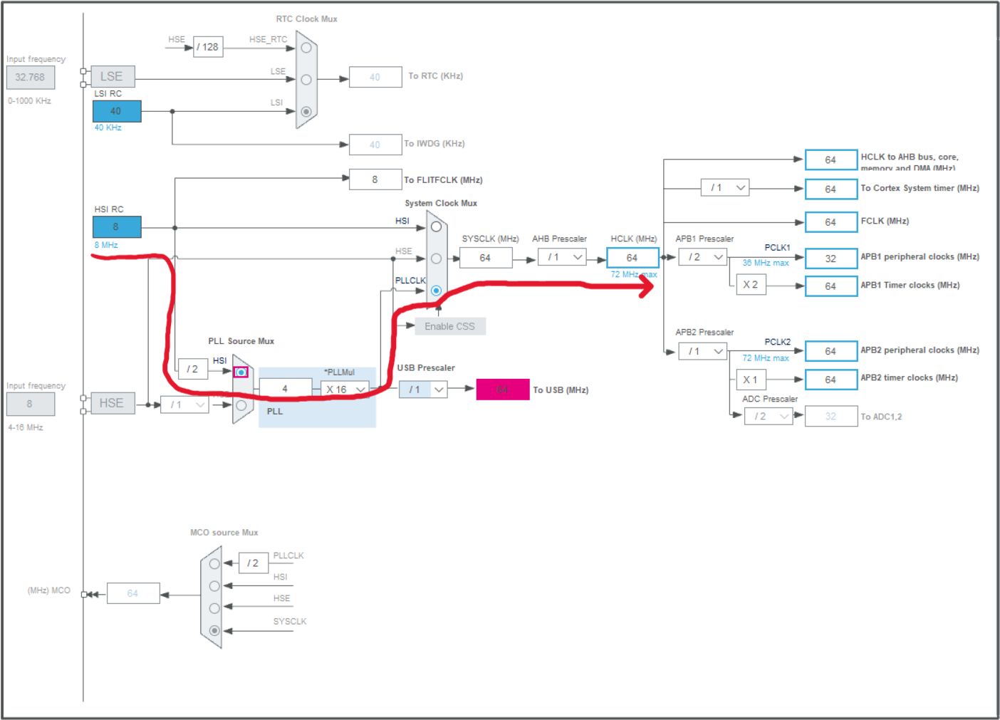
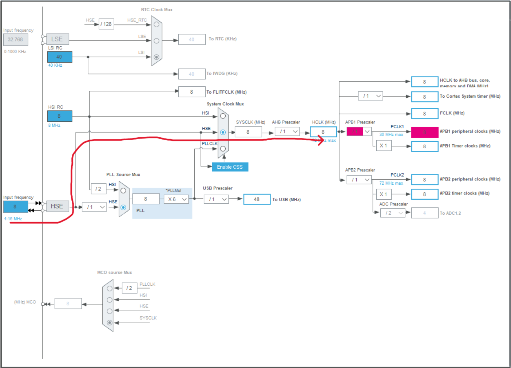
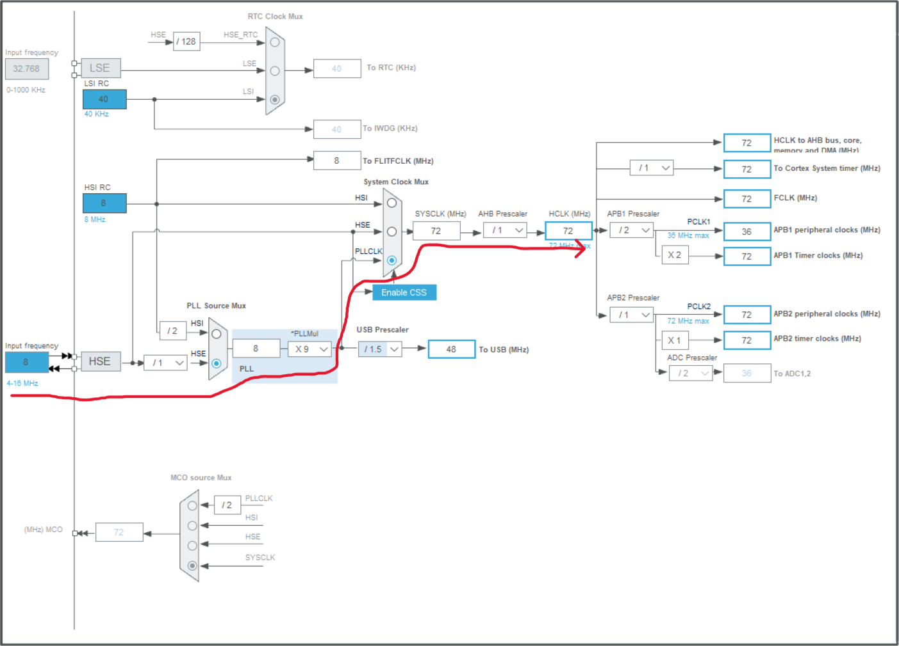
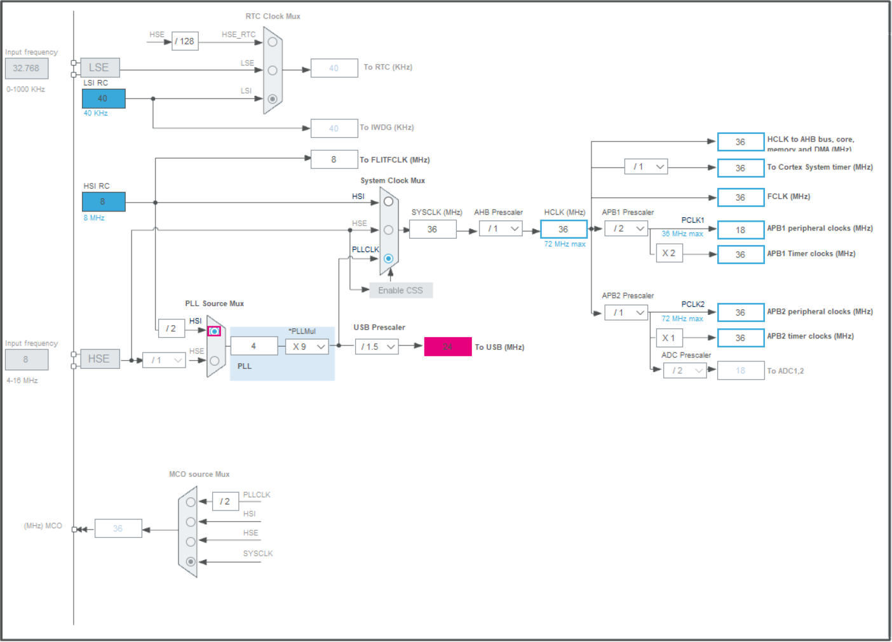
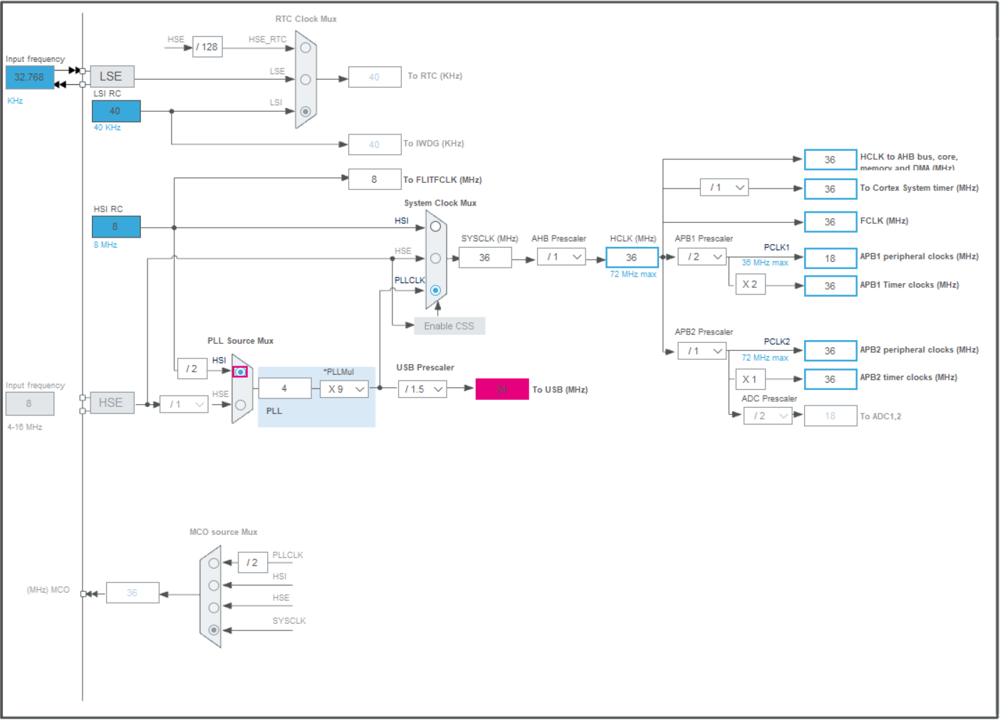
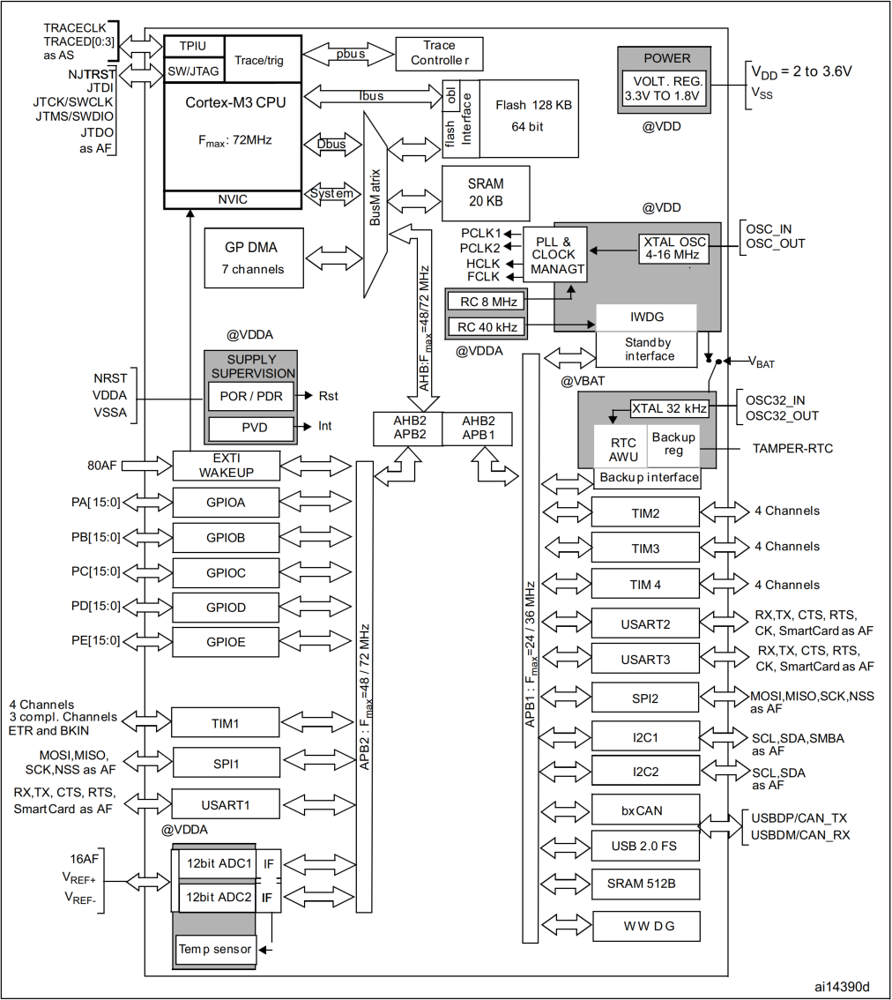

第05章.stm32时钟系统 🏃
===========================================================

stm32有着复杂的时钟系统,在单片机中时钟就像人的心脏一样推动着内核和外设的运转.

9.1 stm32的4个时钟源 🏃 
-----------------------------------------------------------

HSI是高速内部时钟,RC振荡器,频率为8MHz,精度不高。
HSE是高速外部时钟,可接石英/陶瓷谐振器,或者接外部时钟源,频率范围为4MHz~16MHz。
LSI是低速内部时钟,RC振荡器,频率为40kHz,提供低功耗时钟。WDG
LSE是低速外部时钟,接频率为32.768kHz的石英晶体。RTC

9.1.1 HSI是高速内部时钟 🏃☢️♻️🈯❇️🚷🚸♿🚺🚹🚰#️⃣☣️🚘😘☺️🙂🧑👴👨‍🦳🧔🎄🎑🎪🧶🩳👘🍟🍳🥨🥙🍖🥡🍱🦪🚓🚎🚜🛹🛹🛼🚲🛴🚃🚃🚟🚠🛞🤡
~~~~~~~~~~~~~~~~~~~~~~~~~~~~~~~~~~~~~~~~~~~~~~~~~~~~~~~~~~~~~~~~~~~~~~~~~~~~~~~~~~~~~~~~~~~~~~~~~~~~~~~~~~~~~~~~~~~~~~~~~~~~~~~~~~~~~~~~~~~~~~~~~~~~~~

HSI是一个8M的内部高速时钟,即使没有外部晶振芯片也可以工作.所以在一些对系统时钟要求不高的场景下可以省掉一个8M晶振的费用.

第一种配置方法:8M的时钟直接作用在系统时钟,但是由于频率过低导致挂在APB1时钟下的外设无法工作,但是芯片是可以部分工作,不建议使用这种配置.

------

第二种配置方法:8M的晶振通过PLL倍频后得到系统时钟,系统时钟最高为64M.

9.1.2 HSE是高速外部时钟
~~~~~~~~~~~~~~~~~~~~~~~~~~~~~~~~~~~~~~~~~~~~~~~~~~~~~~~~~~~

第一种配置方法:8M的晶振直接作用在系统时钟,但是由于频率过低导致挂在APB1时钟下的外设无法工作,但是芯片是可以部分工作,不建议使用这种配置.

------

第二种配置方法:8M的晶振通过PLL倍频后得到系统时钟,系统时钟最高为72M.

9.1.3 LSI是低速内部时钟
~~~~~~~~~~~~~~~~~~~~~~~~~~~~~~~~~~~~~~~~~~~~~~~~~~~~~~~~~~~

------

9.1.4 LSE是低速外部时钟
~~~~~~~~~~~~~~~~~~~~~~~~~~~~~~~~~~~~~~~~~~~~~~~~~~~~~~~~~~~

------

9.2 stm32的APB1和APB2时钟
-----------------------------------------------------------

