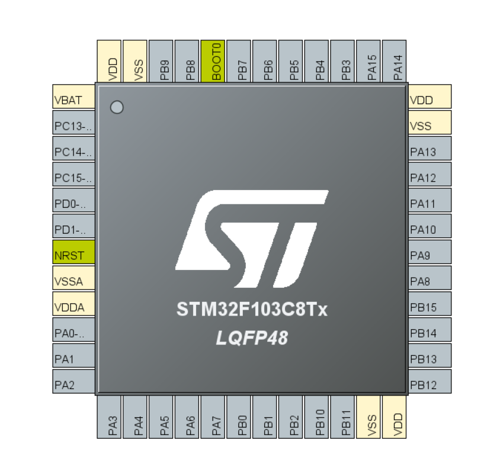
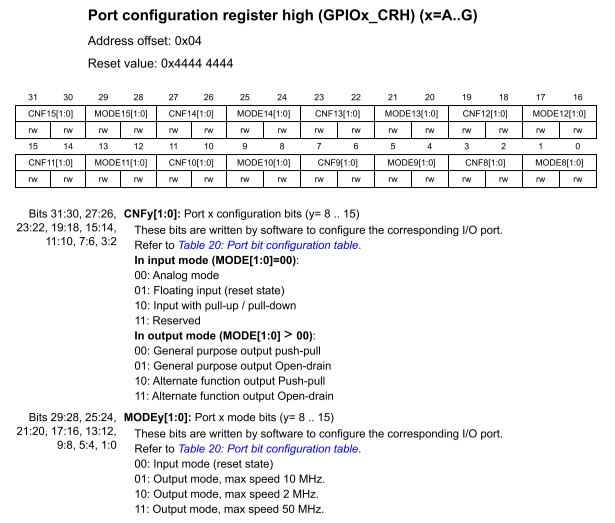

第08章.gpio基本概念
===========================================================

General Purpose Input Output,即通用输入输出端口,简称 ``GPIO`` .通过定义可以明白gpio主要作用是 ``检测输入信号的高低电平`` 以及 ``控制高低电平的输出`` .单片机外围分布的是 ``引脚`` ,其中一部分作为gpio使用,另外一些则是单片机工作所必须的引脚,例如电源、晶振、复位、下载、boot模式选择等.

8.1 gpio简介
-----------------------------------------------------------

8.1.1 gpio的电气特性
~~~~~~~~~~~~~~~~~~~~~~~~~~~~~~~~~~~~~~~~~~~~~~~~~~~~~~~~~~~

stm32的工作电压是 ``2v到3.6v`` ,5v的usb供电通过稳压芯片转换为3.3V给stm32供电.gpio输出电压为3.3V,gpio输出最低电压为0V.电压输入 ``-0.3V到1.164V ``识别为低电平,电压 ``1.833V到3.6V`` 识别为高电平.gpio最大输出 ``25mA`` 电流.

8.1.2 gpio的分组
~~~~~~~~~~~~~~~~~~~~~~~~~~~~~~~~~~~~~~~~~~~~~~~~~~~~~~~~~~~

stm32f103c8t6 有4组IO,GPIOA0~A15、GPIOB0~B15、GPIOC13~C15、GPIOD0~D1一共37个GPIO.GPIOA、GPIOB、GPIOC、GPIOD是IO的分组,每组IO最多有16个gpio.组内的GPIO从0到15编号,但并不是每组IO都有16个GPIO.

------

8.1.3 stm32的gpio结构
~~~~~~~~~~~~~~~~~~~~~~~~~~~~~~~~~~~~~~~~~~~~~~~~~~~~~~~~~~~

stm32的gpio结构上分为两个部分,输入部分和输出部分,输入部分可以读取按键的开关状态,输出部分可以写入高低电平控制LED.

8.2 gpio工作模式
-----------------------------------------------------------

8.2.1 gpio四种输入模式
~~~~~~~~~~~~~~~~~~~~~~~~~~~~~~~~~~~~~~~~~~~~~~~~~~~~~~~~~~~

4种输入模式:

1. 浮空输入:输入电平不确定,受外界环境影响.

2. 上拉输入:输入默认为高电平.
   
3. 下拉输入:输入默认为低电平.
   
4. 模拟输入:模拟信号输入.

8.2.2 gpio四种输出模式
~~~~~~~~~~~~~~~~~~~~~~~~~~~~~~~~~~~~~~~~~~~~~~~~~~~~~~~~~~~

4种输出模式:

1. 开漏输出:不能输出高电平,必须有外部（或内部）上拉才能输出高电平

2. 开漏复用功能:不能输出高电平,必须有外部（或内部）上拉才能输出高电平,由其他外设控制输出

3. 推挽式输出:可输出高低电平,驱动能力强

4. 推挽式复用功能:可输出高低电平,驱动能力强,由其他外设控制输出

8.2.3 gpio三种翻转速度
~~~~~~~~~~~~~~~~~~~~~~~~~~~~~~~~~~~~~~~~~~~~~~~~~~~~~~~~~~~

stm32f103c8t6的最大时钟频率为72Mhz,约为13.89ns.而最大电平翻转速度为20ns,因此需要两个时钟周期.

3种最大翻转速度:

1. 2MHZ
2. 10MHz
3. 50MHz

8.3 stm32的gpio相关寄存器
-----------------------------------------------------------

8.3.1 GPIOx_CRL、GPIOx_CRH寄存器
~~~~~~~~~~~~~~~~~~~~~~~~~~~~~~~~~~~~~~~~~~~~~~~~~~~~~~~~~~~

GPIOx_CRL、GPIOx_CRH为gpio模式配置寄存器,寄存器为只写,STM32的一组GPIO有16个IO口,比如GPIOA这一组,有GPIOA0~GPIOA15共16个GPIO,每一个IO口需要寄存器的4位用来配置工作模式.那么一组GPIO就需要64位的寄存器来存放这一组GPIO的工作模式的配置,但STM32的寄存器都是32位的,所以只能使用2个32位的寄存器来存放了.GPIOx_CRL用来存放低八位的GPIO口(GPIOx0—GPIOx7)的配置,GPIOx_CRH用来存放高八位的GPIO口(GPIOx8—GPIOx15)的配置.

GPIOx_CRL寄存器的配置如下图.

------

GPIOx_CRL寄存器的配置如下图.

------

8.3.2 GPIOx_IDR寄存器
~~~~~~~~~~~~~~~~~~~~~~~~~~~~~~~~~~~~~~~~~~~~~~~~~~~~~~~~~~~

GPIOx_IDR为gpio端口输入数据寄存器,寄存器只读.只使用了低16位,每一个位对应分组内的一个gpio.

8.3.3 GPIOx_ODR寄存器
~~~~~~~~~~~~~~~~~~~~~~~~~~~~~~~~~~~~~~~~~~~~~~~~~~~~~~~~~~~

GPIOx_ODR为gpio端口输出数据寄存器,寄存器可读写.只使用了低16位,每一个位对应分组内的一个gpio.只能够整体操作16位的数据,不能够单独操作每一位.

8.3.4 GPIOx_BSRR寄存器
~~~~~~~~~~~~~~~~~~~~~~~~~~~~~~~~~~~~~~~~~~~~~~~~~~~~~~~~~~~

GPIOx_BSRR为gpio端口位设置/清除寄存器,寄存器只写.GPIOx_BSRR也是32位寄存器,其中低16位是对GPIOx_ODR寄存器16个IO位置1,高16位是对GPIOx_ODR寄存器16个IO位置0.如果GPIOx_BSRR的高16位和低16位都对某一IO口进行了配置,则以GPIOx_BSRR寄存器的低16位的配置为优先级.通过控制GPIOx_ODR寄存器的方式控制GPIO的输出状态.

8.3.5 GPIOx_BRR寄存器
~~~~~~~~~~~~~~~~~~~~~~~~~~~~~~~~~~~~~~~~~~~~~~~~~~~~~~~~~~~

GPIOx_BRR寄存器也是32位寄存器,但是高16位被保留.它的作用是将对应的0~15 GPIO口清0.即当对应位为1时,对应IO口清0,当对应位为0时,对应IO口保持原来的状态.

------

8.3.6 GPIOx_LCKR寄存器
~~~~~~~~~~~~~~~~~~~~~~~~~~~~~~~~~~~~~~~~~~~~~~~~~~~~~~~~~~~

当执行正确的写序列设置了位16(LCKK)时,该寄存器用来锁定端口位的配置.位[15:0]用于锁定GPIO端口的配置.锁住的是端口配置寄存器GPIOx_CRL、GPIOx_CRH.

------

8.4 gpio使用流程
-----------------------------------------------------------

8.4.1 gpio初始化
~~~~~~~~~~~~~~~~~~~~~~~~~~~~~~~~~~~~~~~~~~~~~~~~~~~~~~~~~~~

初始化gpio流程.

1. 初始化APB2时钟,GPIO的时钟来源于APB2,通过调用 ``__HAL_RCC_GPIOx_CLK_ENABLE()`` 初始化相应的时钟.

2. 配置GPIO模式,主要是初始化GPIOx_CRL、GPIOx_CRH寄存器.

.. code-block:: c
   :caption: 初始化gpio
   :linenos:

   void MX_GPIO_Init(void)
   {

      GPIO_InitTypeDef GPIO_InitStruct = {0};

      /* GPIO Ports Clock Enable */
      __HAL_RCC_GPIOC_CLK_ENABLE();
      __HAL_RCC_GPIOD_CLK_ENABLE();
      __HAL_RCC_GPIOA_CLK_ENABLE();

      /*Configure GPIO pin Output Level */
      HAL_GPIO_WritePin(LED1_GPIO_Port, LED1_Pin, GPIO_PIN_SET);

      /*Configure GPIO pin Output Level */
      HAL_GPIO_WritePin(LED2_GPIO_Port, LED2_Pin, GPIO_PIN_SET);

      /*Configure GPIO pin : PtPin */
      GPIO_InitStruct.Pin = LED1_Pin;
      GPIO_InitStruct.Mode = GPIO_MODE_OUTPUT_PP;
      GPIO_InitStruct.Pull = GPIO_NOPULL;
      GPIO_InitStruct.Speed = GPIO_SPEED_FREQ_LOW;
      HAL_GPIO_Init(LED1_GPIO_Port, &GPIO_InitStruct);

      /*Configure GPIO pin : PtPin */
      GPIO_InitStruct.Pin = LED2_Pin;
      GPIO_InitStruct.Mode = GPIO_MODE_OUTPUT_PP;
      GPIO_InitStruct.Pull = GPIO_NOPULL;
      GPIO_InitStruct.Speed = GPIO_SPEED_FREQ_LOW;
      HAL_GPIO_Init(LED2_GPIO_Port, &GPIO_InitStruct);

   }

8.4.2 gpio输出电平控制函数
~~~~~~~~~~~~~~~~~~~~~~~~~~~~~~~~~~~~~~~~~~~~~~~~~~~~~~~~~~~

.. code-block:: c
   :caption: 写入gpio状态
   :linenos:

    void HAL_GPIO_WritePin(GPIO_TypeDef *GPIOx, uint16_t GPIO_Pin, GPIO_PinState PinState)
    {
        /* Check the parameters */
        assert_param(IS_GPIO_PIN(GPIO_Pin));
        assert_param(IS_GPIO_PIN_ACTION(PinState));

        if (PinState != GPIO_PIN_RESET)
        {
            GPIOx->BSRR = GPIO_Pin;
        }
        else
        {
            GPIOx->BSRR = (uint32_t)GPIO_Pin << 16u;
        }
    }

思考:在 PinState != GPIO_PIN_RESET情况下,为什么使用GPIOx->BSRR = GPIO_Pin;而不是GPIOx->BSRR = GPIOx->BSRR&GPIO_Pin;

理由1: GPIOx->BSRR是一个只写寄存器.
理由2: GPIOx->BSRR寄存器的低16位只能够置1,低16位清0对ODRy位没有影响.

结构体GPIO_TypeDef定义的指针变量 ``GPIOx`` 的成员为gpio的寄存器.

.. code-block:: c
   :caption: 写入gpio状态
   :linenos:

   typedef struct
   {
   __IO uint32_t CRL;
   __IO uint32_t CRH;
   __IO uint32_t IDR;
   __IO uint32_t ODR;
   __IO uint32_t BSRR;
   __IO uint32_t BRR;
   __IO uint32_t LCKR;
   } GPIO_TypeDef;

uint16_t定义的变量 ``GPIO_Pin`` 的取值范围是0-15.

.. code-block:: c
   :caption: 写入gpio状态
   :linenos:

   #define GPIO_PIN_0                 ((uint16_t)0x0001)  /* Pin 0 selected    */
   #define GPIO_PIN_1                 ((uint16_t)0x0002)  /* Pin 1 selected    */
   #define GPIO_PIN_2                 ((uint16_t)0x0004)  /* Pin 2 selected    */
   #define GPIO_PIN_3                 ((uint16_t)0x0008)  /* Pin 3 selected    */
   #define GPIO_PIN_4                 ((uint16_t)0x0010)  /* Pin 4 selected    */
   #define GPIO_PIN_5                 ((uint16_t)0x0020)  /* Pin 5 selected    */
   #define GPIO_PIN_6                 ((uint16_t)0x0040)  /* Pin 6 selected    */
   #define GPIO_PIN_7                 ((uint16_t)0x0080)  /* Pin 7 selected    */
   #define GPIO_PIN_8                 ((uint16_t)0x0100)  /* Pin 8 selected    */
   #define GPIO_PIN_9                 ((uint16_t)0x0200)  /* Pin 9 selected    */
   #define GPIO_PIN_10                ((uint16_t)0x0400)  /* Pin 10 selected   */
   #define GPIO_PIN_11                ((uint16_t)0x0800)  /* Pin 11 selected   */
   #define GPIO_PIN_12                ((uint16_t)0x1000)  /* Pin 12 selected   */
   #define GPIO_PIN_13                ((uint16_t)0x2000)  /* Pin 13 selected   */
   #define GPIO_PIN_14                ((uint16_t)0x4000)  /* Pin 14 selected   */
   #define GPIO_PIN_15                ((uint16_t)0x8000)  /* Pin 15 selected   */
   #define GPIO_PIN_All               ((uint16_t)0xFFFF)  /* All pins selected */

枚举类型GPIO_PinState定义的变量 ``PinState``  为写入电平的状态, ``GPIO_PIN_RESET`` 输出为低电平, ``GPIO_PIN_SET`` 输出为高电平.

.. code-block:: c
   :caption: 写入gpio状态
   :linenos:

   typedef enum
   {
   GPIO_PIN_RESET = 0u,
   GPIO_PIN_SET
   } GPIO_PinState;

8.4.3 gpio输出电平翻转函数
~~~~~~~~~~~~~~~~~~~~~~~~~~~~~~~~~~~~~~~~~~~~~~~~~~~~~~~~~~~

.. code-block:: c
   :caption: 读取gpio状态
   :linenos:

	void HAL_GPIO_TogglePin(GPIO_TypeDef *GPIOx, uint16_t GPIO_Pin)
	{
		uint32_t odr;

		/* Check the parameters */
		assert_param(IS_GPIO_PIN(GPIO_Pin));

		/* get current Ouput Data Register value */
		odr = GPIOx->ODR;

		/* Set selected pins that were at low level, and reset ones that were high */
		GPIOx->BSRR = ((odr & GPIO_Pin) << GPIO_NUMBER) | (~odr & GPIO_Pin);
	}

结构体GPIO_TypeDef定义的指针变量 ``GPIOx`` 的成员为gpio的寄存器.

.. code-block:: c
   :caption: 写入gpio状态
   :linenos:

   typedef struct
   {
   __IO uint32_t CRL;
   __IO uint32_t CRH;
   __IO uint32_t IDR;
   __IO uint32_t ODR;
   __IO uint32_t BSRR;
   __IO uint32_t BRR;
   __IO uint32_t LCKR;
   } GPIO_TypeDef;

uint16_t定义的变量 ``GPIO_Pin`` 的取值范围是0-15.

.. code-block:: c
   :caption: 写入gpio状态
   :linenos:

   #define GPIO_PIN_0                 ((uint16_t)0x0001)  /* Pin 0 selected    */
   #define GPIO_PIN_1                 ((uint16_t)0x0002)  /* Pin 1 selected    */
   #define GPIO_PIN_2                 ((uint16_t)0x0004)  /* Pin 2 selected    */
   #define GPIO_PIN_3                 ((uint16_t)0x0008)  /* Pin 3 selected    */
   #define GPIO_PIN_4                 ((uint16_t)0x0010)  /* Pin 4 selected    */
   #define GPIO_PIN_5                 ((uint16_t)0x0020)  /* Pin 5 selected    */
   #define GPIO_PIN_6                 ((uint16_t)0x0040)  /* Pin 6 selected    */
   #define GPIO_PIN_7                 ((uint16_t)0x0080)  /* Pin 7 selected    */
   #define GPIO_PIN_8                 ((uint16_t)0x0100)  /* Pin 8 selected    */
   #define GPIO_PIN_9                 ((uint16_t)0x0200)  /* Pin 9 selected    */
   #define GPIO_PIN_10                ((uint16_t)0x0400)  /* Pin 10 selected   */
   #define GPIO_PIN_11                ((uint16_t)0x0800)  /* Pin 11 selected   */
   #define GPIO_PIN_12                ((uint16_t)0x1000)  /* Pin 12 selected   */
   #define GPIO_PIN_13                ((uint16_t)0x2000)  /* Pin 13 selected   */
   #define GPIO_PIN_14                ((uint16_t)0x4000)  /* Pin 14 selected   */
   #define GPIO_PIN_15                ((uint16_t)0x8000)  /* Pin 15 selected   */
   #define GPIO_PIN_All               ((uint16_t)0xFFFF)  /* All pins selected */

8.4.4 gpio电平读取相关函数
-----------------------------------------------------------

.. code-block:: c
   :caption: 读取gpio状态
   :linenos:

    GPIO_PinState HAL_GPIO_ReadPin(GPIO_TypeDef *GPIOx, uint16_t GPIO_Pin)
    {
        GPIO_PinState bitstatus;

        /* Check the parameters */
        assert_param(IS_GPIO_PIN(GPIO_Pin));

        if ((GPIOx->IDR & GPIO_Pin) != (uint32_t)GPIO_PIN_RESET)
        {
            bitstatus = GPIO_PIN_SET;
        }
        else
        {
            bitstatus = GPIO_PIN_RESET;
        }
        return bitstatus;
    }

结构体GPIO_TypeDef定义的指针变量 ``GPIOx`` 的成员为gpio的寄存器.

.. code-block:: c
   :caption: 写入gpio状态
   :linenos:

   typedef struct
   {
   __IO uint32_t CRL;
   __IO uint32_t CRH;
   __IO uint32_t IDR;
   __IO uint32_t ODR;
   __IO uint32_t BSRR;
   __IO uint32_t BRR;
   __IO uint32_t LCKR;
   } GPIO_TypeDef;

uint16_t定义的变量 ``GPIO_Pin`` 的取值范围是0-15.

.. code-block:: c
   :caption: 写入gpio状态
   :linenos:

   #define GPIO_PIN_0                 ((uint16_t)0x0001)  /* Pin 0 selected    */
   #define GPIO_PIN_1                 ((uint16_t)0x0002)  /* Pin 1 selected    */
   #define GPIO_PIN_2                 ((uint16_t)0x0004)  /* Pin 2 selected    */
   #define GPIO_PIN_3                 ((uint16_t)0x0008)  /* Pin 3 selected    */
   #define GPIO_PIN_4                 ((uint16_t)0x0010)  /* Pin 4 selected    */
   #define GPIO_PIN_5                 ((uint16_t)0x0020)  /* Pin 5 selected    */
   #define GPIO_PIN_6                 ((uint16_t)0x0040)  /* Pin 6 selected    */
   #define GPIO_PIN_7                 ((uint16_t)0x0080)  /* Pin 7 selected    */
   #define GPIO_PIN_8                 ((uint16_t)0x0100)  /* Pin 8 selected    */
   #define GPIO_PIN_9                 ((uint16_t)0x0200)  /* Pin 9 selected    */
   #define GPIO_PIN_10                ((uint16_t)0x0400)  /* Pin 10 selected   */
   #define GPIO_PIN_11                ((uint16_t)0x0800)  /* Pin 11 selected   */
   #define GPIO_PIN_12                ((uint16_t)0x1000)  /* Pin 12 selected   */
   #define GPIO_PIN_13                ((uint16_t)0x2000)  /* Pin 13 selected   */
   #define GPIO_PIN_14                ((uint16_t)0x4000)  /* Pin 14 selected   */
   #define GPIO_PIN_15                ((uint16_t)0x8000)  /* Pin 15 selected   */
   #define GPIO_PIN_All               ((uint16_t)0xFFFF)  /* All pins selected */

