第09章.gpio输出控制led灯闪烁
===========================================================

9.1 led发光二极管
-----------------------------------------------------------

9.1.1 led发光原理
~~~~~~~~~~~~~~~~~~~~~~~~~~~~~~~~~~~~~~~~~~~~~~~~~~~~~~~~~~~

当电流通过晶片时,N型半导体内的电子与P型半导体内的空穴在发光层剧烈地碰撞复合产生光子,以光子的形式发出能量即为可见光.

如下图,将电池的正负极作用在led的正负极是最简单的方式点亮led.

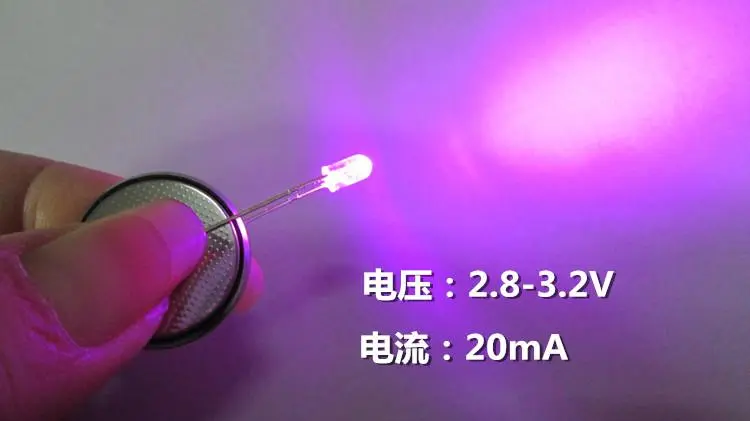

------

9.1.2 led正负极判断
~~~~~~~~~~~~~~~~~~~~~~~~~~~~~~~~~~~~~~~~~~~~~~~~~~~~~~~~~~~

如下图,贴片led的绿色端为负极,对面端为正极.

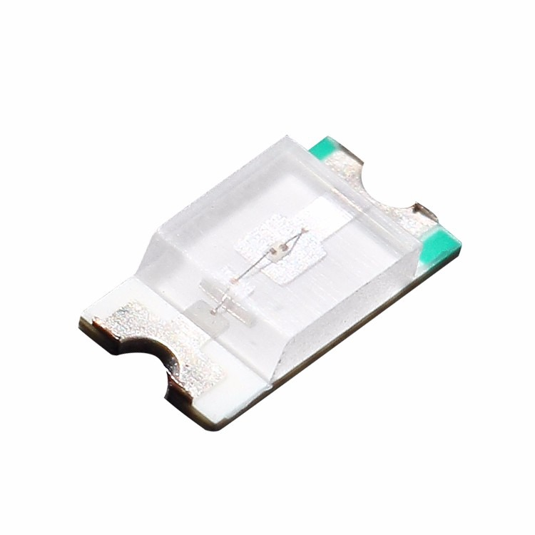

------

如下图,直插led的短引脚为负极,长引脚为正极.

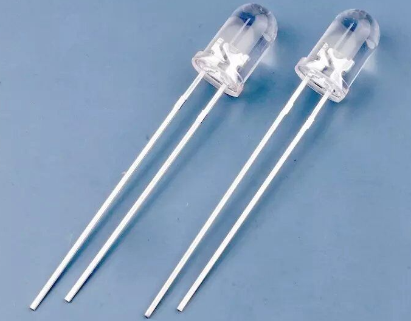

------

9.1.3 stm32点亮led原理
~~~~~~~~~~~~~~~~~~~~~~~~~~~~~~~~~~~~~~~~~~~~~~~~~~~~~~~~~~~

led的正极接到3.3V,负极接到stm32的gpio,当stm32的gpio输出0V时点亮led,gpio输出3.3V时led熄灭led.led点亮最少需要1.8V电压,在led工作范围内电压越高led越亮.所以控制led的亮灭只需要控制gpio输出0v或者3.3v电压即可.

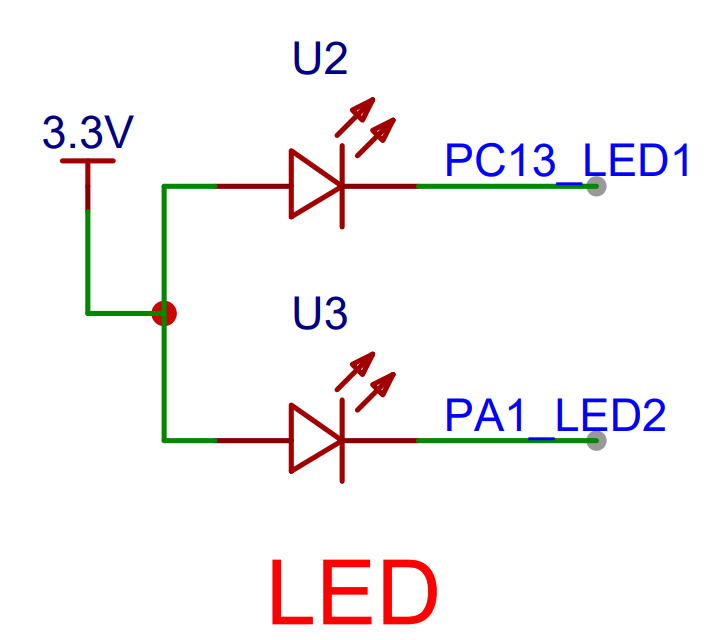

------

9.2 电平的概念
-----------------------------------------------------------

9.2.1 高电平
~~~~~~~~~~~~~~~~~~~~~~~~~~~~~~~~~~~~~~~~~~~~~~~~~~~~~~~~~~~

电路中 ``高电平`` 是电压高的状态,一般记为1.高电平的划分对于TTL来说高电平是:2.4V-5.0V.对于CMOS来说高电平是:4.99-5.0v.

stm32中电压 ``1.833V到3.6V`` 识别为高电平.

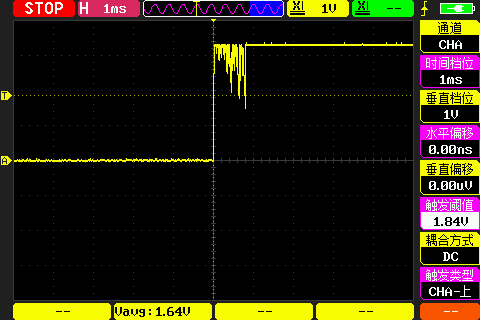

------

9.2.2 低电平
~~~~~~~~~~~~~~~~~~~~~~~~~~~~~~~~~~~~~~~~~~~~~~~~~~~~~~~~~~~

电路中 ``低电平`` 是电压低的状态,一般记为0.低电平的划分对于TTL来说低电平是:0.0V-0.4V.对于CMOS来说低电平是:0.0-0.01v.

stm32电压 ``-0.3V到1.164V`` 识别为低电平.

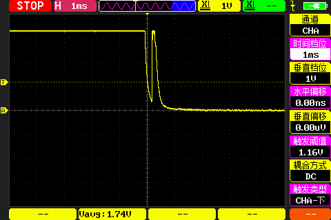

------

9.3 stm32cubemx中gpio输出配置
-----------------------------------------------------------

9.3.1 gpio输出模式配置
~~~~~~~~~~~~~~~~~~~~~~~~~~~~~~~~~~~~~~~~~~~~~~~~~~~~~~~~~~~

以LED1使用的PA1为例,下图列举了PA1 gpio的全部功能,驱动led设置为 ``GPIO_Output`` .

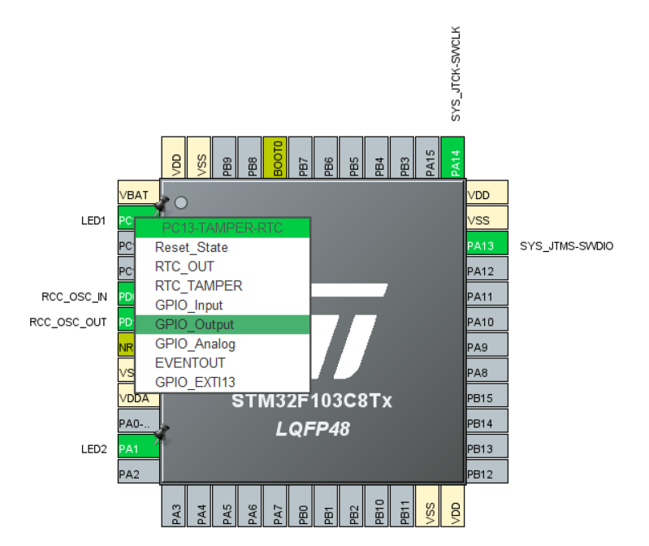

------

如下设置gpio的模式为 ``Output Push Pull`` 即推挽输出,此模式下的gpio驱动能力强,开漏输出无法输出高电平,需要内部或外部上拉.

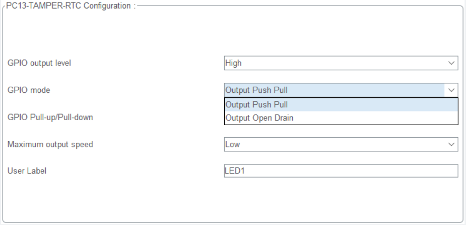

------

9.3.2 gpio默认输出电平
~~~~~~~~~~~~~~~~~~~~~~~~~~~~~~~~~~~~~~~~~~~~~~~~~~~~~~~~~~~

gpio默认输出高或低电平.根据原理图,默认为低时上电点亮led.

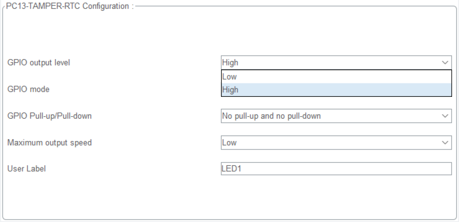

------

9.3.3 gpio输出速度配置
~~~~~~~~~~~~~~~~~~~~~~~~~~~~~~~~~~~~~~~~~~~~~~~~~~~~~~~~~~~

gpio输出速度分别是2MHZ、10MHZ、50MHZ.对应Low、Medium、High.控制led使用默认最低速度即可.

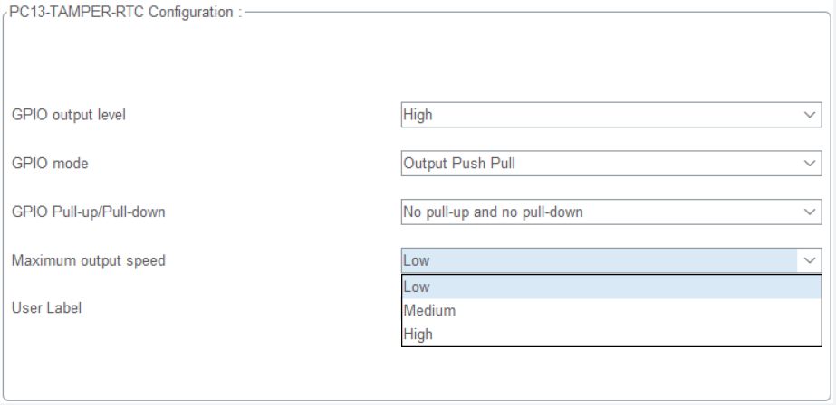

------

gpio点亮led需要的配置.

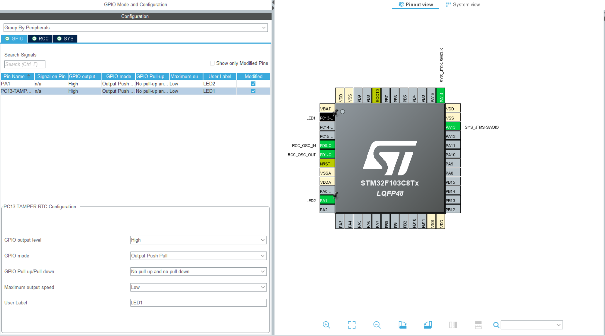

------

.. note::
   1. gpio输出模式,推挽输出.
   2. 默认输出电平,根据原理图和需求配置.
   3. gpio输出速度,默认为low.

