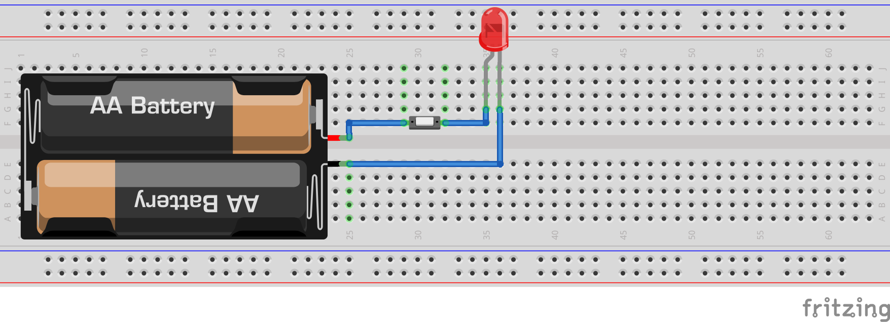
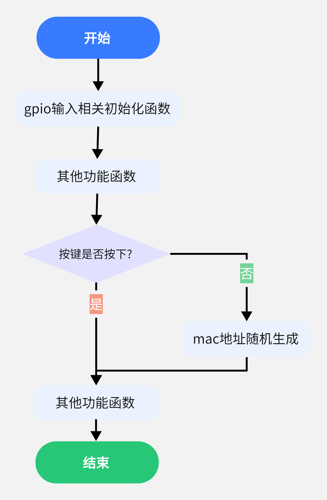
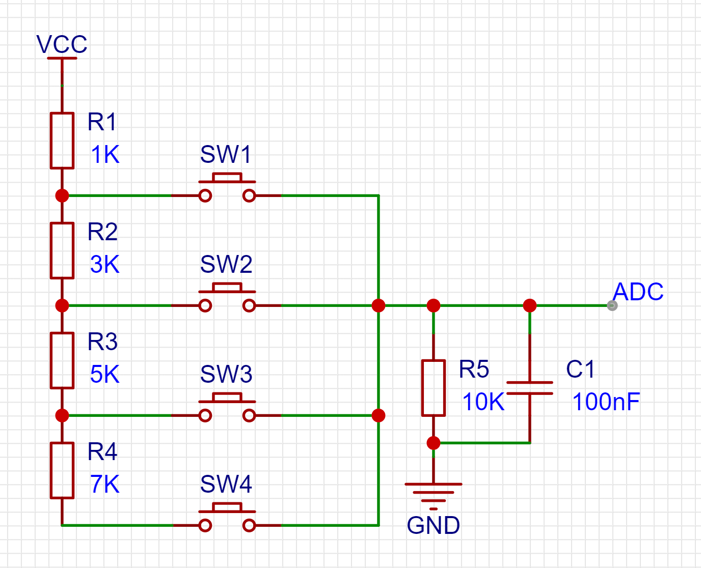
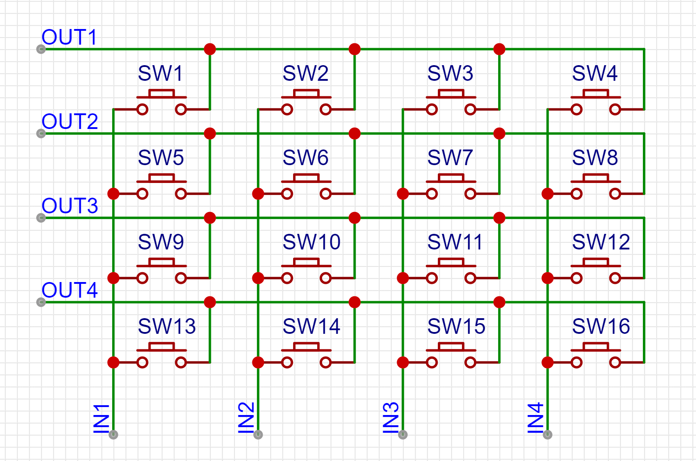
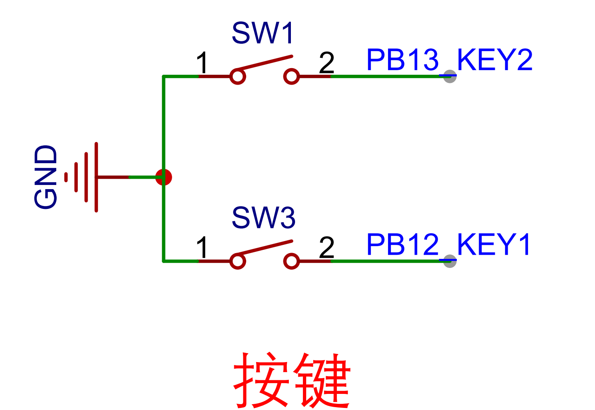
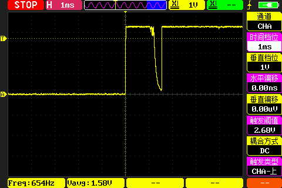
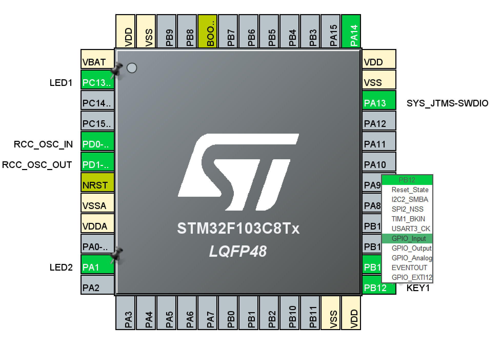
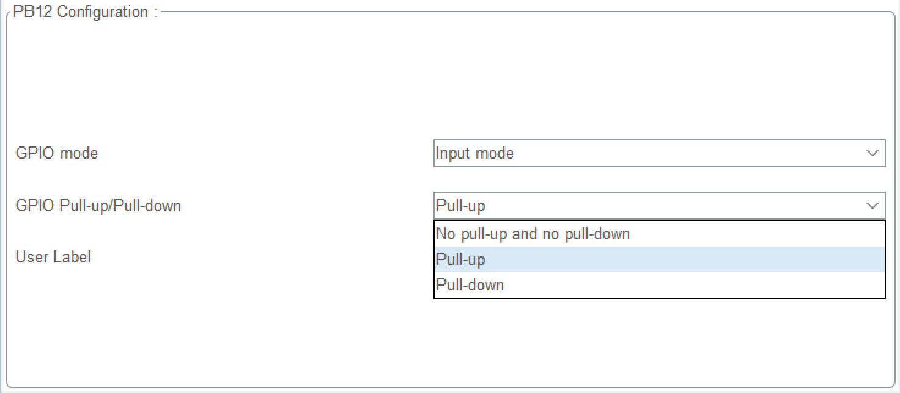

第10章.gpio输入按键控制led灯亮灭
===========================================================

10.1 按键控制的分类
-----------------------------------------------------------

10.1.1 开关按键
~~~~~~~~~~~~~~~~~~~~~~~~~~~~~~~~~~~~~~~~~~~~~~~~~~~~~~~~~~~

下面是最简单的方式用按键控制led的亮灭.按键控制电源正极,按键按下正极接通,led点亮,按键松开led熄灭.

------

10.1.2 扫描按键
~~~~~~~~~~~~~~~~~~~~~~~~~~~~~~~~~~~~~~~~~~~~~~~~~~~~~~~~~~~

在单片机中按键被接通后,需要先读取按键状态,再根据按键状态控制led的亮灭,在裸机中是通过轮询的方式一遍一遍的检查按键的状态,所以将这样的按键控制方式称为按键扫描,程序轮询执行一次需要时间,但这个时间是非常快的过程,几乎察觉不到.相比于通过导通控制的按键开关,按键扫描可以实现多种多样的控制,比如按下两次才能点亮led.

------

10.1.3 分压按键
~~~~~~~~~~~~~~~~~~~~~~~~~~~~~~~~~~~~~~~~~~~~~~~~~~~~~~~~~~~

在用些情况下gpio资源不足,就可以考虑分压按键了,分压按键是通过电阻分压的方式实现,不同的按键按下导通的电阻不同,adc读取电压,根据不同的电阻配置判断具体是哪个按键.这样做的好处是可以只需要一个gpio可以接入多个按键,前提是这个gpio被复用为adc的引脚.

如下图,按键SW1按下时电压u1=(VCC/(R1+R5))*R1.按键SW2按下时电压u2=(VCC/(R1+R2+R5))*R1+R2.按键SW3按下时电压u3=(VCC/(R1+R2+R3+R5))*R1+R2+R3.按键SW4按下时电压u4=(VCC/(R1+R2+R3+R4+R5))*R1+R2+R3+R4.

------

10.1.4 中断按键
~~~~~~~~~~~~~~~~~~~~~~~~~~~~~~~~~~~~~~~~~~~~~~~~~~~~~~~~~~~

假设单片机上接了一些需要耗时处理的外设,这时候再通过扫描按键的方式,就可能明显感觉到延时,或者在其他一些对实施性要求较高的场合,就需要使用按键中端,按键中断的原理是按键按下后产生一个中端,在中断服务函数中处理需要控制的裸机.

10.1.5 矩阵按键
~~~~~~~~~~~~~~~~~~~~~~~~~~~~~~~~~~~~~~~~~~~~~~~~~~~~~~~~~~~

------

10.2 按键硬件连接
-----------------------------------------------------------

10.2.1 按键连接原理图
~~~~~~~~~~~~~~~~~~~~~~~~~~~~~~~~~~~~~~~~~~~~~~~~~~~~~~~~~~~

------

10.2.2 按键消抖
~~~~~~~~~~~~~~~~~~~~~~~~~~~~~~~~~~~~~~~~~~~~~~~~~~~~~~~~~~~

当机械触点断开、闭合时，由于机械触点的弹性作用，一个按键开关在闭合时不会马上就稳定的接通，在断开时也不会一下子彻底断开，而是在闭合和断开的瞬间伴随了一连串的抖动；

------

按键消抖的方法.

1. 硬件方法,在按键的接入到gpio端增加滤波电路实现按键消抖.实际使用中往往是在按键上并联一个电容,但是这种方法效果并不好.
2. 软件方法,由上图可以看出按键按下后需要大约2ms的时间稳定,所以可以在检测到第一次按键按下后2ms再次检测按键的状态,如果仍然为按下则判断为按键按下,否则判断为按键没有按下.按键松开同理.

10.3 stm323cubemx gpio输入配置
-----------------------------------------------------------

10.3.1 stm323cubemx gpio输入配置
~~~~~~~~~~~~~~~~~~~~~~~~~~~~~~~~~~~~~~~~~~~~~~~~~~~~~~~~~~~

------

10.3.2 stm323cubemx gpio输入上拉
~~~~~~~~~~~~~~~~~~~~~~~~~~~~~~~~~~~~~~~~~~~~~~~~~~~~~~~~~~~

