第11章.gpio单总线ds18b20温度传感器
===========================================================

11.1 ds18b20温度传感器
-----------------------------------------------------------

11.1.1 ds18b20温度传感器概述
~~~~~~~~~~~~~~~~~~~~~~~~~~~~~~~~~~~~~~~~~~~~~~~~~~~~~~~~~~~

1. DS18B20数字温度传感器提供9-Bit到12-Bit的摄氏温度测量精度和具有高温和低温触发报警功能的eeprom.

2. DS18B20采用的单总线(1-Wire)通信即仅采用一个数据线(以及地)与微控制器进行通信.传感器的温度检测范围为-55℃至+125℃,并且在温度范围超过-10℃至85℃之外时还具有+-0.5℃的精度.

3. 每片DS18B20都有一个独一无二的64位序列号,所以一个1-Wire总线上可连接多个DS18B20设备.因此,在一个分布式的大环境里用一个微控制器控制多个DS18B20是非常简单的.

4. 温度转换时间在转换精度为12-Bits时达到最大值750ms

11.1.2 ds18b20两种供电方式
~~~~~~~~~~~~~~~~~~~~~~~~~~~~~~~~~~~~~~~~~~~~~~~~~~~~~~~~~~~

使用 ``寄生电源`` 供电方式在远程温度检测或空间比较有限制的地方有很大的应用.下图就是DS18B20的寄生电源控制电路,其由DQ口拉高时向其供电.总线拉高的时候为内部电容(Cpp)充电,当总线拉低是由该电容向设备供电.当DS18B20为寄生电源供电模式时,该VDD引脚必须连接到地.

在寄生电源供电模式下,只要工作在指定的时序下,则该1-Wire总线和Cpp可以提供给DS18B20足够的电流来完成各种工作以及满足供电电压.然而,当DS18B20正在进行温度转换或正将暂存寄存器中的值拷贝至EEPROM时,其工作电流将会高至1.5mA.通过1-Wire总线上的上拉电阻提供的电流将会引起不可接受的电压跌落,同时将会有很大部分电流由Cpp提供.为了保证DS18B20有足够的电流供应,有必要在1-Wire总线上提供一个强有力的上拉,不管此时在进行温度转换还是正将暂存寄存器中的值拷贝至EEPROM中.MOSFET直接将总线拉至高电平能够很好的实现.1-Wire总线必须在温度转换命令[44h]或暂存寄存器拷贝命令[48h]下达10uS后提供一个强有力的上拉,同时在整个温度转换期间(Tconv)或数据传送(Twr=10ms)期间总线必须一直强制拉高.当强制拉高时该1-Wire总线上不允许有任何其他动作.

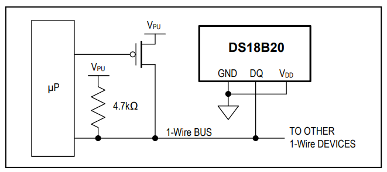

------

DS18B20也可以采用常规的通过外部电源连接至VDD引脚的供电方式,如下图.这种供电方式具有不需要上拉的MOSFET、该1-Wire总线在温度转换期间可执行其他动作的优点.

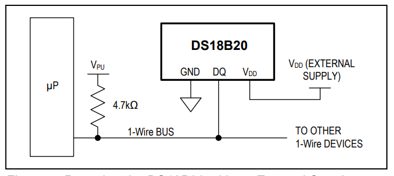

------

在某些情况下,总线上的主设备可能不知道连接到该总线上的DS18B20是由“寄生电源”供电还是由外部电源供电.此时该主设备就需要得到一些信息来决定在温度转换期间是否要强制拉高.为了得到这些信息,主设备可以在发送一个跳过ROM命令[CCh]之后再发送一个读取供电方式命令[B4h]再紧跟一个“读取数据时序”.在读取数据时序中,“寄生电源”供电方式的DS18B20将会将总线拉低,但是,由外部供电方式的DS18B20将会让该总线继续保持高.所以,如果总线被拉低,主设备就必须要在温度转换期间将总线强制拉高.

寄生电源供电方式在温度超过+100℃时不推荐使用,因为在超过该温度下时将会有很大的漏电流导致不能进行正常的通信.实际应用中,在类似的温度状态下强烈推荐该DS18B20由外部供电电源供电.

   :alt: ds18b20接线原理图
   :align: center

------

11.1.3 ds18b20 64位唯一编码
~~~~~~~~~~~~~~~~~~~~~~~~~~~~~~~~~~~~~~~~~~~~~~~~~~~~~~~~~~~

每片DS18B20的片内ROM中都存有一个独一无二的64位的编码.在该内ROM编码的低8位保存有DS18B20的分类编码:28h.中间的48位保存有独一无二的序列号.最高8位保存片内ROM中前56位的循环冗余校验(CRC)值.

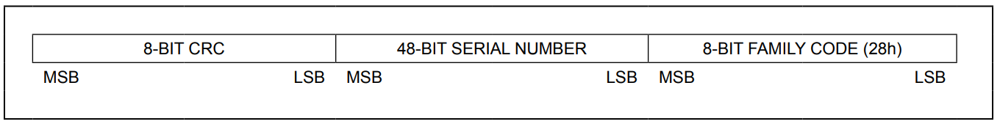

------

11.2 ds18b20的寄存器
-----------------------------------------------------------

11.2.1 ds18b20 温度获取寄存器
~~~~~~~~~~~~~~~~~~~~~~~~~~~~~~~~~~~~~~~~~~~~~~~~~~~~~~~~~~~

如下图,列举了ds18b20的部分寄存器.

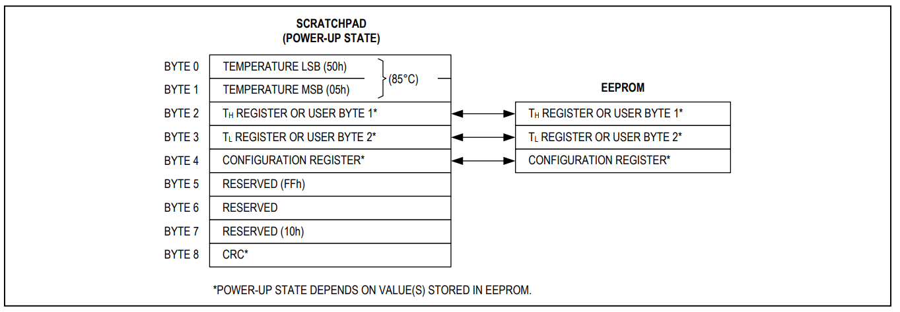

------

温度数据以一个16位标志扩展二进制补码数的形式存储在温度寄存器中如下图,符号标志位(S)温度的正负极性:正数则S=0,负数则S=1。如果DS18B20被定义为12位的转换精度,温度寄存器中的所有位都将包含有效数据。若为11位转换精度,则bit 0为未定义的。若为10位转换精度,则bit 1和bit 0为未定义的。 若为9位转换精度,则bit 2、bit 1和bit 0为未定义的。

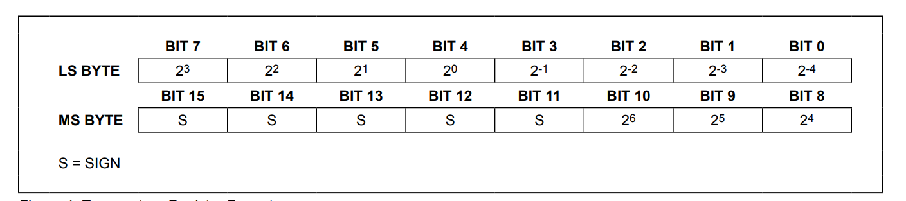

------

如下图.为在12位转换精度下温度输出数据与相对应温度之间的关系表.

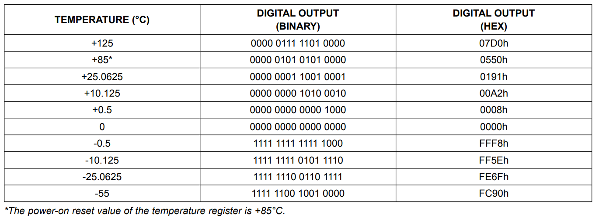

------

输出数据d转换为温度t的技巧,12位数据的精度s为0.0625,11位数据精度s为0.125,10位数据的精度s为0.25,9位数据的精度s为0.5.

当输出数据为正数时t=d*s.
当输出数据为负数时t=(~d+1)*s.

11.2.2 ds18b20 温度报警寄存器
~~~~~~~~~~~~~~~~~~~~~~~~~~~~~~~~~~~~~~~~~~~~~~~~~~~~~~~~~~~

ds18b20可以配置高温和低温报警阈值,当温度高于或低于报警阈值触发报警标志,此标志在下一次温度转换后条件不满足的情况下自动清除.这两个寄存器的结果被写在eeprom中,因此掉电保存配置.

如下图,以TH高温报警阈值为例,bit7表示符号位,S=0为正数,S=1为负数.bit0到bit6为数据位.由于TH是一个8位寄存器,所以只能够和温度寄存器的bit4到bit11位比较大小.TL低温报警寄存器同理.

主设备可以通过报警查询命令[ECh]查询该总线上的DS18B20设备的报警标志位。任何一个报警标志位已经置位的DS18B20设备都会响应该命令.

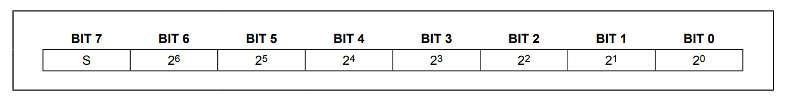

------

11.2.3 ds18b20 测温精度配置寄存器
~~~~~~~~~~~~~~~~~~~~~~~~~~~~~~~~~~~~~~~~~~~~~~~~~~~~~~~~~~~

测温精度配置寄存器,只使用了bit5位和bit6位.默认12位精度.

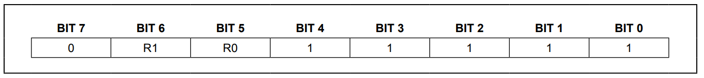

------

如下图,配置了9到12位精度,共计4种模式.

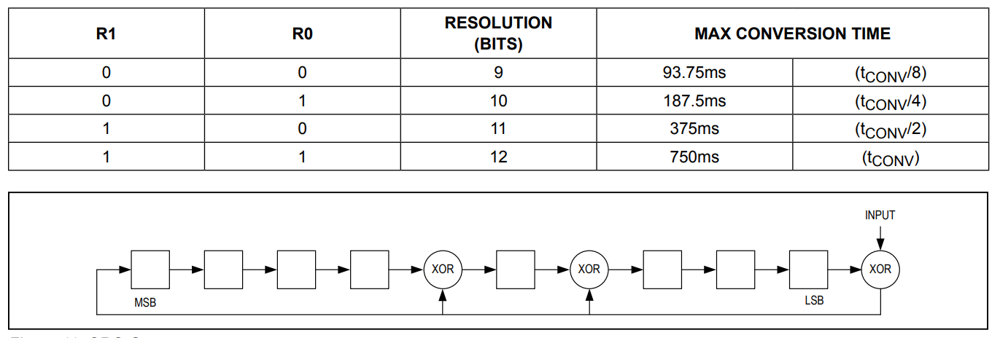

------

11.3 ds18b20单总线通信协议
-----------------------------------------------------------

如下图,是莫斯电码的对照表,电码中划用嗒(dah)来表示,点用嘀(dit)来表示,当然点划之间的停顿也是必不可少的.以SOS是国际通用求救信号为例,莫斯电码为"...---...",在发送电报的时候划的长度是点的3倍,点和划之间用一个点的长度作为间隔.

------

假设电报员按下一次嘀的时间为0.5s,这发送sos的按动状态为:

1. 发送 's':按下0.5s,松开0.5s,按下0.5s松开0.5s,按下0.5s松开0.5s.
2. 发送 'o':按下1.5s,松开0.5s,按下1.5s松开0.5s,按下1.5s松开0.5s.
3. 发送 's':按下0.5s,松开0.5s,按下0.5s松开0.5s,按下0.5s松开0.5s.

发现电报员手中的按键只有两种状态,按下和松开.对应单总线使用的gpio也只有高电平和低电平两种状态,在配合高低电平的持续时间就可以接收发送数据,

11.3.1 ds18b20初始化时序
~~~~~~~~~~~~~~~~~~~~~~~~~~~~~~~~~~~~~~~~~~~~~~~~~~~~~~~~~~~

主机与DS18B20所有的通信都是由初始化时序开始的,该时序包括从主机发出的复位脉冲及从机DS18B20响应的存在脉冲组成.如下图,当DS18B20响应复位信号的存在脉冲后,则其向主机表明其在该总线上,并且已经做好操作命令.

在初始化序列期间,总线上的主机通过拉低1-Wire总线超过480us来发送(TX)复位脉冲.之后主机释放总线而进入接收模式(RX).当总线释放后,5kΩ左右的上拉电阻将1-Wire总线拉至高电平.当DS18B20检测到该上升边沿信号后,其等待15us至60us后通过将1-Wire总线拉低60us至240us来实现发送一个存在脉冲.

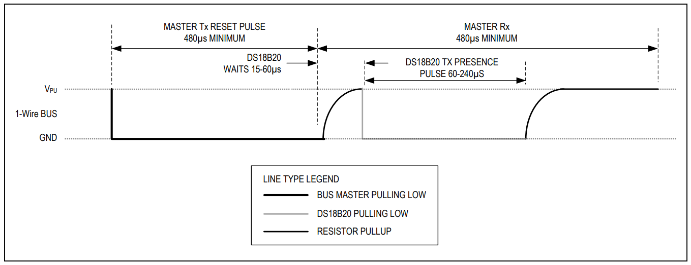

------

11.3.2 主机写时序
~~~~~~~~~~~~~~~~~~~~~~~~~~~~~~~~~~~~~~~~~~~~~~~~~~~~~~~~~~~

1. 为了形成写一个bit '1',主机拉低电平1到15us后释放总线,这时上拉电阻将总线拉高电平.从机在
2. 为了形成写一个bit '0',主机拉低电平后在整个时段期间,主机至少拉低总线60us

在主设备初始化写时段后,DS18B20将会在15us至60us的时间窗口内对总线进行采样.如果总线在采样窗口期间是高电平,则逻辑1被写入DS18B20;若总线是低电平,则逻辑0被写入DS18B20.

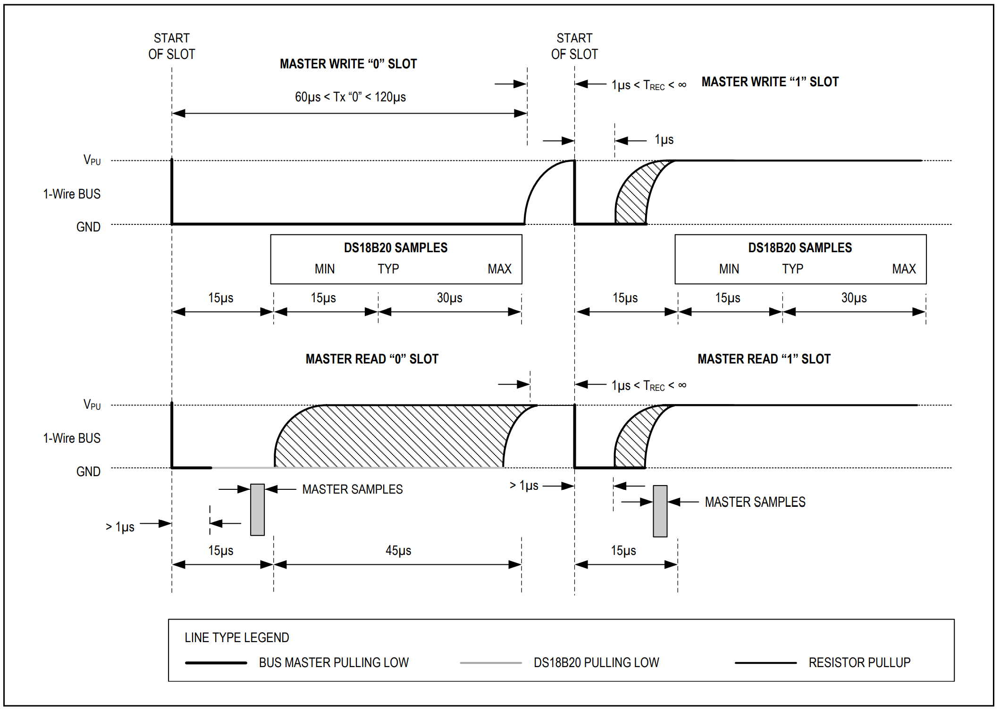

------

11.3.3 主机读时序
~~~~~~~~~~~~~~~~~~~~~~~~~~~~~~~~~~~~~~~~~~~~~~~~~~~~~~~~~~~

仅在读时段期间DS18B20才能向主设备传送数据。因此,主设备在执行完读暂存寄存器[BEh]或读取供电模式[B4h]后,必须及时地生成读时段,这样DS18B20才能提供所需的数据。此外,主设备可以在执行完转换温度[44h]或拷贝EEPROM[B8h]命令后生成读时段,以便获得在“DS18B20功能命令”章节中提到的操作信息。

每个读时段最小必须有60us的持续时间且独立的写时段间至少有1us的恢复时间。读时段通过主设备将总线拉低超过1us再释放总线来实现初始化(见图14)。当主设备初始化完读时段后,DS18B20将会向总线发送0或者1。DS18B20通过将总线拉至高来发送逻辑1,将总线拉至低来发送逻辑0。当发送完0后,DS18B20将会释放总线,则通过上拉电阻该总线将会恢复到高电平的闲置状态。从DS18B20中输出的数据在初始化读时序后仅有15us的有效时间。因此,主设备在开始改读时段后的15us之内必须释放总线,并且对总线进行采样。

------

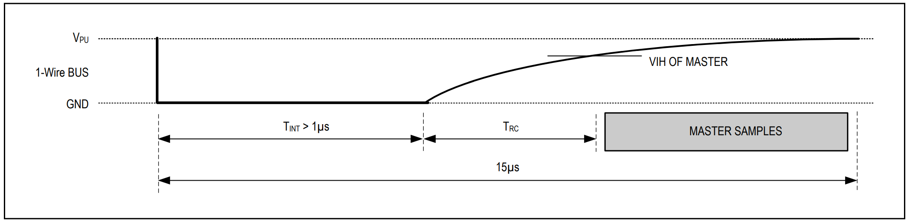

------

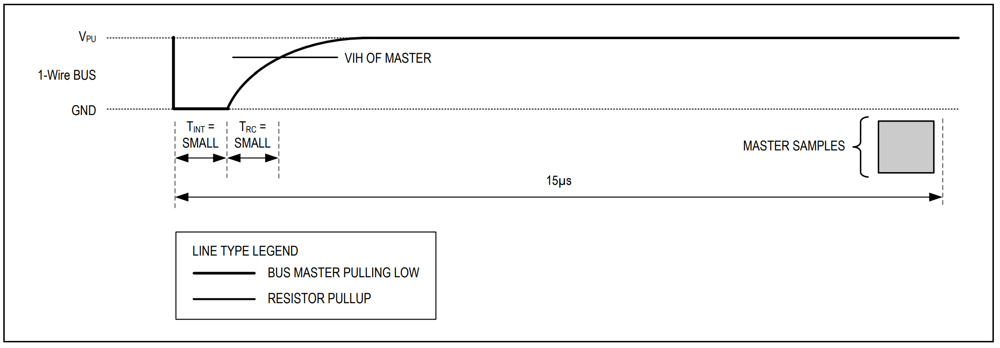

------

11.4 ds18b20单总线通信协议源码分析
-----------------------------------------------------------

11.4.1 ds18b20初始化时序源码
~~~~~~~~~~~~~~~~~~~~~~~~~~~~~~~~~~~~~~~~~~~~~~~~~~~~~~~~~~~

.. code-block:: c
   :caption: ds18b20初始化时序源码
   :linenos:

    uint8_t ds18b20_init(void)
    {
        uint8_t Pulse_Time=0;

        //主机进入发送模式
        ds18b20_set_pin_out();
        //主机拉低电平最少480um
        HAL_GPIO_WritePin(DS18B20_GPIO_Port,DS18B20_Pin,GPIO_PIN_RESET);
        delay_us (750);
        //主机上拉释放总线靠电阻上拉,只要有15到60um的高电平即可
        HAL_GPIO_WritePin(DS18B20_GPIO_Port,DS18B20_Pin,GPIO_PIN_SET);
        delay_us (15);
        
        //主机进入接收模式
        ds18b20_set_pin_in();
        //主机等待ds18b20的响应,超时返回1,没有超时检测到低电平开始计数
        while(HAL_GPIO_ReadPin(DS18B20_GPIO_Port,DS18B20_Pin)&&Pulse_Time<100)
        {
            Pulse_Time++;
            delay_us(1);
        }
        if( Pulse_Time>=100)
        {
            return 1;
        }
        else
        {
            Pulse_Time= 0;
        }
        //ds18b20拉低电平60-240um,计数范围在60-240um返回1,否则返回0
        while(!HAL_GPIO_ReadPin (DS18B20_GPIO_Port,DS18B20_Pin) && Pulse_Time<240)
        {
            Pulse_Time++;
            delay_us(1);
        }
        if( Pulse_Time>=240)
        {
            return 1;
        }
        else
        {
            return 0;
        }
    }

11.4.2 主机写时序源码
~~~~~~~~~~~~~~~~~~~~~~~~~~~~~~~~~~~~~~~~~~~~~~~~~~~~~~~~~~~

.. code-block:: c
   :caption: 主机写时序源码
   :linenos:

    static void ds18b20_write_byte(uint8_t data)
    {
        uint8_t write_bit;

        ds18b20_set_pin_out();
        //循环8次,从一个字节的第一位都第八位,第八位后再左移就变为0x00
        for(write_bit=0x01; write_bit !=0; write_bit<<=1)
        {
            //对比每一位是0还是1
            if((data&write_bit)==RESET)
            {
                //主机拉低60到120us的总线,后至少1us的恢复时间,写0
                HAL_GPIO_WritePin (DS18B20_GPIO_Port,DS18B20_Pin,GPIO_PIN_RESET);
                delay_us(70);
                HAL_GPIO_WritePin (DS18B20_GPIO_Port,DS18B20_Pin,GPIO_PIN_SET);
                delay_us(2);
            }
            else 
            {
                //主机拉低电平至少1us后拉高电平,写1
                HAL_GPIO_WritePin (DS18B20_GPIO_Port,DS18B20_Pin,GPIO_PIN_RESET);
                delay_us(9);
                HAL_GPIO_WritePin (DS18B20_GPIO_Port,DS18B20_Pin,GPIO_PIN_SET);
                delay_us (55);
            }
        }
    }

11.4.3 主机读时序源码
~~~~~~~~~~~~~~~~~~~~~~~~~~~~~~~~~~~~~~~~~~~~~~~~~~~~~~~~~~~

.. code-block:: c
   :caption: 初始化gpio
   :linenos:

    static uint8_t ds18b20_read_bit(void)
    {
        uint8_t data;
        //主机拉低电平至少1us
        ds18b20_set_pin_out();
        HAL_GPIO_WritePin (DS18B20_GPIO_Port ,DS18B20_Pin ,GPIO_PIN_RESET);
        delay_us(10);
        //如果电平为低,读入0.如果电平为高读入1.
        ds18b20_set_pin_in();
        if(HAL_GPIO_ReadPin (DS18B20_GPIO_Port ,DS18B20_Pin) == SET)
        {
            data=1;
        }
        else  
        {
            data=0;
        }
        delay_us(45);
        return data;
    }

    static uint8_t ds18b20_read_byte(void)
    {
        uint8_t i,j,data=0;
        //循环读出8位的数据组成一个字节
        for(i=0;i<8;i++)
        {
            j=ds18b20_read_bit();
            data=(data)|(j<<i);
        }
        return data ;
    }

11.4.4 ds18b20读取温度函数
~~~~~~~~~~~~~~~~~~~~~~~~~~~~~~~~~~~~~~~~~~~~~~~~~~~~~~~~~~~

.. code-block:: c
   :caption: 初始化gpio
   :linenos:

    float ds18b20_get_temperature(void)
    {
        uint8_t sign;
        uint8_t TL,TH;
        short temp;
        
        //初始化
        ds18b20_init();
        //不发送64位的唯一编码,开始温度转化
        ds18b20_write_byte(SKIP_ROM); 
        ds18b20_write_byte(CONVERT_TEMP);
        delay_us (350);
        //初始化
        ds18b20_init();
        //不发送64位的唯一编码,,读取温度
        ds18b20_write_byte(SKIP_ROM);     
        ds18b20_write_byte(READ_SCRATCHPAD);
        //获取低8位和高8位数据
        TL = ds18b20_read_byte();
        TH = ds18b20_read_byte();
        //高八位数据的高5位均是符号位,大于7即为负数
        if(TH >7)
        {
            TH=~TH;
            TL=~TL;
            sign =0;
        }
        else 
        {
            sign =1;               
        }
        temp=TH;      
        temp<<=8;
        temp+=TL;
        //12位精度
        temp=(float)temp*0.0625;
        if(sign)
        {
            return temp;
        }
        else 
        {
            return -temp;   
        }
    }

