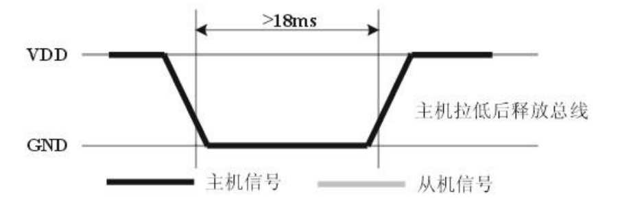

第12章.gpio单总线dht11温湿度传感器
===========================================================

12.1 dht11温湿度传感器
-----------------------------------------------------------

12.1.1 dht11温湿度传感器概述
~~~~~~~~~~~~~~~~~~~~~~~~~~~~~~~~~~~~~~~~~~~~~~~~~~~~~~~~~~~

dht11数字温湿度传感器是一款含有已校准数字信号输出的温湿度复合传感器.它应用专用的数字模块采集技术和温湿度传感技术,确保产品具有极高的可靠性与卓越的长期稳定性.传感器包括一个电容式感湿元件和一个NTC测温元件,并与一个高性能8位单片机相连接.

------

12.1.2 dht11温湿度传感器接线原理图
~~~~~~~~~~~~~~~~~~~~~~~~~~~~~~~~~~~~~~~~~~~~~~~~~~~~~~~~~~~

12.2 dht11单总线通信协议
-----------------------------------------------------------

12.2.1 单总线说明
~~~~~~~~~~~~~~~~~~~~~~~~~~~~~~~~~~~~~~~~~~~~~~~~~~~~~~~~~~~

dht11 器件采用简化的单总线通信。单总线即只有一根数据线,系统中的数据交换、控制均由单总线完成。设备(主机或从机)通过一个漏枀开路或三态端口连至该数据线,以允许设备在不发送数据时能够释放总线,而让其它设备使用总线；单总线通常要求外接一个约 4.7kΩ 的上拉电阻,这样,当总线闲置时,其状态为高电平。由于它们是主从结极,只有主机呼叫从机时,从机才能应答,因此主机访问器件都必须严格遵循单总线序列,如果出现序列混乱,器件将不响应主机。

12.2.2 单总线传送数据位定义
~~~~~~~~~~~~~~~~~~~~~~~~~~~~~~~~~~~~~~~~~~~~~~~~~~~~~~~~~~~

DATA用于微处理器与dht11之间的通讯和同步,采用单总线数据格式,一次传送40位数据,高位先出.

数据格式:
8bit 湿度整数数据 + 8bit 湿度小数数据 + 8bit 温度整数数据 + 8bit 温度小数数据 + 8bit 校验位。

注:其中湿度小数部分为 0。

校验位数据定义
“8bit 湿度整数数据 + 8bit 湿度小数数据 + 8bit 温度整数数据 + 8bit 温度小数数据”8bit 校验位等于
所得结果的末 8 位

12.2.3 dht11数据读取步骤
~~~~~~~~~~~~~~~~~~~~~~~~~~~~~~~~~~~~~~~~~~~~~~~~~~~~~~~~~~~

步骤一:
dht11上电后(dht11上电后要等待1S以越过不稳定状态在此期间不能发送任何指令),测试环境温湿度数据,并记录数据,同时dht11的DATA数据线由上拉电阻拉高一直保持高电平;此时dht11的DATA引脚处于输入状态,时刻检测外部信号。

步骤二:
主机的 I/O 设置为输出同时输出低电平,且低电平保持时间不能小于 18ms(最大不得超过 30ms),然后主机的 I/O 设置为输入状态,由于上拉电阻,主机的 I/O 即 dht11 的 DATA 数据线也随之变高,等待 dht11 作出回答信号,发送信号如图所示:

------

步骤三:
dht11 的 DATA 引脚检测到外部信号有低电平时,等待外部信号低电平结束,延迟后 dht11 的 DATA引脚处于输出状态,输出 83 微秒的低电平作为应答信号,紧接着输出 87 微秒的高电平通知外设准备接收数据,主机的 I/O 此时处于输入状态,检测到 I/O 有低电平(dht11 回应信号)后,等待 87 微秒的高电平后的数据接收,发送信号如图所示:

------

步骤四:
由 dht11 的 DATA 引脚输出 40 位数据,微处理器根据 I/O 电平的变化接收 40 位数据,位数据“0”的格式为: 54 微秒的低电平和 23-27 微秒的高电平,位数据“1”的格式为: 54 微秒的低电平加 68-74微秒的高电平。位数据“0”、“1”格式信号如图所示:

------

结束信号:
dht11的DATA引脚输出 40 位数据后,继续输出低电平 54 微秒后转为输入状态,由于上拉电阻随之变为高电平。但 dht11 内部重测环境温湿度数据,并记录数据,等待外部信号的到来。

11.3 dht11单总线通信协议源码分析
-----------------------------------------------------------