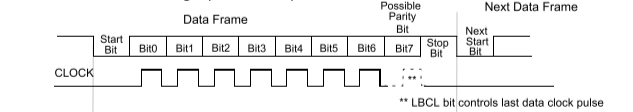

第15章.uart基本概念
===========================================================

在stm32官方相关的资料中使用usart(universal synchronous asynchronous receiver transmitter)来表示串口.将串口按照有没有同步时钟信号划分为同步串口和异步串口,有同步时钟信号的为同步串口,没有同步时钟信号的为异步串口.本章以使用最多的异步串口uart为例.

10.1 并行通信与串行通信
-----------------------------------------------------------

以一张纯黑白照片为例,说明并行通信和串行通信.一般所说的黑白照片并不是真正的只有黑白,还存在黑白之间的过渡颜色灰色,这里我们将问题进一步简化,假设只有黑色和白色两种像素.如下是一张660*660像素的纯黑白照片.则有435600个像素点,假设1表示黑色像素,0表示白色像素.则一个字节可以表示8个像素点.那么这张照片可以用54450个字节存放.

如果使用串行通信发送这个照片需要连续发送54450个字节,数据是一个接着一个发送,直到发送完54450个字节.现在使用并行通信来发送数据将大大提高发送效率,我们将54450个字节的数据拆分为8组数据线发送,也就是每组数据线需要连续发送6807个字节数据,数据发送完成后按照一定的规则组装即可成为一张照片.所以在摄像头或者显示屏这些设备数据大多以并行通信方式.

并行通信有这么多优点是不是只要使用并行通信就可以了,当然不是的,并行通信就像拓宽了车道数量一样来提高通行效率,所以并行通信也会占用更加多的数据线,这样会占用更加多的GPIO资源也会增加PCB设计难度,而且有些场合下不需要传输大容量数据,所以根据数据传输的特点来使用串行通信和并行通信.

------

10.2 数据传送方向
-----------------------------------------------------------

按照数据传送方向,通信可分为:单工、半双工、全双工.

.. note:: 

   单  工:数据传输只支持数据在一个方向上传输.
   半双工:允许数据在两个方向上传输但在某一时刻只允许数据在一个方向上传输它实际上是一种切换方向的单工通信.
   全双工:允许数据同时在两个方向上传输,全双工通信是两个单工通信方式的结合它要求发送设备和接收设备都有独立的接收和发送能力.

将单工比作上课,老师用嘴巴说上课内容,学生用耳朵听课,这时候数据就是单行的由老师到学生的方向.

------

将半双工比作访谈节目,主持人问,嘉宾回答,主持人提问的时候信息由主持人到嘉宾,嘉宾回答问题的时候信息由嘉宾到主持人.

------

将半双工比作大妈对骂,大妈甲在说的时候也在听大妈乙说的内容,同时大妈乙在说的时候也在听大妈甲说的内容,听说同时进行.

10.3 同步通信与异步通信
-----------------------------------------------------------

按照串行数据的时钟控制方式串行通信又可分为同步通信和异步通信两种方式。

10.3.1 波特率
~~~~~~~~~~~~~~~~~~~~~~~~~~~~~~~~~~~~~~~~~~~~~~~~~~~~~~~~~~~

假设发送一个字符a,字符a的ASCII码值为97,对应的二进制位为01100001,发送端发送01100001接收端解析为字符a.在电路中,假设高电平为1,低电平为0,这是我们注意发送第一位低电平,第二位为高电平,第三位还是高电平,第二位与第三位之前没有电平变化.如果没有一个节拍,不清楚这段持续的高电平是代表两个比特位还是一个比特位.如果通信双方约定好通信的节拍,相当于在这段电平变化中划了7条等距线,这样在哪一段代表比特位0或1变得一目了然.

波特率为每秒传输的比特位数,比如常用的波特率9600bps表示一秒传输9600个比特位,也就是1200个字节.换算得传输每个比特位需要约0.1ms,还是以发送字符a为例,这需要0.8ms才能发送一个字符a,这里0.1ms也就是上面说的节拍,发送8个比特位数据就变为发送8个均为0.1ms的等长变化的电平变化.波特率需要发送与接收双方设置为相同,不然会出现数据乱码.

10.3.2 异步通信
~~~~~~~~~~~~~~~~~~~~~~~~~~~~~~~~~~~~~~~~~~~~~~~~~~~~~~~~~~~

上面介绍波特率时将问题简化,实际发送一个字符a,需要大于8个比特位.假设波特率9600bps发送一个比特位为0.1ms,如果发送与接收双方都能够控制精确的0.1ms,发送数据不会有误.但是发送或者接收的时钟是有误差的,可能多也可能少几微妙,这个误差也会随着发送数据量的推移误差越来越大,直到数据乱码.这时候引入起始位和停止位的概念,在数据前加入一位起始位,在数据后加入一位停止位,这样就相当于每发送10个比特位就同步一次节拍,就不会有误差的累计,这样做的带来的另一个优点是数据直接不需要连续的,接收端只接收起始位和停止位之间的数据,其他时刻的不接受.

1、异步串行方式的特点

所谓异步通信是指数据传送以字符为单位字符与字符间的传送是完全异步的位与位之间的传送基本上是同步的。异步串行通信的特点可以概括为:

①以字符为单位传送信息。

②相邻两字符间的间隔是任意长。

③因为一个字符中的比特位长度有限所以需要的接收时钟和发送时钟只要相近就可以。

④异步方式特点简单的说就是:字符间异步字符内部各位同步。

异步位系统是面向字符来传输信息的也就是我们一般情况下的一个字符8位1bit当然了传输的时候还要加上起始位和结束位没有这两位接收方就不知道什么时候开始接收数据什么时候结束了。如此一来字符与字符之间就不是连着的打个比喻就像秋天的叶子一样一片一片往下落。发送方和接收方不要求同步就是说你想什么时候落就什么时候落我都接着用不着先通知我

2、异步串行方式的数据格式

异步串行通信的数据格式如图8-1所示每个字符(每帧信息)由4个部分组成:

①1位起始位规定为低电0

②5~8位数据位即要传送的有效信息

③1位奇偶校验位

④1~2位停止位规定为高电平1。

------

10.3.3 同步通信
~~~~~~~~~~~~~~~~~~~~~~~~~~~~~~~~~~~~~~~~~~~~~~~~~~~~~~~~~~~

上面介绍了异步通信,异步通信有两个缺点：

1. 发送数据速率不能太高,上面以波特率9600bps为例,每个比特位需要0.1ms,使用另外一个波特率115200bps,每个比特位需要8.6um,随着波特率的升高直到即使发送10比特位更新一次节拍都有可能产生数据乱码,但即使这样发送速率任然没有达到我们的要求.

2. 发送数据效率不高,前面发送字符a为例,有效的比特位为8,而实际需要10比特位.这显然不是我们想要的.

3、同步串行方式的特点

所谓同步通信是指数据传送是以数据块(一组字符)为单位字符与字符之间、字符内部的位与位之间都同步。同步串行通信的特点可以概括为:

①以数据块为单位传送信息。

②在一个数据块(信息帧)内字符与字符间无间隔。

③因为一次传输的数据块中包含的数据较多所以接收时钟与发送进钟严格同步通常要有同步时钟。

步位系统就不同了他要求发送方与接收方严格的同步二者波特率要相同。

同步位系统传输的什么呢不是字符是字符组合也就是帧我们在OSI数据链路层可以学习到。帧的长度没有规定传输的时候视情况而定吧。这个帧里面包含了同步信息来通知接收方调整以同步。这里再打个比喻前面我们说异步位系统传输的数据像树叶那么同步位系统传输的就像是把这些树叶串成一串是连续的。

4、同步串行方式的数据格式

同步串行通信的数据格式如图8-2所示每个数据块(信息帧)由3个部分组成:

①2个同步字符作为一个数据块(信息帧)的起始标志

②n个连续传送的数据

③2个字节循环冗余校验码(CRC)

5.用途:

同步串行:通信网中有大批量数据需要传输

异步串行:应用于在工业、实际应用中。适用于短距离、速率不高的情况下。

步位系统比异步位系统要实用高效。这个比较好理解计算机对帧的处理比对字符要少的多在传送相同大小的数据量的时候计算机要对大量的字符进行开始与结束操作帧则要少的多。同时同步位系统的下的网络效率也更高因为每个字符都至少包含两位的开始结束信息这个在数据量大的时候开销是很客观的。

同步通信:带时钟同步信号传输。
    -SPIIIC通信接口
异步通信:不带时钟同步信号。
    -UART(通用异步收发器),单总线

========    ==================    ===========    ==========
通信标准      引脚说明              通信方式        通信方向
========    ==================    ===========    ==========
UART          RXD、TXD             异步通信        全双工
1-wire        DQ                   异步通信        半双工
SPI           SCK、MISO、MOSI      同步通信        全双工
I2C           SCL、SDA             同步通信        半双工
========    ==================    ===========    ==========

10.4 串口中硬件流控制
-----------------------------------------------------------

1.流控概念

在两个设备正常通信时由于处理速度不同就存在这样一个问题有的快有的慢在某些情况下就可能导致丢失数据的情况。如台式机与单片机之间的通讯接收端数据缓冲区已满则此时继续发送来的数据就会丢失。流控制能解决这个问题当接收端数据处理不过来时就发出“不再接收”的信号发送端就停止发送直到收到“可以继续发送”的信号再发送数据。因此流控制可以控制数据传输的进程实现收发双方的速度匹配防止数据的丢失。
PC机中常用的两种流控制是硬件流控制(包括RTS/CTS、DTR/CTS等)和软件流控制XON/XOFF(继续/停止)。

1. 使用方式
    a. 硬件流控
           硬件流控制常用的有RTS/CTS流控制和DTR/DSR(数据终端就绪/数据设置就绪)流控制。
             RTS (Require ToSend发送请求)为输出信号用于指示本设备准备好可接收数据低电平有效低电平说明本设备可以接收数据。
             CTS (Clear ToSend发送允许)为输入信号用于判断是否可以向对方发送数据低电平有效低电平说明本设备可以向对方发送数据。
    
             其他介绍:
           硬流控的RTS 、CTS :RTS (Require ToSend发送请求)为输出信号用于指示本设备准备好可接收CTS (Clear ToSend发送清除)为输入信号有效时停止发送。假定A、B两设备通信A设备的RTS 连接B设备的CTS A设备的CTS连接B设备的RTS。前一路信号控制B设备的发送后一路信号控制A设备的发送。对B设备的发送(A设备接收)来说如果A设备接收缓冲快满的时发出RTS信号(高电平)(意思通知B设备停止发送)B设备通过CTS 检测到该信号停止发送一段时间后A设备接收缓冲有了空余发出RTS信号(低电平)指示B设备开始发送数据。A设备发(B设备接收)类似。
    
    b. 软件流控
           软件流控和硬件流控都方式一样只是实现方式不同而已。在通信过程中软件流控通过在数据流中插入Xoff(特殊字符)和Xon(另一个特殊字符)信号来实现。A设备一旦接收到B设备发送过来的Xoff立刻停止发送反之如接收到B设备发送过来的Xon则恢复发送数据给B设备。同理B设备也类似从而实现收发双方的速度匹配。

    
2. 流控使用
        如果串口只接了RX、TX两个信号那么要流控的话只能使用软流控如果接了RXTXCTS RTS四个信号那么可以使用硬流控或者软件流控。

RS232 引脚说明
4. 数据发送
    a. 物理连接(交叉连接)
        § 主机的RTS(输出)信号连接到从机的CTS(输入)信号。
        § 主机的CTS(输入)信号连接到从机的RTS(输出)信号。
        ▪ RTS (Require ToSend发送请求)为输出信号用于指示本设备准备好可接收数据低电平有效低电平说明本设备可以接收数据。
        ▪ CTS (Clear ToSend发送允许)为输入信号用于判断是否可以向对方发送数据低电平有效低电平说明本设备可以向对方发送数据。
        
    b. 主机发送过程:
        § 主机查询主机的CTS脚信号此信号连接到从机的RTS信号受从机控制。
        § 如果主机CTS信号为有效(低)表示从机的接收FIFO未满从机可以接收此时主机可以向从机发送数据。
        § 主机在发送过程中要一直查询CTS信号是否为有效状态。一旦无效则终止发送。
    
    c. 主机接收过程:
        § 主机如果接收FIFO未满则使主机RTS信号有效也即从机的CTS信号有效。此时从机如果要发送发送前会查询从机的CTS信号如果为有效则开始发送。
        § 在发送过程中一直查询从机CTS信号的有效状态如果无效则中止发送。是否无效由主机的RTS信号决定。
        § 主机如果FIFO满了则使主机RTS信号无效也即从机CTS信号无效。主机接收中止。
    
    d. 那主机的CTS信号什么时候会无效呢？
           从机在接收到主机发送的数据时从机的接收模块的FIFO如果满了则会使从机RTS无效也即主机的CTS信号无效。主机则查询到CTS无效时主机发送中止。
    此过程可以由硬流控完成。我们只要设置开启硬流控设置FIFO大小。RTS信号和CTS信号由控制器代码查询和设置。 

5. 理论验证:
    a.  主机发送验证:
        § 向主机串口丢数据看TX线上是否有数据。
        § 理论上遥控主机CTS信号为无效时TX线上无数据遥控主机CTS信号为有效时TX线上有数据
    b. 主机接收验证:
        § 从机向串口丢数据主机看RX线上是否有数据。
        § 理论上如果主机使RTS信号为有效时RX线上有数据如果主机使RTS信号为无效时RX线上无数据

        

