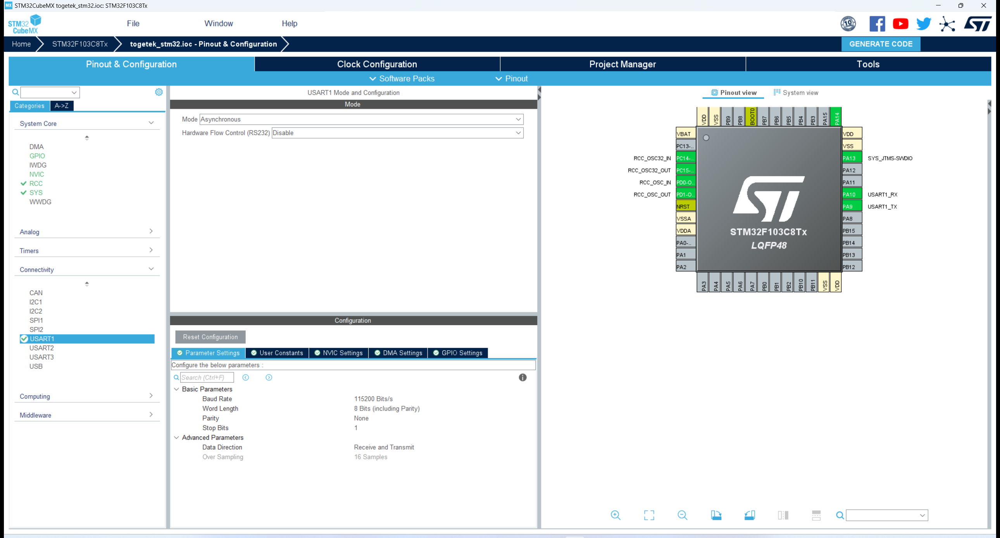

第16章.uart收发数据几种方式
===========================================================

11.1 串口收发中stm32cubemx配置
-----------------------------------------------------------

stm32的usart有多种模式,这里配置为异步模式(asynchronous),也是使用最多的模式.其他默认即可.

1. 异步模式
2. 波特率115200

------

11.2 串口相关函数
-----------------------------------------------------------

11.2.1 串口初始化函数
~~~~~~~~~~~~~~~~~~~~~~~~~~~~~~~~~~~~~~~~~~~~~~~~~~~~~~~~~~~

串口初始化函数是使用stm32cubemx生成的.

.. code-block:: c
   :caption: 串口初始化函数
   :linenos:

   MX_USART1_UART_Init

11.2.2 串口收发函数
~~~~~~~~~~~~~~~~~~~~~~~~~~~~~~~~~~~~~~~~~~~~~~~~~~~~~~~~~~~

.. code-block:: c
   :caption: 阻塞式发送函数
   :linenos:

   HAL_StatusTypeDef HAL_UART_Transmit(UART_HandleTypeDef *huart, uint8_t *pData, uint16_t Size, uint32_t Timeout);

.. code-block:: c
   :caption: 阻塞式接收函数
   :linenos:

    HAL_StatusTypeDef HAL_UART_Receive(UART_HandleTypeDef *huart, uint8_t *pData, uint16_t Size, uint32_t Timeout);

11.3 串口重定向
-----------------------------------------------------------

上面介绍了通过HAL_UART_Transmit函数让串口发送数据,在学C语言的时候使用printf函数打印数据,下面介绍如何使用printf函数让串口打印数据.

处理的思路是重写C语言的打印字符的函数,让fputc函数调用HAL_UART_Transmit函数打印数据.

.. code-block:: c
   :caption: if语句的第一种形式举例1
   :linenos:

    #include "stdio.h"

    #ifdef __GNUC__
    #define PUTCHAR_PROTOTYPE int __io_putchar(int ch)
    #else
    #define PUTCHAR_PROTOTYPE int fputc(int ch, FILE *f)
    #endif

    PUTCHAR_PROTOTYPE
    {
        HAL_UART_Transmit(&huart1, (uint8_t*) &ch, 1, 0xffff);
        return ch;
    }

11.4 非阻塞式接收发送函数
-----------------------------------------------------------

还是以寄快递为例,我们假设先在网上下单,填好快递信息,过了一会快递员打电话说已经到楼下了,这时候我们只需要将东西下楼送到快递员的手上,过了一会快递员将寄好的快递单号直接推送到我们的手上.

通过HAL_UART_Transmit_IT函数发送数据,不需要占用前台程序的资源,等数据发送完成后进入中端函数HAL_UART_TxCpltCallback,在这个函数中可以处理数据发送完成后的任务. 

.. code-block:: c
   :caption: if语句的第一种形式举例1
   :linenos:

   HAL_StatusTypeDef HAL_UART_Transmit_IT(UART_HandleTypeDef *huart, uint8_t *pData,uint16_t Size);

   void HAL_UART_TxCpltCallback(UART_HandleTypeDef *huart);
   void HAL_UART_TxHalfCpltCallback(UART_HandleTypeDef *huart);

还是以收快递为例,假设正在吃饭,这时候快递员敲门说有你的一个快递,打开门后开始收快递,接收完快递后你就继续吃饭.

通过 HAL_UART_Receive_IT 函数接收数据,不需要占用前台程序的资源,等数据接收完成后进入中端函数 HAL_UART_RxCpltCallback ,在这个函数中可以处理数据接收完成后的任务. 

.. code-block:: c
   :caption: if语句的第一种形式举例1
   :linenos:

   HAL_StatusTypeDef HAL_UART_Receive_IT(UART_HandleTypeDef *huart, uint8_t *pData,uint16_t Size);

   void HAL_UART_RxCpltCallback(UART_HandleTypeDef *huart);
   void HAL_UART_RxHalfCpltCallback(UART_HandleTypeDef *huart);

11.5 非阻塞式接收发送DMA函数
-----------------------------------------------------------

HAL_UART_Transmit_DMA()
HAL_UART_Receive_DMA()
  