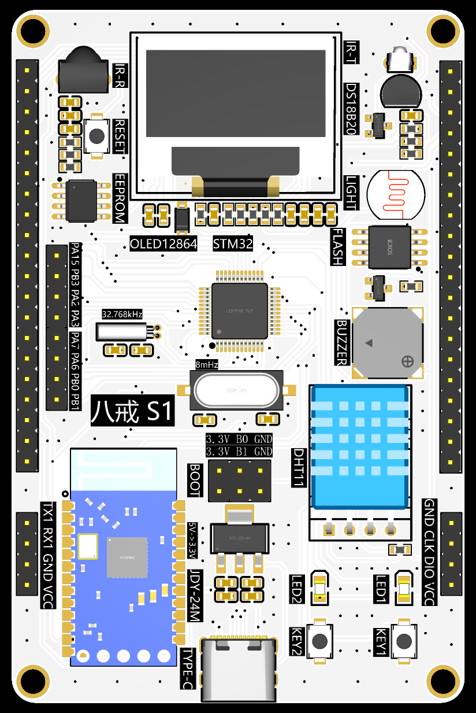

第01章.单片机设计电子网一起学stm32教程介绍
===========================================================

1.1 学习编程的一般过程
-----------------------------------------------------------

1.1.1 C语言编程思维的形成过程🏃
~~~~~~~~~~~~~~~~~~~~~~~~~~~~~~~~~~~~~~~~~~~~~~~~~~~~~~~~~~~

学习编程在笔者看来就是学习一种 ``思维方式`` ,以C语言为例.

1. 首先学习一些基本 ``概念`` ,比如变量、函数、指针等,只需要知道就可以.
2. 然后学习一些使用 ``规定`` ,比如C语言的标识符区分大小写、C语言的语句以冒号结束等.只需要记住就可以.
3. 最后通过大量练习,潜移默化中似乎习惯了这种 ``思维方式`` ,我们自己也就学会了使用这些 ``概念`` 和 ``规定`` 又有了自己的理解.

当我们不假思考就能够写出代码的时候,我们就学会了编程.

.. code-block:: c
   :caption: C语言打印计算圆的面积结果
   :linenos:

   /***************************************************************
   * @brief      计算圆的面积
   * @author     单片机设计电子网
   * @version    
   * @date       2023年1月15日
   **************************************************************/

   #include <stdio.h>

   #define PI (3.14)                                  //定义宏,圆周率的值为3.14

   /***************************************************************
   *  @brief     计算圆的面积
   *  @param     无   
   *  @note      无
   *  @Sample usage:     无 
   **************************************************************/
   int main(void)
   {
      int r = 3;                                      //定义int型变量r为半径,初始值为3
      float area = r*r*PI;                            //定义float型变量area面积,变量值为 r*r*PI
      printf("半径为%d的圆面积为%f\r\n",r,area);       //printf打印计算结果,%d表示为整数,%f表示为浮点数

      return 0;
   }

1.1.2 stm32编程思维的形成过程🏃
~~~~~~~~~~~~~~~~~~~~~~~~~~~~~~~~~~~~~~~~~~~~~~~~~~~~~~~~~~~

回到stm32编程思维形成的过程如下.

1. 开始的时候会介绍gpio、串口、定时器、i2c、spi等 ``概念`` ,这些概念就像基石一样,知道即可.

2. 在stm32中还会学到如何使用gpio读取ds18b20温度传感器的数据,使用串口控制at命令的蓝牙模块.开始时可能不能理解为什么这样配置,先要学会 ``抄代码`` ,这些外设的使用就像 ``规定`` 一样,使用多了就知道如何使用了.

3. 最终拿到任何没有使用过的外设都能够自己编写驱动软件,这样就认为已经具有了stm32的编程思维,这样也就有了自学的能力.

.. code-block:: c
   :caption: stm32 GPIO控制led的亮灭
   :linenos:

   /**
  * @brief  The application entry point.
  * @retval int
  */
   int main(void)
   {
      /* USER CODE BEGIN 1 */

      /* USER CODE END 1 */

      /* MCU Configuration--------------------------------------------------------*/

      /* Reset of all peripherals, Initializes the Flash interface and the Systick. */
      HAL_Init();

      /* USER CODE BEGIN Init */

      /* USER CODE END Init */

      /* Configure the system clock */
      SystemClock_Config();

      /* USER CODE BEGIN SysInit */

      /* USER CODE END SysInit */

      /* Initialize all configured peripherals */
      MX_GPIO_Init();
      /* USER CODE BEGIN 2 */

      /* USER CODE END 2 */

      /* Infinite loop */
      /* USER CODE BEGIN WHILE */
      while (1)
      {
         /* USER CODE END WHILE */

         /* USER CODE BEGIN 3 */

         HAL_GPIO_WritePin(LED1_GPIO_Port,LED1_Pin,GPIO_PIN_RESET);      //led1点亮,led的正极接到3.3V,负极输出低电平时led亮起
         HAL_GPIO_WritePin(LED2_GPIO_Port,LED2_Pin,GPIO_PIN_SET);	       //led2熄灭
         HAL_Delay(1000);									                      //led1点亮、led2熄灭状态保持1s

         HAL_GPIO_WritePin(LED1_GPIO_Port,LED1_Pin,GPIO_PIN_SET);        //led1熄灭
         HAL_GPIO_WritePin(LED2_GPIO_Port,LED2_Pin,GPIO_PIN_RESET);	    //led2点亮
         HAL_Delay(1000);									                      //led1熄灭、led2点亮状态保持1s
      }
      /* USER CODE END 3 */
   }

.. important::

   - 学习编程并不难,难的是不敢开始和畏惧的心.

1.2 单片机的基本概念
-----------------------------------------------------------

1.2.1 什么是单片机呢?🏃
~~~~~~~~~~~~~~~~~~~~~~~~~~~~~~~~~~~~~~~~~~~~~~~~~~~~~~~~~~~

单片机:Single-Chip Microcomputer,单片微型计算机,是一种集成电路芯片.

.. figure:: ./../media/stm32渲染图.png
   :alt: stm32芯片
   :align: center

------

1.2.2 单片机的组成部分🏃🏃
~~~~~~~~~~~~~~~~~~~~~~~~~~~~~~~~~~~~~~~~~~~~~~~~~~~~~~~~~~~

如下以stm32为例,说明单片机的组成部分.

1. cortex-m3内核,由ARM公司设计并授权给芯片设计厂商使用.
2. sram是ram的一种,用来存放运行时的数据,封装在芯片内部.
3. flash存放代码的存储器,封装在芯片内部.
4. 定时器、串口、gpio、usb等芯片内部的外设接口.

如上是微观的单片机内部组成,从宏观上说芯片内部主要分为两个部分:一个是由arm公司设计的内核,另一个是由芯片设计厂商设计的外设,最后由封装公司封装为我们看到的芯片.

学习stm32最主要的是学习芯片内部的外设以及这些外设驱动的传感器或其他设备.

.. figure:: ./../media/stm32_系统结构.png
   :alt: stm32系统结构
   :align: center

------

1.2.3 单片机与电脑的区别🏃
~~~~~~~~~~~~~~~~~~~~~~~~~~~~~~~~~~~~~~~~~~~~~~~~~~~~~~~~~~~

.. csv-table:: 单片机与电脑的区别
  :align: center
  :header: 对比项, 电脑, 单片机
  :widths: 15, 40, 30

  频率,       2~5Ghz,            72Mhz
  内存容量,    GB级如16GB,       KB级如64KB
  硬盘容量,    TB级如1TB,        KB级如128KB
  功耗,        数百瓦,          小于0.5瓦
  价格,        数千元,          几十元
  用途,        通用型计算机,    专用型计算机

单片机的特点:价格便宜、体积小巧、功耗低、集成度高等.

1.2.4 单片机的用途🏃
~~~~~~~~~~~~~~~~~~~~~~~~~~~~~~~~~~~~~~~~~~~~~~~~~~~~~~~~~~~

1. 家用电器:家庭使用的洗衣机、油烟机、空调等都是由单片机作为控制单元.
2. 仪器仪表:气压检测、温度检测等.
3. 工业控制:车床、机器人、机械臂等
4. 汽车电子:胎压检测、防抱死系统等.

.. figure:: ./../media/家电.png
   :alt: stm32芯片
   :align: center

------

1.3 疑问解答
-----------------------------------------------------------

1.3.1 什么是stm32?🏃
~~~~~~~~~~~~~~~~~~~~~~~~~~~~~~~~~~~~~~~~~~~~~~~~~~~~~~~~~~~

简单来说stm32是意法半导体公司推出的一款基于arm cortex内核的32位单片机.stm32单片机是一个总称,ST公司购买了ARM公司内核授权后设计出不同的芯片,如教程使用的 ``单片机设计电子网-八戒S1 stm32单片机开发板`` 就是根据stm32的其中一款单片机设计.

教程使用stm32f103c8t6设计的开发板原因?

这是一款定位为中端的单片机,也是stm32系列单片机中使用较广泛的一款单片机,有一些的优点:

1. 拥有64kb的ram、128kb的flash,以及丰富的外设接口.
2. 同时价格也很便宜,使用广泛.
3. 丰富的资料,非常适合入门学习.

.. figure:: ./../media/stm32芯片图片.png
   :alt: stm32f103c8t6的gpio
   :align: center

------

1.3.2 学习stm32需要C语言基础吗?🏃
~~~~~~~~~~~~~~~~~~~~~~~~~~~~~~~~~~~~~~~~~~~~~~~~~~~~~~~~~~~

stm32使用C语言开发,但是也不是一定都用C语言,比如一些stm32内置python解释器,也是可以使用python开发.但是目前的主流stm32开发还是C语言,因此需要使用先学习C语言.但不需要C语言功底非常好才能学习stm32,stm32这类嵌入式的开发是C语言应用的一个方向,学好stm32也能够在一定的程度上提升C语言编程能力.

.. figure:: ./../media/C语言.png
   :alt: C语言
   :align: center

------

1.3.3 什么是嵌入式软件开发?🏃
~~~~~~~~~~~~~~~~~~~~~~~~~~~~~~~~~~~~~~~~~~~~~~~~~~~~~~~~~~~

说到嵌入式,你可能会想到嵌入式洗碗机、嵌入式油烟机,就像洗碗机、油烟机被嵌入到橱柜一样.

嵌入式软件开发中的 ''嵌入式'' 其实也有这个意思,嵌入式软件开发的硬件被镶嵌入到盒子中,比如使用的手机,电路板被嵌入到手机壳中,再比如电子车钥匙,电路板被嵌入到钥匙壳中.

当然这里的嵌入式还有相对于电脑这样的 ``通用`` 设备而言,嵌入式设备往往具有特定的功能,考虑到价钱、体积等多方面因素而 ``专用`` 的.不像通用的电脑,有的人用来打游戏、有的人用来做PPT、有的人用来写代码等.

1.3.4 教程体系的设计是怎样?🏃🏃
~~~~~~~~~~~~~~~~~~~~~~~~~~~~~~~~~~~~~~~~~~~~~~~~~~~~~~~~~~~

.. figure:: ./../media/一起学stm32_课程体系.png
   :alt: C语言
   :align: center

------

1.4 本教程内容
-----------------------------------------------------------

教程的内容应该是贴合stm32拥有的功能来设计,所以如下教程内容中,从零开始学stm32,先是如何搭建软件开发环境,然后是如何新建一个工程,最后也是核心的内容围绕stm32拥有的外设逐个学习.

后续的课程内容就是按照stm32拥有的外设来进行,然后结合具体的外设可以连接控制的设备,我们就学会了如何使用这个设备,后面遇到其他设备,哪怕是其他芯片的单片机,我们都能够触类旁通,因为我们掌握了这种思维方式.

1.3.4 在线技术文档🏃
~~~~~~~~~~~~~~~~~~~~~~~~~~~~~~~~~~~~~~~~~~~~~~~~~~~~~~~~~~~

在线技术文档也就是上课使用的讲义,:guilabel:`单片机设计电子网` 

.. figure:: ./../media/板子3D图片.png
   :alt: stm32f103c8t6的gpio
   :align: center

------

第01章.单片机设计电子网一起学stm32教程介绍

第02章.stm32f103xx资源介绍

第03章.stm32开发环境搭建

第04章.stm32项目工程构建

第05章.stm32时钟系统

第06章.stm32滴答定时器延时函数

第07章.stm32在线仿真调试方法

第08章.gpio基本概念

第09章.gpio输出控制led灯闪烁

第10章.gpio输入按键控制led灯亮灭

第11章.gpio单总线ds18b20温度传感器

第12章.gpio单总线dht11温湿度传感器

第13章.gpio外部中断概念

第14章.gpio外部中断按键控制led灯

第15章.uart基本概念

第16章.uart收发数据几种方式

第17章.uart指令控制蓝牙

第18章.time通用定时器概念

第19章.time通用定时器计数器模式

第20章.time定时器中断

第21章.time定时温湿度数据采集

第22章.pwm基本概念

第23章.pwm有源蜂鸣器播放音乐

第24章.time高级定时器概念 

第25章.time输入捕获中断红外遥控

第26章.pwm红外遥控发射

第27章.nvic中断优先级管理

第28章.adc模数转换基本概念

第29章.adc光敏电阻

第30章.i2c总线基本概念

第31章.i2c接口oled显示屏

第32章.i2c接口eeprom读写

第33章.spi总线基本概念

第34章.spi接口flash芯片读写

第35章.stm32芯片内置温度数据

第36章.stm32芯片内置rtc实时时钟

第37章.watchdog之窗口看门狗

第38章.watchdog之独立看门狗

第39章.usb基本概念

第40章.usb虚拟串口通信

1.5 需要准备的材料
-----------------------------------------------------------

1.5.1 单片机设计电子网-八戒S1 stm32单片机开发板
~~~~~~~~~~~~~~~~~~~~~~~~~~~~~~~~~~~~~~~~~~~~~~~~~~~~~~~~~~~

这是单片机设计电子网专门为stm32的学习而设计的stm32开发板,开发板上几乎涵盖了stm32f103xx芯片所拥有的全部外设功能,所以学完这套开发板上的功能就等于入门了stm32.这些外设包括:led、按键、ds18b20温度传感器、dht11温湿度传感器、红外发射、红外接收、无缘蜂鸣器、光敏电阻、spi flash芯片、eeprom芯片、蓝牙模块、oled显示模块等.

------

1.5.2 DAP-link烧录器
~~~~~~~~~~~~~~~~~~~~~~~~~~~~~~~~~~~~~~~~~~~~~~~~~~~~~~~~~~~

烧录器主要有两个作用:第一个是软件烧录、第二个是串口线.

软件烧录不多说就是将编译无误的固件通过swd接口烧录到芯片内部的flash中.

串口线只有部分的烧录器拥有这个功能,比如dap-link、部分的j-link拥有,而st-link 却没有串口线功能.一般使用的电脑是没有串口的功能,而单片机与电脑通信的重要方式之一就是串口,所以就使用串口线将电脑的usb接口转换为单片机的串口接口,而这个工具就是串口线.就像sd卡插到电脑需要读卡器一样,读卡器就是将电脑的usb接口转换为sd的接口.

教程使用dap-link的原因就是dap-link拥有如下优点:

1. 价格便宜,只需十几块钱.
2. 拥有烧录和串口两个功能.
3. 软件免驱.不需要手动安装驱动.
4. 设计小巧,携带方便.

.. figure:: ./../media/dap-link烧录器.png
   :alt: DAP-link烧录器
   :align: center

------

1.5.3 windows系统电脑
~~~~~~~~~~~~~~~~~~~~~~~~~~~~~~~~~~~~~~~~~~~~~~~~~~~~~~~~~~~

硬件配置:i5以及以上CPU、8G及以上的内存、500G及以上的硬盘.
系统:windows10或者windows11系统.

如果有电脑是i5及以上且是最近几年刚买的,但是开机和使用还是很卡的情况下,主要原因如下:

1. windows系统的电脑使用时间久了都会用这样的问题.所以每隔几年可以重新安装电脑系统.

2. 杀毒软件捣鬼,由于听过电脑中了勒索病毒等新闻,买回来电脑第一件事就是安装杀毒软件,windows系统自带杀毒软件,当系统有更新的时候及时的更新即可,系统的更新有时也有病毒库的更新,所以不需要单独安装任何杀毒软件.自己安装的杀毒软件往往是电脑开机慢的元凶.
   
3. 需要使用各种软件直接到软件的官网下载,不要到各种可能会安装垃流氓软件的网站下载软件.

4. 机械硬盘安装软件尽可能不要安装在C盘,可以安装到d盘等其他盘符.固态硬盘可以随意安装,但是为了方便管理软件尽可能安装在同一个盘符.

5. 在CPU还行的情况下电脑由于硬件配置卡顿,排在第一应该是硬盘的原因,如果是机械硬盘建议换为固态硬盘,换为固态硬盘后能够显著的提高开机和软件的打开速度.排在第二的是内存原因,一般开发最低要求是8G内存,最好为16G,大内存可以允许打开更多的软件而不卡顿.

上面说的都是cpu性能还行,例如intel i5及以上或者amd同等cpu,如果cpu不行的情况下就考虑换电脑了.

1.6 需要注意的事项
-----------------------------------------------------------

学习stm32和学习其他的任何知识都是一样的,都需要抓住重点.为了教程的完整性,本教程中也包括一些介绍的内容,问了方便读者抓住重点,为此将课程的内容按照重要的程度分为3个等级,分别是了解、理解和掌握.
对应在每个章节中都用🏃图标来表示.

.. note::

   -      🏃图标:了解,知道就可以.比如什么是单片机、单片机和电脑的区别、单片机的特点.
   -   🏃🏃图标:理解,能够自己解释的通顺.比如单片机的组成部分、gpio的概念、i2c协议等.
   - 🏃🏃🏃图标:掌握,是本教程的核心内容,比如gpio使用、串口的使用、定时器的使用.

读者可以根据内容的重要性,对于重要的内容着重的学习,其他的内容可以略过.

