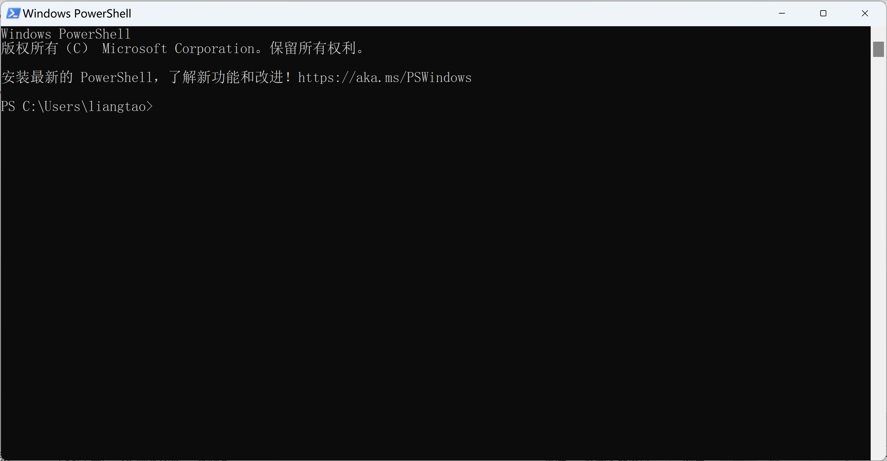

3.ubuntu虚拟机初始配置
===========================================================

3.1.更换为国内软件安装源
-----------------------------------------------------------

由于特殊的原因在国内下载ubuntu上的软件速度很慢甚至无法下载,使用国内的镜像源可以解决这个问题,示例使用的是清华的tuna镜像源,也有一些其他的高校或公司搭建的镜像源.

.. code-block:: shell
   :caption: 更换国内软件源,提高软件下载速度
   :linenos:

   # 备份软件安装源
   sudo cp /etc/apt/sources.list /etc/apt/sources.list.bak
   # 替换为清华tuna镜像源
   sudo sed -i "s@http://.*archive.ubuntu.com@http://mirrors.tuna.tsinghua.edu.cn@g" /etc/apt/sources.list
   sudo sed -i "s@http://.*security.ubuntu.com@http://mirrors.tuna.tsinghua.edu.cn@g" /etc/apt/sources.list
   # 更新软件源列表
   sudo apt-get update
   sudo apt-get upgrade

3.2.安装OpenSSH
-----------------------------------------------------------

说到shell第一个想到windows的PowerShell,在windows上多使用界面的方式进行操作,毕竟windows的精髓就是界面,很少使用PowerShell命令.其实PowerShell的功能也非常强大,有时候记住一些常用命令可以极大的提高工作效率.

OpenSSH是一款开源的软件,可以实现shell的远程连接,还可以实现文件的收发.就像 ``远程操控`` ubuntu一样.

.. code-block:: shell
   :caption: 安装OpenSSH
   :linenos:

   sudo apt-get install openssh-server

------

在linux系统中多使用命令的方式进行操作,针对嵌入式的开发完全可以使用ubuntu服务版(没有界面),ubuntu服务版相对于桌面版系统运行起来占用的资源较少,而且界面在实际开发中根本不会用到,使用ubuntu桌面版的原因就是方便新手由 ``界面`` 到 ``命令`` 的过度,在宿主机性能不够的时候完全可以安装ubuntu服务版.

------

在ubuntu虚拟机起来后,使用OpenSSH与虚拟机链接,像在ubuntu系统里面使用shell一样通过命令操作.

在一些软件开发公司都有专门的开发服务器,这些服务器往往是专门服务器主机或者高性能的PC主机,相比于普通的个人PC主机(台式机或笔记本)服务器主机有如下特点:

 1. 核心数多,通常是几十个核心或者多个CPU组成,内存容量大,可以同时供多个人开发编译软件.
 2. 存储容量大,拥有几十上百TB的容量,硬盘做了RAID备份,有坏盘的时候数据不会丢失.
 3. 利用虚拟化软件,如docker在一个物理服务器上安装多个linux系统.
 4. 可靠性高,可以7*24小时运行

-----------------------------------------------------------

------

对于小公司和个人花大价钱搭建一个开发服务器是不现实的,就使用到上面安装的vmware虚拟机软件,在vmware软件里面安装ubuntu系统,vmware中设置为桥接模式,ubuntu和宿主windows主机分配两个不同的ip,再使用ssh连接到ubuntu系统.

------

使用 ``MobaXterm`` 这款免费的shell软件,使用ifconfig查看ubuntu虚拟机的ip地址,填写ip后使用用户名和密码登录即可,就可以像在ubuntu内使用terminal一样操作ubuntu.

3.3.安装VIM编辑器
-----------------------------------------------------------

ubuntu中已经预装了vim tiny版,但是这个版本方向键和退格键不符合使用习惯,重新安装VIM.

.. code-block:: shell
   :caption: 更换国内软件源,提高软件下载速度
   :linenos:

   # 卸载原有的vim
   sudo apt-get remove vim-common
   # 安装新的vim
   sudo apt-get install vim